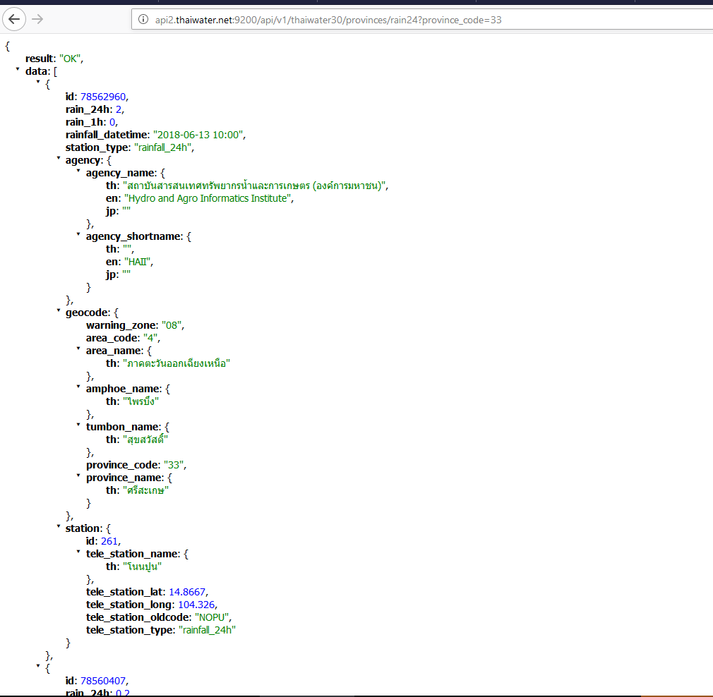
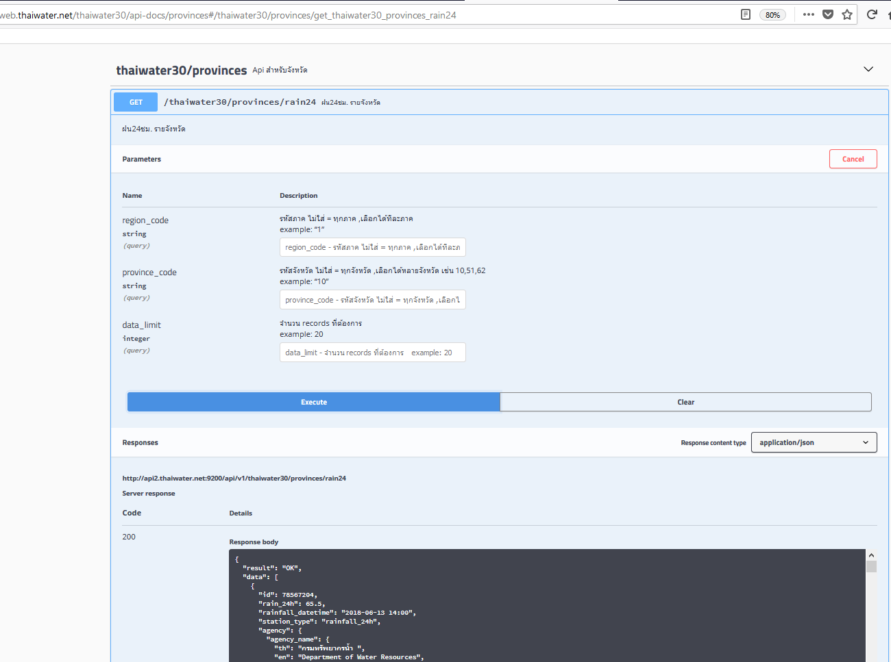
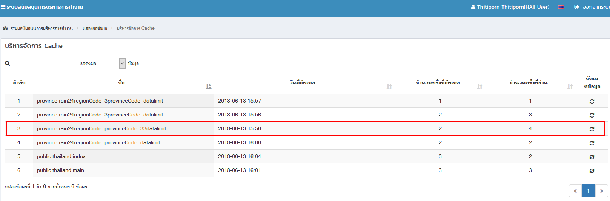

<!---
author Thitiorn Meeprasert (thitiporn@haii.or.th)
-->
###การสร้าง api cache
ใน go memory reset เมื่อมีการ restart service

1. สร้าง sturct    <span style="color:red">&ast;require</span>
```go
// for build api cache
// สร้าง struc เพื่อ clone model_rainfall24hr.Param_Rainfall24 เพิ่ม function is_valid,description เพื่อใช้ใน function builddata
type Param_Rainfall24 struct {
	Param *model_rainfall24hr.Param_Rainfall24
}
```

2. สร้าง function IsValid เพื่อตรวจสอบข้อมูล cache ว่ามีการเปลี่ยนแปลงหรือไม่ สามารถเขียนให้ ตรวจสอบกับเวลาปัจจุบัน หรือตั้งเวลาได้ <span style="color:red">&ast;require</span>

```go
//สร้าง func s *Param_Rainfall24 struc เพื่อ clone model_rainfall24hr.Param_Rainfall24 เพิ่ม function is_valid,description เพื่อใช้ใน function builddata
func (s *Param_Rainfall24) IsValid(lastupdate time.Time) bool {
	return true
}
```

3. สร้าง func GetDescription เพื่อ ใส่ รายละเอียดการตั้งเวลา refresh cahce ที่กำหนดไว้ <span style="color:red">&ast;require</span>
```go
//สร้าง func GetDescription เพื่อ ใส่ รายละเอียดการตั้งเวลา refresh cahce ที่กำหนดไว้
func (s *Param_Rainfall24) GetDescription() string {
	return "refresh every 1 hour"
}
```

4. สร้าง function BuildData เพื่ออ่านข้อมูลในฐานข้อมูลหรือ อื่น ๆ ที่ต้องการ return cache <span style="color:red">&ast;require</span>
```go
// build cache data
func (s *Param_Rainfall24) BuildData() (interface{}, error) {
	rs := &Struct_rain24Hr{}
	rs_data, err := model_rainfall24hr.GetRainfallThailandDataCache(s.Param)
	if err != nil {
		return result.Result0(err), nil
	} else {
		rs.Result = "OK"
		rs.Data = rs_data
		rs.Scale = setting.GetSystemSettingJson("Frontend.public.rain_setting")
		return rs, err
	}
}
```

5. สร้าง function กำหนดชื่อ cache และตั้งเวลา <span style="color:red">&ast;require</span>
```go
//สร้าง function กำหนดชื่อ cache และตั้งเวลา
func getRain24GoCache(param *model_rainfall24hr.Param_Rainfall24) ([]byte, time.Time, error) {

	cacheName := "province.rain24" + "regionCode=" + param.Region_Code + "provinceCode=" + param.Province_Code + "datalimit=" + string(param.Data_Limit)
	if !datacache.IsRegistered(cacheName) {

		c := &Param_Rainfall24{}
		c.Param = param

		// refresh cache in every 1 hour
		datacache.RegisterDataCache(cacheName, c, []string{""}, c, "16 1 * * *")
	}

	// ถ้าจะ return datacache.GetGZJSON ต้องใส่ time มาด้วย
	return datacache.GetGZJSON(cacheName)
}
```

6. ใน function ที่ service เรียกมาทำงานให้เปลี่ยนจาก อ่านข้อมูลในฐานข้อมูลมาเรียกข้อมูลจาก function getRain24GoCache
```go
func (srv *HttpService) getRain24(ctx service.RequestContext) error {
	param_Rainfall24 := &model_rainfall24hr.Param_Rainfall24{}
	if err := ctx.GetRequestParams(param_Rainfall24); err != nil {
		return err
	}
	ctx.LogRequestParams(param_Rainfall24)
	// call data with cache
	b, t, err := getRain24GoCache(param_Rainfall24)
	if err != nil {
		return err
	}

	r := service.NewCachedResult(200, service.ContentJSON, b, t)
	ctx.Reply(r)
	return nil
}
```
####ตัวอย่าง
#####api
http://api2.thaiwater.net:9200/api/v1/thaiwater30/provinces/rain24?province_code=33


#####api-doc
http://web.thaiwater.net/thaiwater30/api-docs/provinces#/thaiwater30/provinces/get_thaiwater30_provinces_rain24




#####ดู cache ที่สร้างผ่าน backoffice เมนู  ระบบสนับสนุนการบริหารการทำงาน -> แสดงผลข้อมูล ->บริหารจัดการ Cache

