<!---
author Thitiorn Meeprasert (thitiporn@haii.or.th)
-->
###การเพิ่มกลุ่ม api ใหม่

1. สร้าง folder ใหม่ ใต้
```
haii.or.th\api\thaiwater30\service\
```
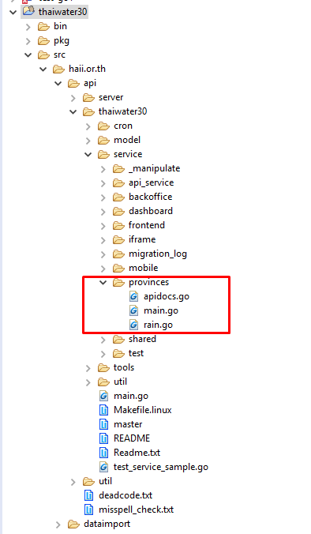


2. เพิ่มข้อมูล module ใน table api.service_module
```sh
Table : api.service_module
Add row name = ชื่อ folder
```
กรณีนี้ใช้ชื่อเดิมคือ thaiwater30

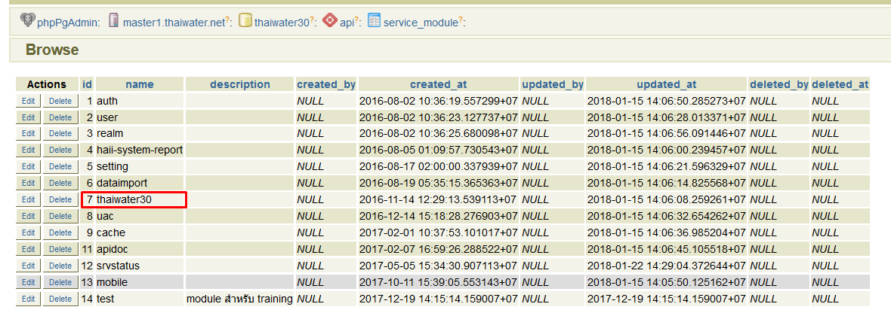


3. เพิ่มข้อมูล service ใน table api.service
```sh
Table : api.service
Add row
Name = ชื่อ service
service_version_id = 1
service_module_id = 7 ตาม id ของ module ที่ใช้ 7 = thaiwater30
service_method_id =1 คือ GET
service_auth_type_id = 2 no authen
```

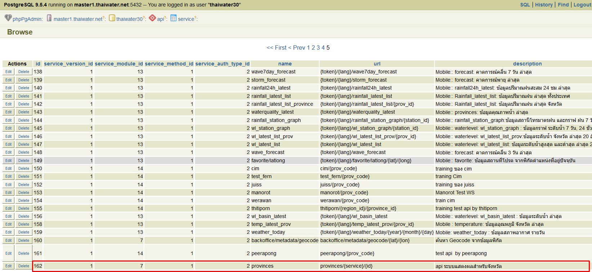
4. สร้างไฟล์ main.go
```
haii.or.th\api\thaiwater30\service\provinces\main.go
```

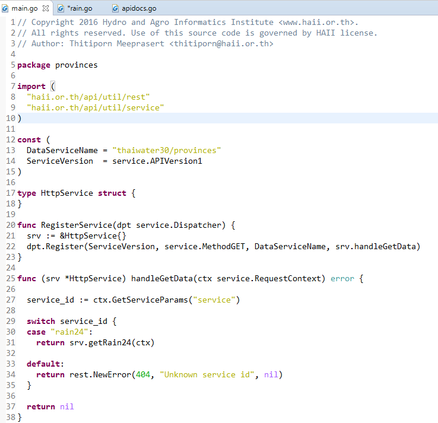

5. สร้างไฟล์  apidocs.go เพื่อเก็บ header สำหรับ api กลุ่มใหม่
```
haii.or.th\api\thaiwater30\service\provinces\apidocs.go
```
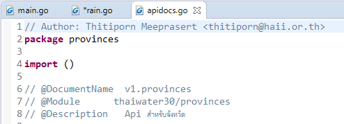

6. เพิ่ม comment สำหรับ api doc
```
haii.or.th\api\server\service\apidoc\document.go
```
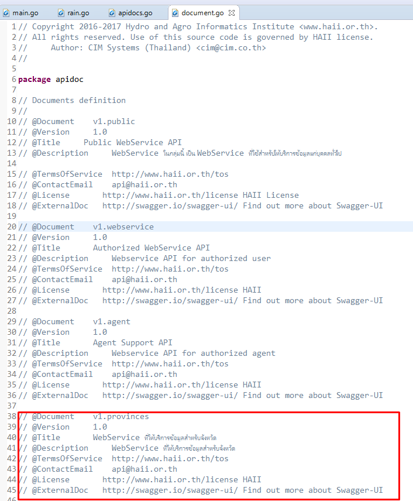

7. update code to git

8. ssh ไปยังเครื่อง api.thaiwater.net
```
cd go_local/src/haii.or.th/api/thaiwater30
make pull install
```
<br>
####แก้ไขไฟล์ใน Front-end
- resources/lang/th/api-docs/api-docs.php
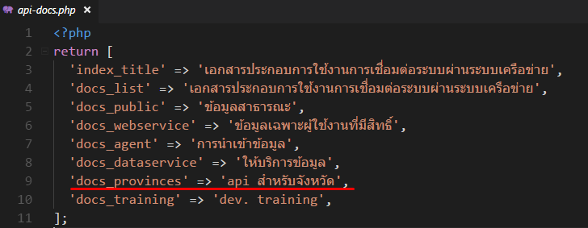
<br>
- resources/views/production/api-docs/index.blade.php
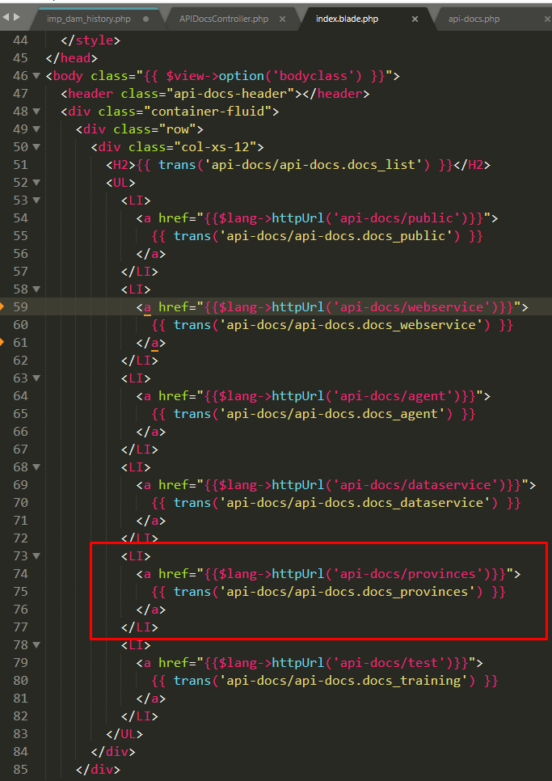
<br>
- app/Http/Controllers/Common/APIDocsController.php
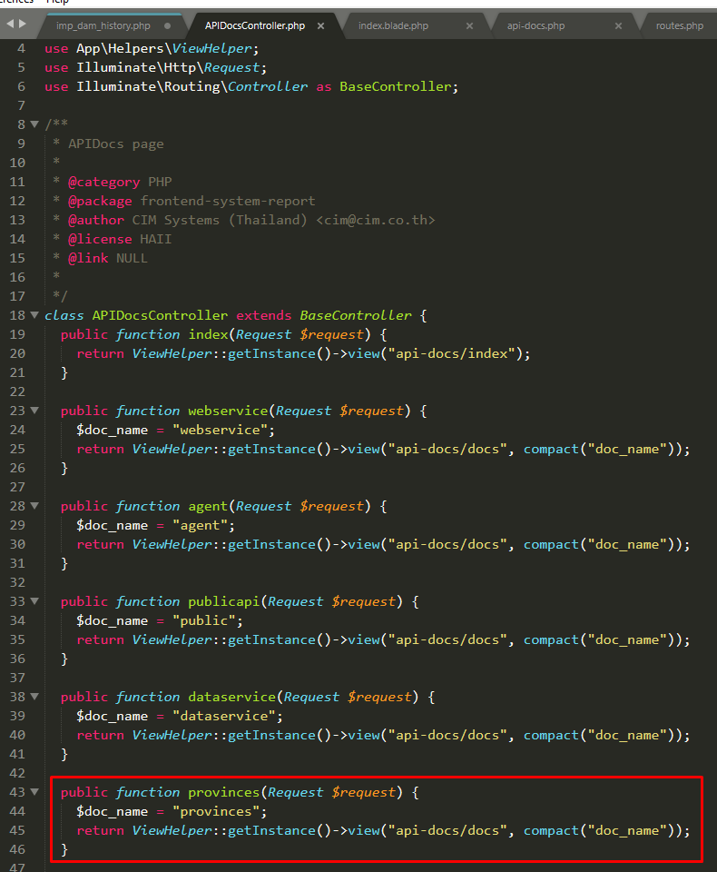
<br>
- app\Http\routes.php
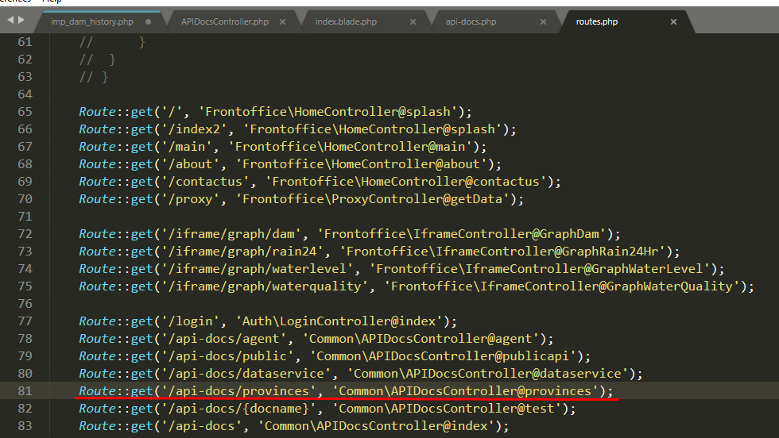

#####เมนูกลุ่มเอกสาร api
http://web.thaiwater.net/thaiwater30/api-docs
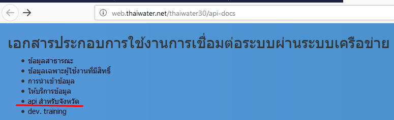

#####api-doc
http://web.thaiwater.net/thaiwater30/api-docs/provinces#/thaiwater30/provinces/get_thaiwater30_provinces_rain24
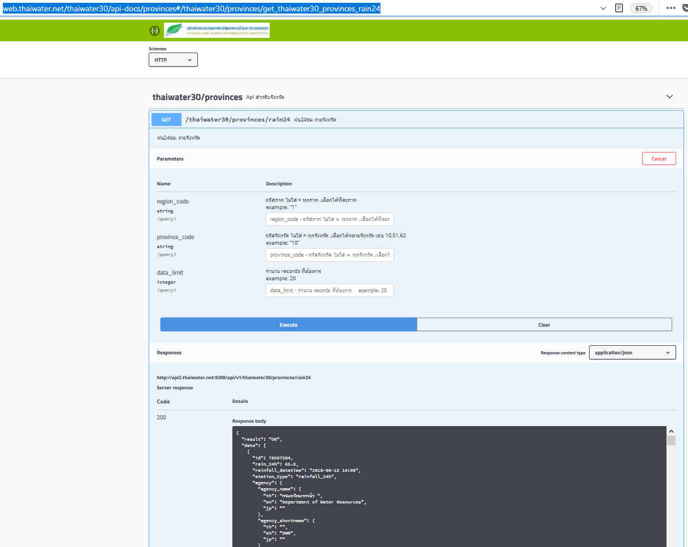
