<!---
author Thitiorn Meeprasert (thitiporn@haii.or.th)
-->
###การเพิ่ม api ใน thaiwater30 ตย. cctv
http://api2.thaiwater.net:9200/api/v1/thaiwater30/analyst/cctv

1. โครงสร้างของโปรแกรมเป็นแบบ MVC (Module-Control-View)
```
folder ของ api ในกลุ่มของนักวิเคราะห์
src\haii.or.th\api\thaiwater30\service\frontend\analyst\
```
- route คือไฟล์ main.go ที่อยู่ใต้ src\haii.or.th\api\thaiwater30\service\frontend\analyst\
- controller คือไฟล์ตามที่ route เรียกใช้งาน
- model คืออยู่ใน folder src\haii.or.th\api\thaiwater30\model\

2. สร้าง route การเรียกใช้งาน api
```
src\haii.or.th\api\thaiwater30\service\frontend\analyst\main.go
```
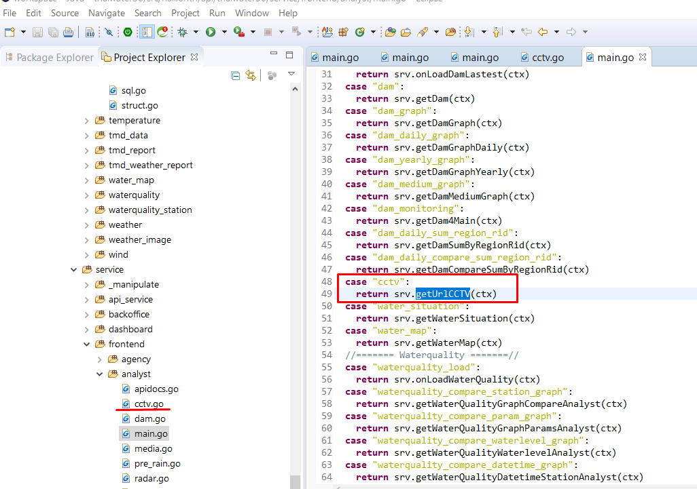

3. สร้างไฟล์ controller
```
src\haii.or.th\api\thaiwater30\service\frontend\analyst\cctv.go
```
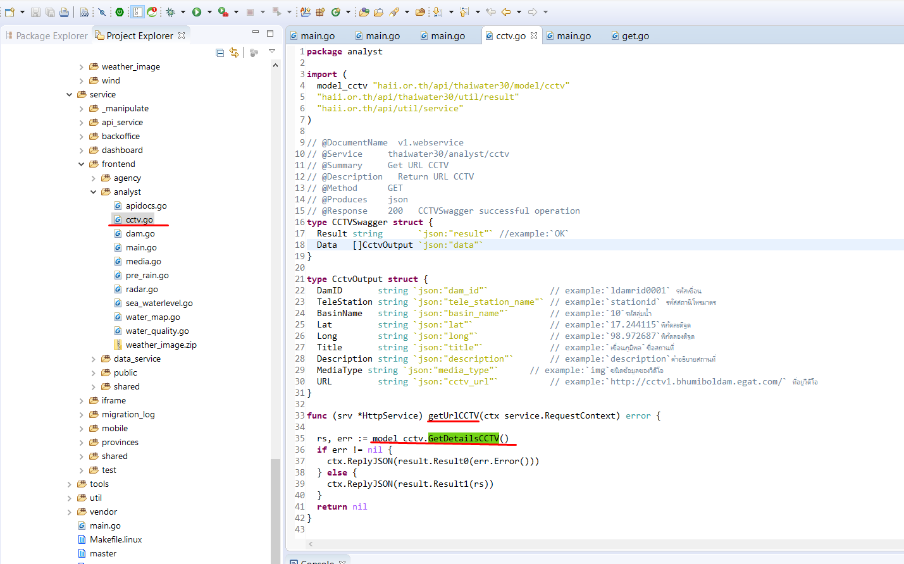

4.ในไฟล์ controller จะมีการเรียกใช้งาน model ที่สร้างไว้แล้ว หรือสร้างใหม่ตามความต้องการ
โดยโครงสร้างของ folder model ประกอบด้วย
- get.go ไฟล์เก็บ func model ที่ controller เรียกใช้งาน
- sql.go ไฟล์เก็บค่า constant SQL ที่ใช้ใน model นี้ทั้งหมด
- struct.go เก็บ struct สำหรับ model นี้ทั้ง input และ output

```
src\haii.or.th\api\thaiwater30\model\cctv\get.go
```
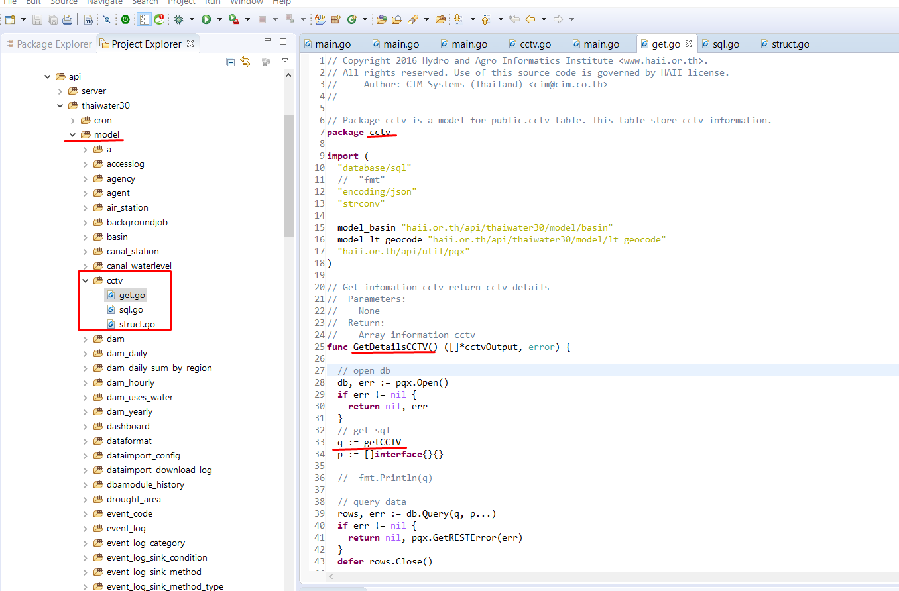

5. เมื่อเขียน api เรียบร้อยแล้วทดสอบ local ก่อนขึ้น production

- สร้าง tunnel สำหรับการ Map ฐานข้อมูลมาเป็น localhost
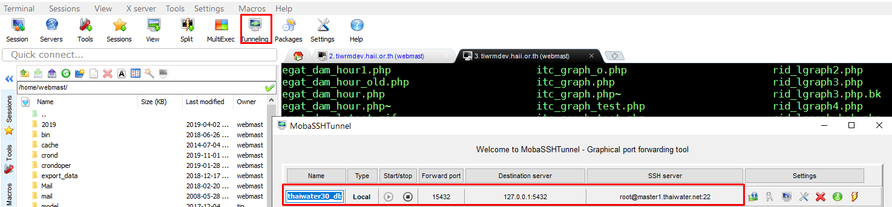

- config
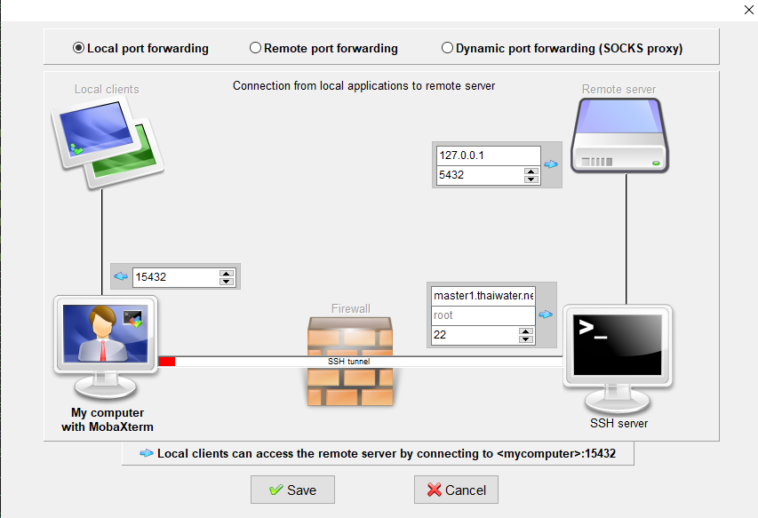

- เพิ่มการทดสอบ api โดยการเรียกใช้ model ที่สร้าง
```
src\haii.or.th\test\main.go
```
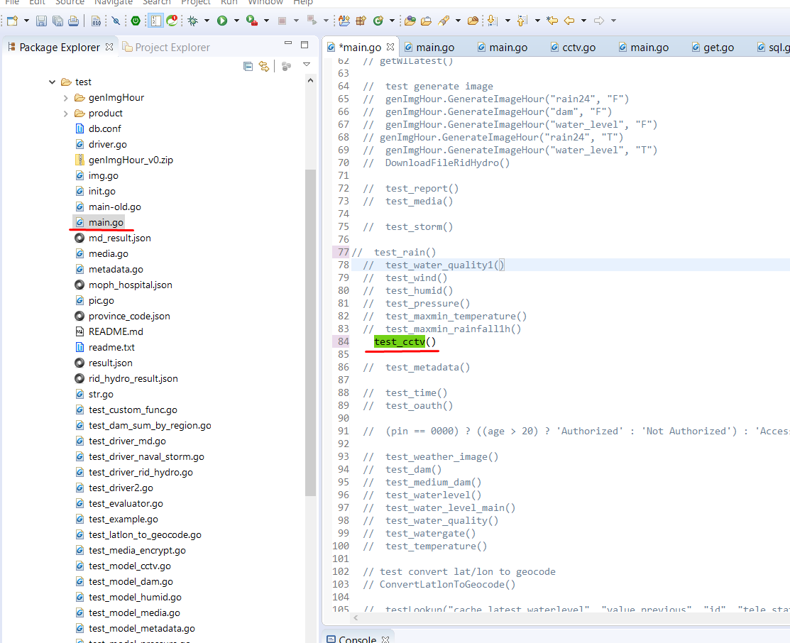

- สร้างไฟล์ func ที่เรียกทดสอบ api
```
src\haii.or.th\test\test_model_cctv.go
```
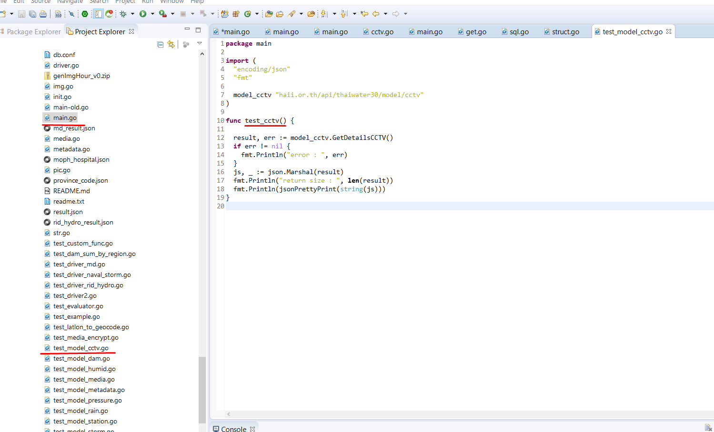

- การรันทดสอบ เมนู Run-> Run Configuration

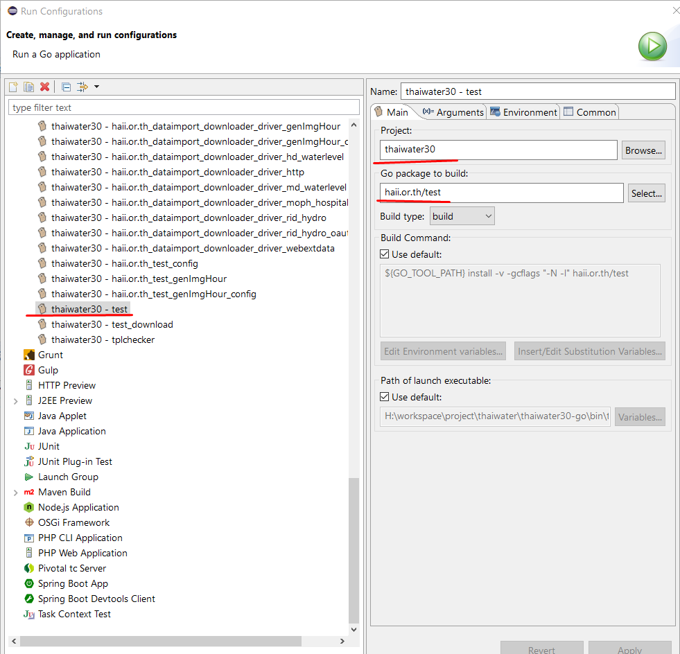

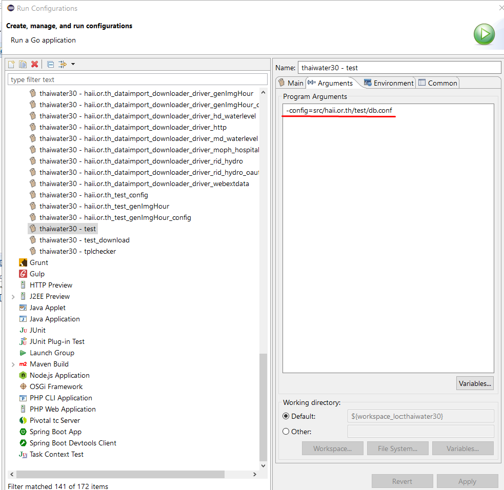

จากนั้นกด รัน จะได้ผลที่ได้การรันทดสอบ

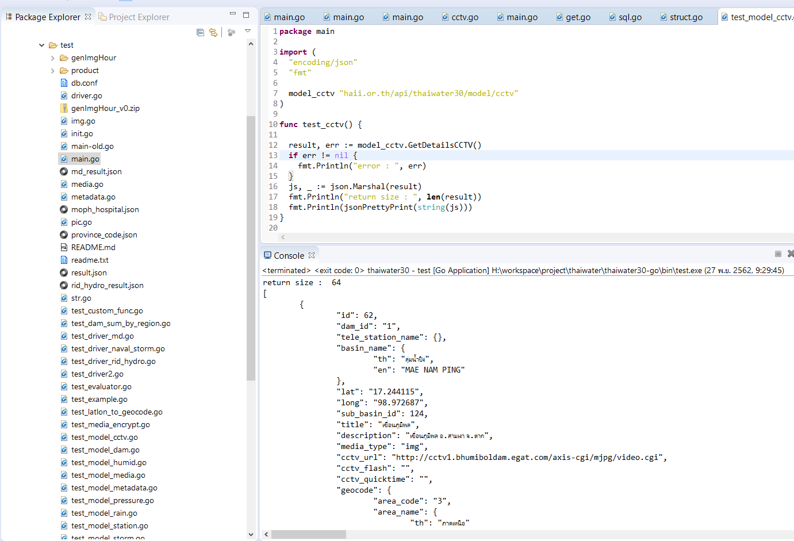

6. เมื่อทดสอบเรียบร้อยแล้ว push code ไปที่ git
7. การนำขึ้น production
ssh ไปที่เครื่อง api2.thaiwater.net
รันscript
```
./make_pull_install.sh
```
8. จากนั้นเรียกทดสอบ api ผ่าน browser

#### ตัวอย่าง api ที่ได้

http://api2.thaiwater.net:9200/api/v1/thaiwater30/analyst/cctv

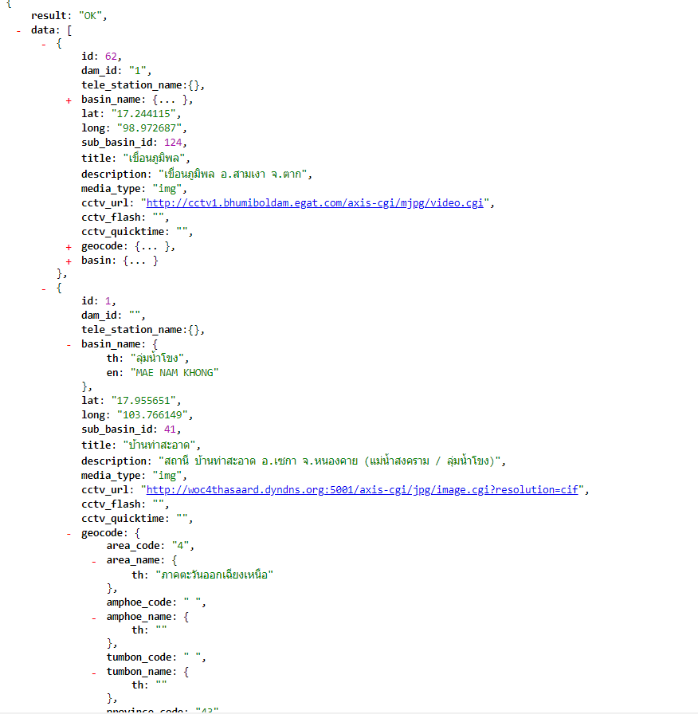
