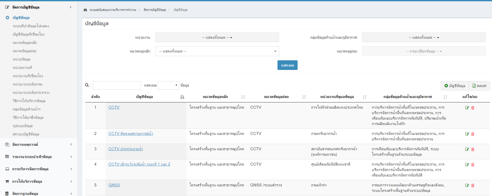

<!---
author Thitiorn Meeprasert (thitiporn@haii.or.th)
-->
### ระบบให้บริการข้อมูล

กรณีผู้ใช้แจ้ง เข้าระบบ shopping ข้อมูลและไม่พบรายการข้อมูลที่ต้องการ
http://web.thaiwater.net/thaiwater30/data_service

## ดำเนินการตรวจสอบดังนี้

1. ตรวจสอบ บัญชีข้อมูล metadata ใน backoffice (ระบบสนับสนุนการบริหารการทำงาน -> จัดการบัญชีข้อมูล ->  บัญชีข้อมูล) มีบัญชีข้อมูลนั้นหรือไม่
ถ้าไม่มีให้สร้างบัญชีข้อมูลขึ้นมาใหม่

ถ้ามีข้อมูลแล้ว ให้คลิกที่แก้ไข ตรวจสอบ
* **ข้อมูลต้องเชื่อมโยงแล้วเท่านั้น**
* **รูปแบบการเชื่อมโยงข้อมูล ต้องไม่เป็นแบบ Web Extract**

* **กรอกข้อมูลที่ require ให้ครบ** เนื่องจากบางข้อมูลเป็นข้อมูลที่ import เข้าสู่ตารางโดยตรงทำให้ข้อมูลที่ require จากแบบหน้าเว็บไม่มีข้อมูลนั้น

 
2. ตรวจสอบการตั้งค่า download (ระบบสนับสนุนการบริหารการทำงาน  -> เชื่อมโยงข้อมูล -> ตั้งค่าการ download)
**ระบบให้บริการข้อมูลผูกกับการเชื่อมโยงข้อมูล** ถ้าข้อมูลไหนเป็นข้อมูลที่ import เข้าสู่ตารางโดยตรงจะไม่มีในรายการให้บริการข้อมูล
ถ้าไม่มีให้สร้างการ download

 
3. ตรวจสอบการตั้งค่า dataset (ระบบสนับสนุนการบริหารการทำงาน -> เชื่อมโยงข้อมูล ->  ตั้งค่า dataset)

 
4. ตรวจสอบ ตั้งค่าการเชื่อมโยง (ระบบสนับสนุนการบริหารการทำงาน -> เชื่อมโยงข้อมูล -> ตั้งค่าการเชื่อมโยง) เป็นการผูก download, dataset เข้ากับบัญชีข้อมูล

