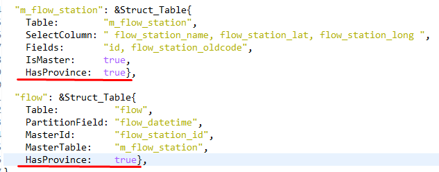

<!---
author Thitiorn Meeprasert (thitiporn@haii.or.th)
-->
###ตรวจสอบระบบให้บริการข้อมูลมี Error

1. Error "invalid memory address or nil pointer dereference"

- ตรวจสอบ service โดยการรันโปรแกรมทดสอบ เพื่อดูรายละเอียด Error ตามเอกสารด้านล่างนี้
http://web.thaiwater.net/thaiwater30/docs/api/data_service_gen_sql/index.html <br>
โดย service_id ได้จาก url ของ api เช่น
http://api2.thaiwater.net:9200/api/v1/thaiwater30/api_service?mid=562&eid=....
service_id = mid

<br>
- จากนั้นตรวจสอบว่า ข้อมูลจากระบบให้บริการที่ error เป็นข้อมูลอะไร โดย login backoffice  ระบบสนับสนุนการบริหารการทำงาน  -> เชื่อมโยงข้อมูล -> ตั้งค่าการเชื่อมโยง

<br>
 - จากนั้น ตรวจสอบว่าข้อมูลนี้ใช้ table อะไร

<br>
- จากนั้นตรวจสอบไฟล์ mapping ระบบให้บริการข้อมูล
```sh
src\haii.or.th\api\thaiwater30\model\metadata\map.go
```
<span style="color:red">\*\*</span>เมื่อมีการเพิ่ม table ใหม่ต้องเพิ่ม mapping ในไฟล์ api\thaiwater30\model\metadata\map.go ด้วยเพื่อให้ระบบให้บริการข้อมูลดึงมาใช้ได้
- ถ้าไม่มีให้เพิ่มการ mapping ดังตัวอย่างด้านล่างนี้


<br>
2. Error "The server encountered an internal error. Please retry the request. ...pq: missing FROM-clause entry for table lg"

- ตรวจสอบตามขั้นตอนด้านจน และตรวจสอบ field mapping กรณี Metadata มี "HasProvince" mapping ของ data ต้องมี "HasProvince" เหมือนกัน


