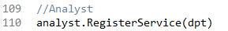
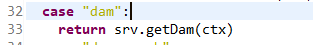
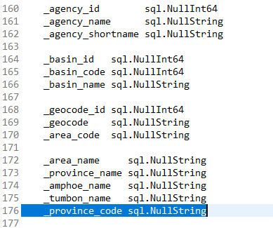
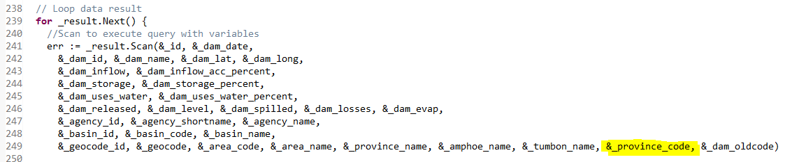

<!---
author Thitiorn Meeprasert (thitiporn@haii.or.th)
-->
###api เขื่อนเพิ่มเงื่อนไขรหัสภาค,รหัสจังหวัด
http://api2.thaiwater.net:9200/api/v1/thaiwater30/analyst/dam

1. ดูในไฟล์ line 110
```
haii.or.th\api\thaiwater30\main.go
```


2. ไฟล์ในข้อ 1 link ไปที่
```
haii.or.th\api\thaiwater30\service\frontend\analyst\main.go
```


3. ไฟล์ในข้อ 2 link ไปที่
```
haii.or.th\api\thaiwater30\service\frontend\analyst\dam.go
```
line 222 function getDam()

```go
p := &Struct_Dam_Inputparam{}

paramDamHourly := &model_dam_hourly.Struct_DamHourlyLastest_InputParam{}
paramDamHourly.Basin_id = p.BasinID
paramDamHourly.Dam_date = p.DamDate
resultDamHourly, err := model_dam_hourly.GetDamHourlyLastest(paramDamHourly)
```
เพิ่ม paramter ที่ต้องการให้เป็นเงื่อนไข ProvinceID,RegionID
```go
type Struct_Dam_Inputparam struct {
	DamDate    string `json:"dam_date"`    // required:false example:`2006-01-02` วันที่ ไม่ใส่ = วันปัจจุบัน
	DamType    int    `json:"dam_size"`    // required:false enum:[1,2] example:`1` ขนาดของเขื่อน ไม่ใส่ = ทุกขนาด, 1 = ขนาดใหญ่, 2 = ขนาดกลาง
	BasinID    string `json:"basin_id"`    // required:false example:`1` รหัสลุ่มน้ำ ไม่ใส่ = ทุกลุ่มน้ำ เลือกได้หลายลุ่มน้ำ เช่น 1,2,4
	ProvinceID string `json:"province_id"` // required:false example:`10` รหัสจังหวัด ไม่ใส่ = ทุกจังหวัด เลือกได้หลายจังหวัด เช่น 10,51,62
	RegionID   string `json:"region_id"`   // required:false example:`1` รหัสภาค ไม่ใส่ = ทุกภาค เลือกได้ทีละภาค
	//	ไม่จำเป็นต้องใช้เงื่อนไขนี้ เมื่อเลือกเขื่อนขนาดใหญ่ หน้าแสดงผล มี เขื่อนรายชั่วดมงด้วย
	//	IsHourly bool   `json:"is_hourly"` // example:true รายชั่วโมง
}
```
เพิ่ม Province_id ใน Struct_DamHourlyLastest_InputParam
```
haii.or.th\api\thaiwater30\model\dam_hourly\struct.go
```
เพิ่ม Province_id
```go
type Struct_DamHourlyLastest_InputParam struct {
	Province_id string `json:"province_id"` // รหัสจังหวัด
	Basin_id    string `json:"basin_id"`    // รหัสลุ่มน้ำ
	Dam_date    string `json:"dam_date"`    // วันที่
	Agency_id   string `json:"agency_id"`   // รหัสหน่วยงาน
	Start_date  string `json:"start_date"`  // วันที่ีเริ่มต้น
	End_date    string `json:"end_date"`    // วันที่สิ้นสุด
}
```
จากนั้นเพิ่มรับค่า
```go
paramDamHourly.Province_id = p.ProvinceID
```
4. เพิ่มเงื่อนไขในการ query ข้อมูล
```
haii.or.th\api\thaiwater30\model\dam_hourly\get.go
```
function GetDamHourlyLastest
```go
line 176 เพิ่มการรับค่าจากฐานข้อมูล
		_province_code sql.NullString
```


เพิ่มการตรวจสอบ parameter เพื่อสร้าง querystring

```go
//Check Filter province_id
	arrProvinceId := []string{}
	if param.Province_id != "" {
		arrProvinceId = strings.Split(param.Province_id, ",")
	}
	if len(arrProvinceId) > 0 {
		if len(arrProvinceId) == 1 {
			arrParam = append(arrParam, strings.Trim(param.Province_id, " "))
			sqlCmdWhere += " AND province_code = $" + strconv.Itoa(len(arrParam))
		} else {
			arrSqlCmd := []string{}
			for _, strId := range arrProvinceId {
				arrParam = append(arrParam, strings.Trim(strId, " "))
				arrSqlCmd = append(arrSqlCmd, "$"+strconv.Itoa(len(arrParam)))
			}
			sqlCmdWhere += " AND province_code IN (" + strings.Join(arrSqlCmd, ",") + ")"
		}
	}
```
เพิ่มตัวแปร "&amp;\_province_code" เพื่อรับค่าที่ query มาจากฐานข้อมูล



##### ทำการทดสอบก่อนที่จะ push ขึ้น git
1. clone project ทดสอบ
```
git clone https://git.haii.gin/cim_atikom/go-test.git
```

แก้ไข ไฟล์ main.go
```go
import(
	"encoding/json"
	"fmt"
	model_dam_hourly "haii.or.th/api/thaiwater30/model/dam_hourly"
)

func main() {
	// test model
	initDB()

	//	test dam add param province_id
	paramDamHourly := &model_dam_hourly.Struct_DamHourlyLastest_InputParam{}
	paramDamHourly.Province_id = "71"
	paramDamHourly.Region_id = ""
	paramDamHourly.Basin_id = ""
	paramDamHourly.Dam_date = ""

	resultDamHourly, err := model_dam_hourly.GetDamHourlyLastest(paramDamHourly)
	if err != nil {
		fmt.Println(err)
	}
	js, _ := json.Marshal(resultDamHourly)

	fmt.Println(string(js))
}
```
ถ้ารันได้ result json แสดงว่าโปรแกรมทำงานถูกต้อง

