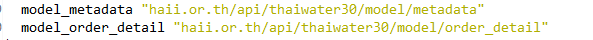

<!---
author Thitiorn Meeprasert (thitiporn@haii.or.th)
-->
###ให้บริการข้อมูล เพิ่มกรองข้อมูลจากระบบ<br>โทรมาตรสสนก. ไม่แสดงข้อมูลที่มีค่าเป็น 999999

1. ดูจาก folder
```
haii.or.th\api\thaiwater30\service\api_service\
```
ดูในไฟล์  
```
haii.or.th\api\thaiwater30\service\api_service\main.go
```

ว่าเรียกใช้ model อะไร


2. ดูที่ model model_order_detail  ว่ามีการใช้เงื่อนไขยังไงบ้าง
```
haii.or.th/api/thaiwater30/model/order_detail/sql.go
```

แก้ไขไฟล์
```
haii.or.th\api\thaiwater30\model\metadata\map.go
```
เพิ่ม

```go  
Where: "humid_value " + filterValue,
```

ใน struct ข้อมูลที่มาจากโทรมาตรสสนก.
```go
var filterValue = "999999"
// Where:          "humid_value " + filterValue,

"humid": &Struct_Table{
	Table:          "humid",
	PartitionField: "humid_datetime",
	MasterId:       "tele_station_id",
	MasterTable:    "m_tele_station",
	Where:          "humid_value " + filterValue,
	HasProvince:    true,
	HasBasin:       true},

// เพิ่มเงื่อนไข query ข้อมูล value <> 999999
//Where:          "pressure_value <> " + filterValue,
"pressure": &Struct_Table{
	Table:          "pressure",
	PartitionField: "pressure_datetime",
	MasterId:       "tele_station_id",
	MasterTable:    "m_tele_station",
	Where:          "pressure_value <> " + filterValue,
	HasProvince:    true,
	HasBasin:       true,
},

"rainfall_daily": &Struct_Table{
	Table:          "rainfall_daily",
	PartitionField: "rainfall_datetime",
	MasterId:       "tele_station_id",
	MasterTable:    "m_tele_station",
	WhereHAII:      " m.tele_station_type = 'R' ",
	Where:          "rainfall_value <> " + filterValue,
	HasProvince:    true,
	HasBasin:       true},

"soilmoisture": &Struct_Table{
	Table:          "soilmoisture",
	PartitionField: "soil_datetime",
	MasterId:       "tele_station_id",
	MasterTable:    "m_tele_station",
	Where:          "soil_value <> " + filterValue,
	HasProvince:    true,
	HasBasin:       true},

"solar": &Struct_Table{
	Table:          "solar",
	PartitionField: "solar_datetime",
	MasterId:       "tele_station_id",
	MasterTable:    "m_tele_station",
	Where:          "solar_value <> " + filterValue,
	HasProvince:    true,
	HasBasin:       true},

"temperature": &Struct_Table{
	Table:          "temperature",
	PartitionField: "temp_datetime",
	MasterId:       "tele_station_id",
	MasterTable:    "m_tele_station",
	Where:          "temp_value <> " + filterValue,
	HasProvince:    true,
	HasBasin:       true},

```

3. แก้ไขไฟล์
```
haii.or.th\api\thaiwater30\model\metadata\struct.go
```
เพิ่ม
```go
 Where          string // เพิ่มเงื่อนไข ให้ value 999999
```
```go
//    map struct table ที่เตรียวไว้สำหรับ shopping
type Struct_Table struct {
	Table          string // ชื่อตาราง
	PartitionField string // ชื่อ partition field
	MasterId       string // ชื่อ master id field
	MasterTable    string // ชื่อ master table
	SelectColumn   string //
	WhereHAII      string // เงื่อนไขถ้าเป็น สสนก
	Where          string // เพิ่มเงื่อนไข ให้ value 999999

	IsMaster    bool // เป็นตาราง master ?
	HasProvince bool // มี geocode_id ในตาราง?
	HasBasin    bool //    มี subbasin_id ในตาราง?
}
```

4. ดูที่ model model_order_detail
```
haii.or.th/api/thaiwater30/model/order_detail/sql.go
```
line 243
```go
// เพิ่มเงื่อนไข query ข้อมูล value 999999
if st.Where != "" {
	q += " AND " + st.Where + " "
}
```

5. ทำการส่งโค๊ดขึ้น git (Add, Commit, Push)
6. ssh ไปยังเครื่อง api.thaiwater.net git pull และ install api server ใหม่ โดยใช้คำสั่งดังนี้
```sh
cd go_local/src/haii.or.th/api/thaiwater30
make pull install
```
