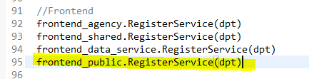
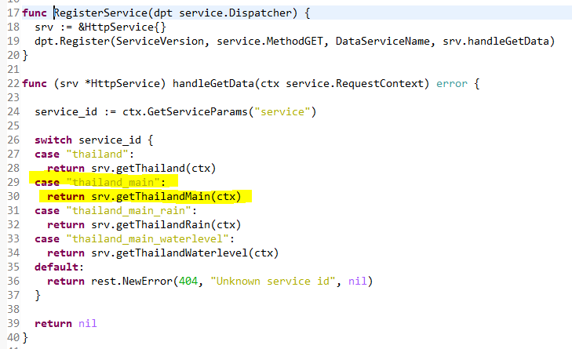
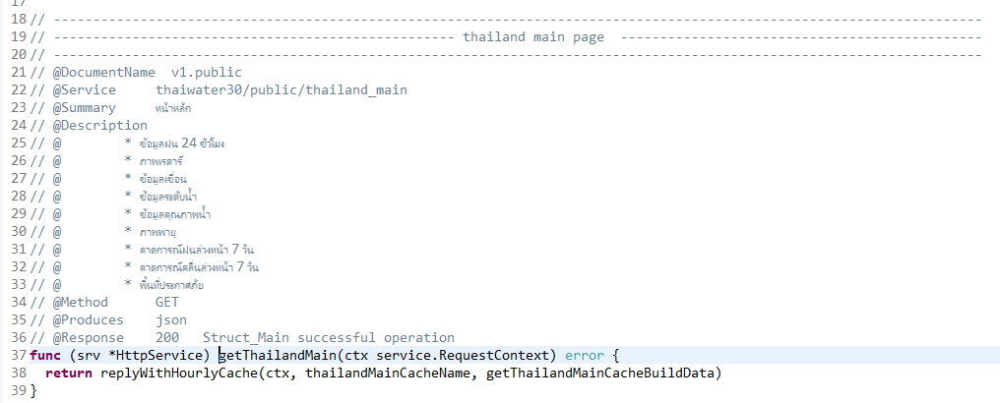
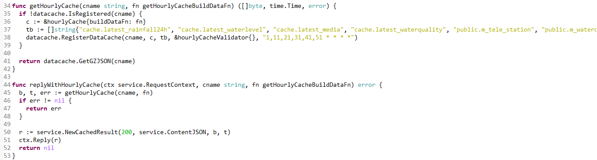
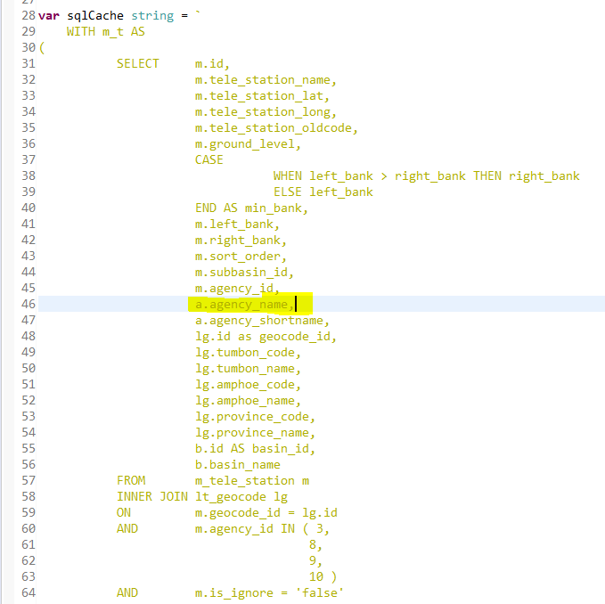
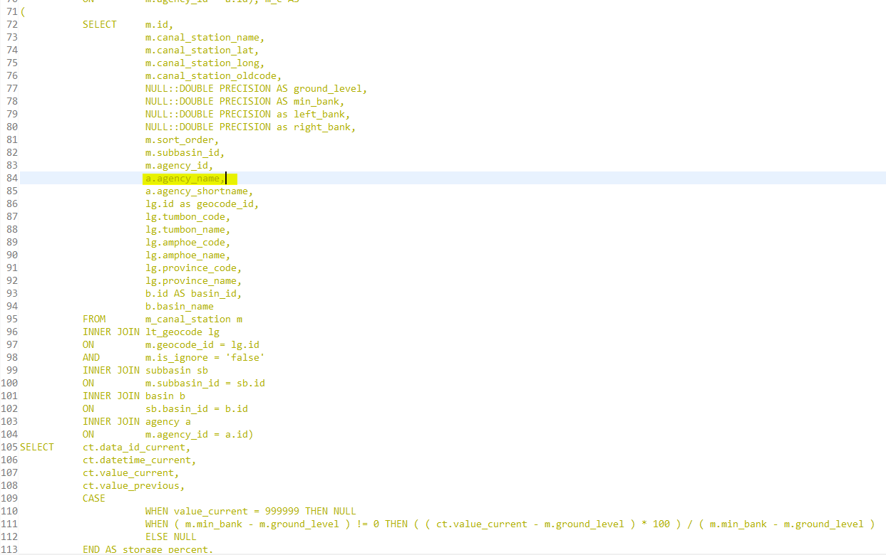
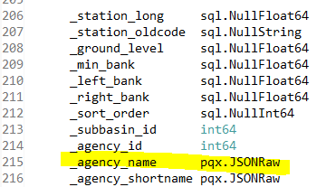
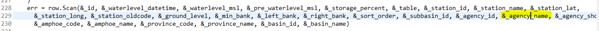
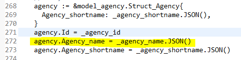

<!---
author Thitiorn Meeprasert (thitiporn@haii.or.th)
-->
### แก้ไข api สำหรับหน้าแสดงผล thailand/main ให้ส่งข้อมูลหน่วยงาน
ใช้ inspector หาว่าหน้านี้ใช้ service อะไร และตรวจสอบว่ามีข้อมูล agency name หรือไม่
http://web.thaiwater.net/thaiwater30/main

service
http://api2.thaiwater.net:9200/api/v1/thaiwater30/public/thailand_main

1. ดูในไฟล์ เปรียบเหมือน route ของ service เพื่อดูว่าเรียกใช้ function อะไร
```
haii.or.th\api\thaiwater30\main.go
```


2. ไฟล์ในข้อ 1 link ไปที่
```
haii.or.th\api\thaiwater30\service\frontend\public\main.go
```


3. ไฟล์ในข้อ 2 link ไปที่
```
haii.or.th\api\thaiwater30\service\frontend\public\main_page.go
```


4. ไฟล์ในข้อ 3 link ไปที่
```
haii.or.th\api\thaiwater30\service\frontend\public\hourly_cache.go
```



แก้ไขที่ไฟล์
```
src\haii.or.th\api\thaiwater30\model\tele_waterlevel\cache.go
```

```sql
var sqlCache string = `
```

เพิ่ม line 46
a.agency_name,


line 84
a.agency_name,


line 215 เพิ่มตัวแปรรับใน วน loop query
_agency_name pqx.JSONRaw


line 229 row.scan รับค่าที่อ่านจาก query
&_agency_name,


row 263 เพิ่มใน struct agency เพื่อแสดง tab ใน json

