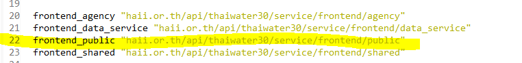
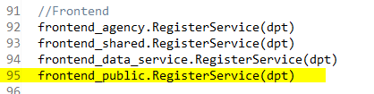
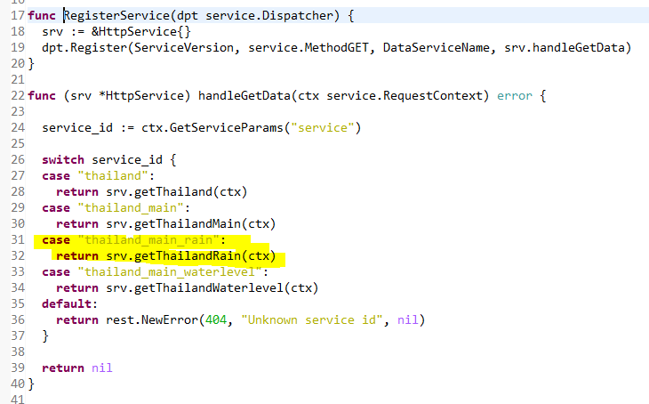
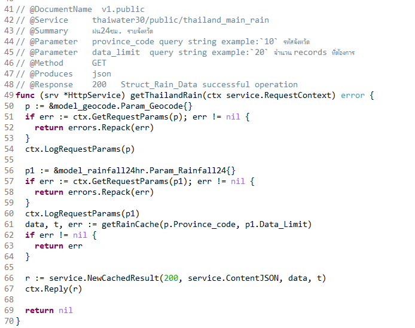
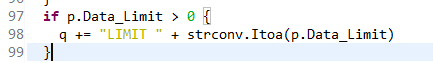

<!---
author Thitiorn Meeprasert (thitiporn@haii.or.th)
-->
### api thaiwater30/public/thailand_main_rain เพิ่มเงื่อนไข data limit

service service http://api2.thaiwater.net:9200/api/v1/thaiwater30/public/thailand_main_rain

1. ดูในไฟล์ เพื่อหา route ของ api เพื่อไปดูต่อว่าใช้ model อะไร
```
haii.or.th\api\thaiwater30\main.go
```
line 22 ระบุว่า include file อะไร


line 95 เพื่อดู function ว่าใช้ function อะไร


กด F3 ที่ชื่อ function จะเปิด reference ไปที่ไฟล์ที่มี function
```
haii.or.th\api\thaiwater30\service\frontend\public\main.go
```


```
haii.or.th\api\thaiwater30\service\frontend\public\main_page.go
```




ไฟล์
```
haii.or.th\api\thaiwater30\model\rainfall24hr\cache.go
```



