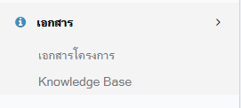
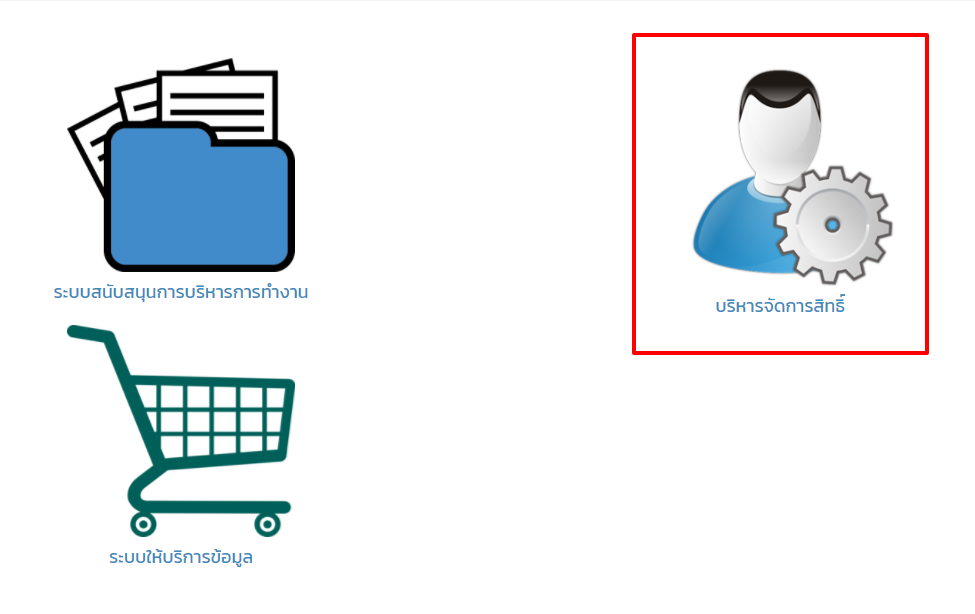
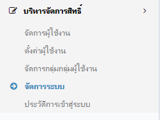
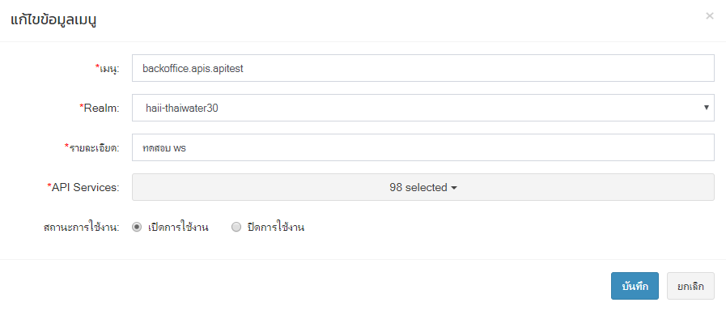
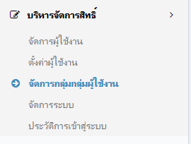
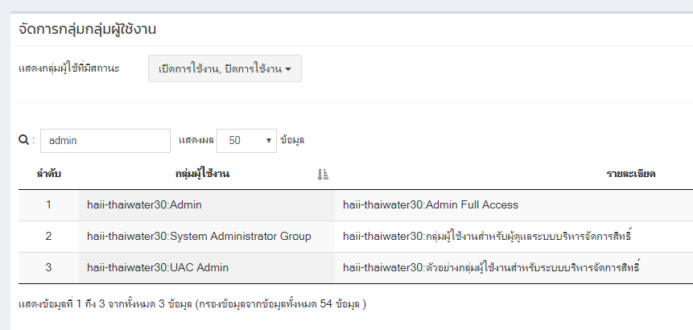
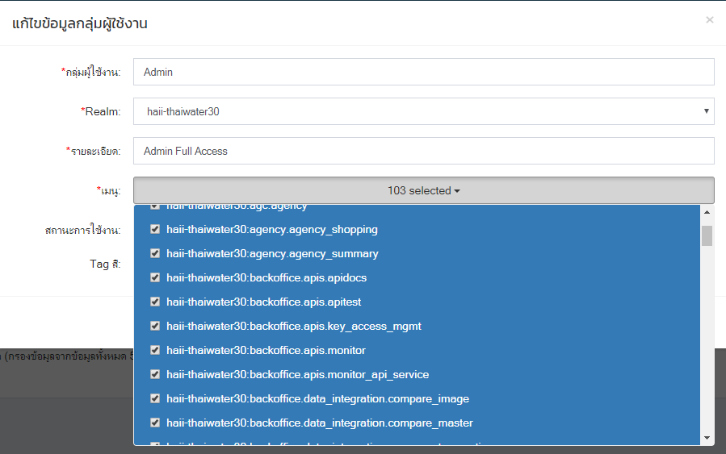

# การเพิ่มเมนูระบบ
## การเพิ่มเมนู
1. ทำการเปิดไฟล์ menu ที่ resources/views/production/backoffice/layout/\_main-menu.blade.php
2. เมนูจะถูกแบ่งเป็นกลุ่มตามโมดูลของระบบ เช่น
   * $user_menu - เมนูระบบสนับสนุนบริหารการทำงาน
   * $admin_menu - เมนูระบบจัดการสิทธิ์
3. เพิ่มกลุ่มเมนู
```php
<?php
array(
  'text' => 'เอกสาร',   // ชื่อกลุ่มเมนู
  'icon' => 'fa-info-circle', // font icon อ้างอิงจาก fontawesome
  'items' => array()  // เมนูย่อยภายใน (ดูรายละเอียดข้อถัดไป)
)
```
4. การเพิ่มเมนูย่อย
```php
<?php
array(
  'text' => 'เอกสาร',
  'icon' => 'fa-info-circle',
  'items' => array(
    array(
      'srv' => 'backoffice.docs.project',   // ชื่อ service สามารถทำการลงทะเบียนผ่านทางระบบจัดการสิทธิ์
      'text' => 'เอกสารโครงการ',  // ชื่อหรือข้อความที่แสดงเมนู หากมีหลายภาษาสามารถทำตัวแปรใส่ในไฟล์ภาษาได้
      'href' => 'https://drive.google.com/drive/folders/0B3IjoVwlGDuuclBpTnR4UjNwUjQ',  // ลิ้งค์ของเมนู
      'target' => '_blank'  // เปิดลิ้งค์เป็นหน้าใหม่ ถ้าเปิดหน้าเดิมไม่ต้องใส่
    ),
    array(
      'srv' => 'backoffice.docs.help',
      'text' => 'Knowledge Base',
      // 'text' => trans('backoffice/tools/check_image.page_name'), ตัวอย่างการแปลภาษา กรณีนี้จะอยู่ที่ resources/lang/.ภาษา./backoffice/tools/check_image.php
      'href' => $l->httpUrl('backoffice/km')  // ลิ้งค์ของเมนู กรณีนี้จะลิ้งค์ไปที่ Laravel Route
    )
  )
```
5. ทำการส่งโค๊ดขึ้น git (Add, Commit, Push)
6. ไปยังเครื่อง server และทำการ git pull origin demo
7. ทำการทดสอบโดยเปิด browser และตรวจสอบเมนูที่เพิ่ม โดยเมนูที่เพิ่มหากไม่มีการลงทะเบียนในระบบจัดการสิทธิ จะไม่สามารถกำหนดสิทธิในเมนูได้

   

## การลงทะเบียนเมนู
เมื่อทำการเพิ่มเนูแล้ว เมนูจะยังไม่มี permission จึงจำเป็นจะต้องทำการลงทเะบียนเมนูในระบบ และจัดการ permission เพื่อให้ผู้ใช้แต่ละกลุ่มมีสิทธิการเข้าใช้
1. ไปที่ระบบจัดการสิทธิ์

   

2. เข้าเมนู จัดการระบบ

   

3. ทำการเพิ่ม permission
   * เมนู - ชื่ออ้างอิงของเมนู การตั้งจะใช้ ชื่อระบบ.กลุ่มเมนู.เมนู เช่น backoffice.apis.apitest จะสื่อถึงระบบใน backoffice กลุ่มเมนูของ APIs และเมนูการทดสอบ api (สามารถดูในเมนูอื่นๆ ที่ลงทะเบียนไว้แล้ว เพื่อความเข้าใจในการตั้งชื่อ) โดยชื่อห้ามซ้ำกับของเดิมในระบบ ชื่อที่ตั้งนี้เราจะำไปใส่ใน srv ตอนเพิ่มเมนูใน template

   * Realm - บอกถึงเมนูนี้ จะอยู่ในกลุ่มของระบบไหน ในที่นี่เป็น haii-thaiwater30 เป็นระบบของ thaiwater30

   * รายละเอียด - รายละเอียดเป็นข้อความ

   * API Services - เลือกว่าเมนูนี้สามารถใช้ ws ตัวใดได้

   * สถานะการใช้งาน - เปิดหรือปิดการใช้งาน
   &nbsp;
   

## การตั้ง menu permission
1. ไปที่เมนูจัดการกลุ่มผู้ใช้งาน ในโมดูลจัดการสิทธิ์
  

2. ทำการค้นหากลุ่มที่ต้องการจัดการ permission ในที่นี่จะแก้ไขที่กลุ่ม admin ให้เข้าเมนู apitest ได้
   

3. กดเข้าไปแก้ไขในกลุ่ม admin_menu

4. ในเมนู dropdown list ให้ทำการเลือกเมนูที่ต้องการ ในที่นี้จะเป็น apitest
   
