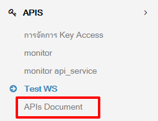
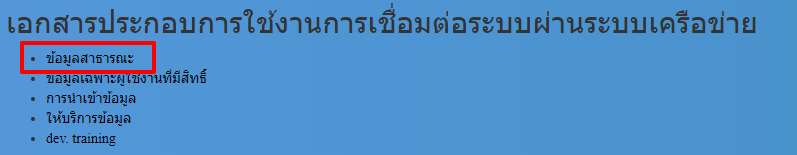
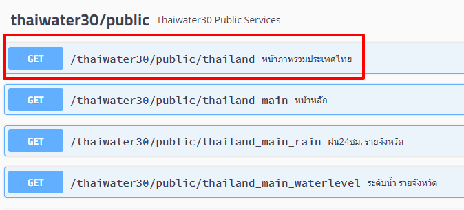
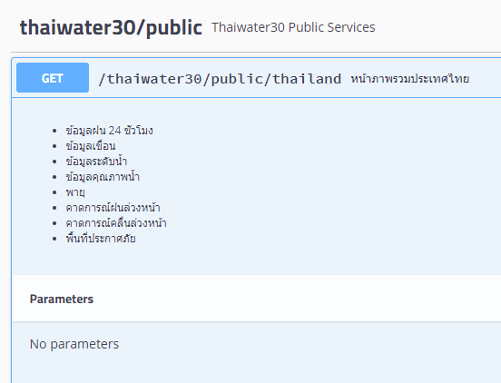
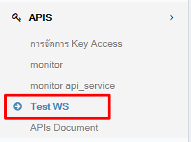
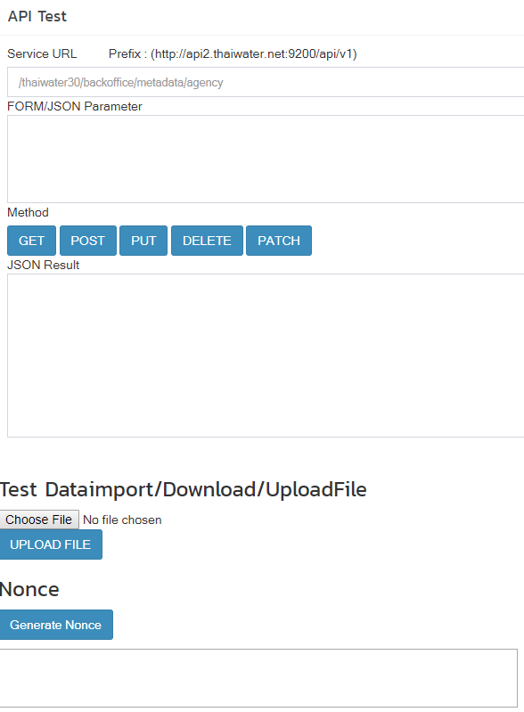
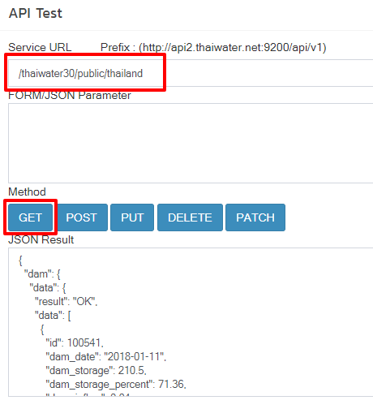
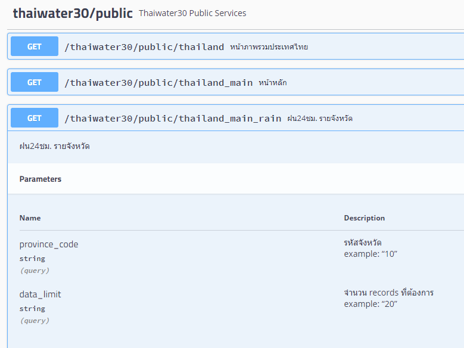
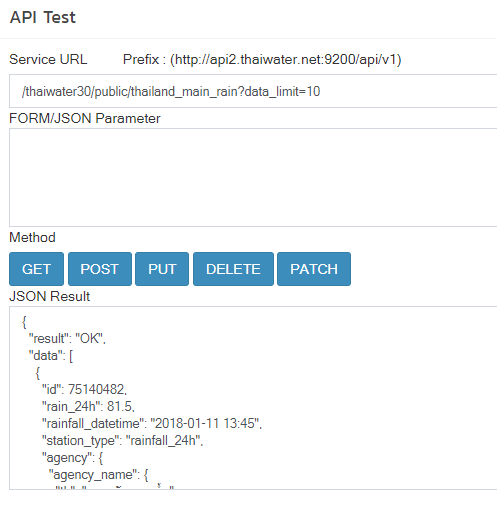

# การตรวจสอบ Web Service
## การเรียกดูเอกสาร web Service
1. ไปยังเมนู APIs document
   

2. ในที่นี้จะเข้าไปยัง web service ข้อมูลสาธารณะ
  
3. ดูรายละเอียดที่ web service หน้ารวมประเทศไทย ซึ่งจะมีรายละเอียดของ web service นี้ โดยมีระบุว่าไม่ต้องการ parameter
   
   

4. ทำการก็อปปี้ web service url ที่ต้องการตรวจสอบ ในที่นี้คือ **"/thaiwater30/public/thailand"**

## การทดสอบ web service แบบไม่มีพารามิเตอร์
1. เข้าเมนู Test WS ภายใต้กลุ่มเมนู APIS
   
2. จะพบกับหน้าจอทดสอบ web service
   * **Service URL** - URL ของ web service ที่ได้จากเอกสาร
   * **FORM/JSON Parameter** - พารามิเตอร์ของ web service
   * **Method** - method ของการส่งข้อมูล ซึ่งตรวจสอบได้จากเอกสาร ว่า service นั้นๆ ส่งข้อมูลแบบไหน
   * **JSON Result** - ผลลัพธ์ที่ได้จาก web service
   * **Test Dataimport/Download/UploadFile** -
   * **Nounce** -

   
3. จาก ws ที่เราต้องการทดสอบ คือหน้ารวมประเทศไทย ซึ่งมี url เป็น **"/thaiwater30/public/thailand"** และ Method เป็น GET ใส่ข้อมูลเหล่านี้ในฟอร์ม และทำการกด GET
   
4. ตรวจสอบผลลัพธ์ในช่อง JSON Result

## การทดสอบ web service แบบมีพารามิเตอร์
1. ในที่นี้จะทดลองทดสอบ ws ฝน 24 ชมรายจังหวัด จากเอกสารจะได้ข้อมูลดังนี้
   
2. ws จะต้องการพารามิเตอร์ 24 ตัว คือ รหัสจังหวัด และ จำนวน record ที่ต้องการ
3. สมมติรหัสจังหวัดที่ต้องการทดสอบคือ 10 (กรุงเทพ) และจำนวน record คือ 10 โดยเราสามารถหารหัสจังหวัดได้ในตาราง public.lt_geocode
4. ในกรณีนี้เป็นรูปแบบ GET ให้ทำการใส่พารามิเตอร์ใน query string เข้าไปได้เลย แต่ถ้าเป็นแบบ POST เราจะต้องใส่พารามิเตอร์ในรูปแบบ JSON ในช่อง FORM/JSON Parameter
   
5. กด GET ตามเอกสาร ws ที่ส่งข้อมูลแบบ get
6. ตรวจสอบผลลัพธ์
