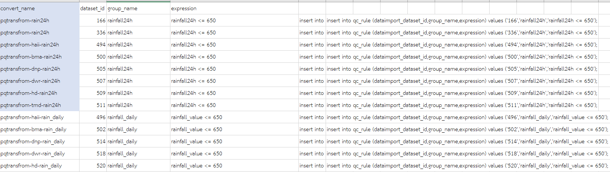

<!---
author Thitiorn Meeprasert (thitiporn@haii.or.th)
-->
###การเพิ่ม qc_rule

1.การสร้าง download
2.  สร้าง dataset
ใช้ชื่อ คำนวนฝน-[agency_short_name]-[data_type] เช่น คำนวนฝน-bma-rain1h หมายถึง การคำนวนฝน 1 ชม. ของ bma
<br>
3. ค้นหา dataset ของคำนวนฝน

<br>
4. สร้าง qc_rule ใช้ dataset id
การสร้าง expresseion หมายถึงเงื่อนไขหรือเกณฑ์การกรอง ให้ดูจาก การ map dataset ว่าใช้ field value อะไรเช่น

```go
rainfall24 = ใช้ field rainfall24
rainfall_daily = ใช้ rainfall_value
```


5. insert ข้อมูลใน table : public.qc_rule
```sql
insert into qc_rule (dataimport_dataset_id,group_name,expression) values ('166','rainfall24h','rainfall24h <= 650');
insert into qc_rule (dataimport_dataset_id,group_name,expression) values ('336','rainfall24h','rainfall24h <= 650');
insert into qc_rule (dataimport_dataset_id,group_name,expression) values ('494','rainfall24h','rainfall24h <= 650');
insert into qc_rule (dataimport_dataset_id,group_name,expression) values ('500','rainfall24h','rainfall24h <= 650');
insert into qc_rule (dataimport_dataset_id,group_name,expression) values ('505','rainfall24h','rainfall24h <= 650');
insert into qc_rule (dataimport_dataset_id,group_name,expression) values ('507','rainfall24h','rainfall24h <= 650');
insert into qc_rule (dataimport_dataset_id,group_name,expression) values ('509','rainfall24h','rainfall24h <= 650');
insert into qc_rule (dataimport_dataset_id,group_name,expression) values ('511','rainfall24h','rainfall24h <= 650');
insert into qc_rule (dataimport_dataset_id,group_name,expression) values ('496','rainfall_daily','rainfall_value <= 650');
insert into qc_rule (dataimport_dataset_id,group_name,expression) values ('502','rainfall_daily','rainfall_value <= 650');
insert into qc_rule (dataimport_dataset_id,group_name,expression) values ('514','rainfall_daily','rainfall_value <= 650');
insert into qc_rule (dataimport_dataset_id,group_name,expression) values ('518','rainfall_daily','rainfall_value <= 650');
insert into qc_rule (dataimport_dataset_id,group_name,expression) values ('520','rainfall_daily','rainfall_value <= 650');
```

6. backoffice ระบบสนับสนุนการบริหารการทำงาน->เชื่อมโยงข้อมูล->ตั้งค่า dataset สำหรับคำนวณฝน เพิ่ม field qc_status

