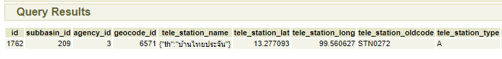
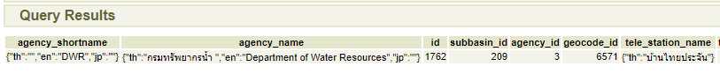
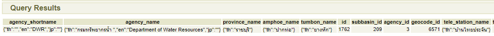

# การตรวจสอบ Metadata สถานีโทรมาตร
สถานีโทรมาตรจากทุกหน่วยงาน จะมีการปรับเปลี่ยน id ใหม่ ทำให้ค่า id จะเป็นตัวเลขซึ่งทำให้ไม่ทราบว่าเป็นสถานีของหน่วยงานไหน การตรวจสอบสามารถทำได้ดังนี้
1. เก็บค่า id ของโทรมาตรจาก url ซึ่งใน url การดูข้อมูลของสถานีจะมีการส่ง id สถานีไป เช่น
http://web.thaiwater.net/thaiwater30/1762&province=70
ค่า id=1762
2. นำค่า id ไปตรวจสอบในฐานข้อมูลในเครื่อง
   * Host - 192.168.12.136
   * phpPgAdmin - https://192.168.12.136/phpPgAdmin/
   * Schema - public
   * Table - m_tele_station
3. รันคำสั่ง sql (กรณีที่เราได้ id เป็น 1762)
```sql
SELECT * FROM m_tele_station
WHERE id = 1762
```

4. กรณีต้องการชื่อหน่วยงาน ให้ทำการ join กับตาราง agency
```sql
SELECT a.agency_shortname, a.agency_name, *
FROM m_tele_station m
INNER JOIN agency a ON m.agency_id = a.id
WHERE m.id = 1762
```
   

5. หากต้องการชื่อพื้นที่ เช่น จังหวัด อำเภอ ตำบล ให้ทำการ join กับตาราง lt_geocode
```sql
SELECT a.agency_shortname, a.agency_name,
   g.province_name, g.amphoe_name, g.tumbon_name, *
FROM m_tele_station m
INNER JOIN agency a ON m.agency_id = a.id
INNER JOIN lt_geocode g ON m.geocode_id = g.id
WHERE m.id = 1762
```
   
