### ตรวจสอบเชื้่อมโยงข้อมูล กรมอุตุวิทยา
------
ผู้ใช้แจ้งตรวจสอบสถานีฝนของกรมอุตุ ตามที่วงสีแดงไว้ **ข้อมูลเหมือนจะค้าง ไม่อัพเดท**

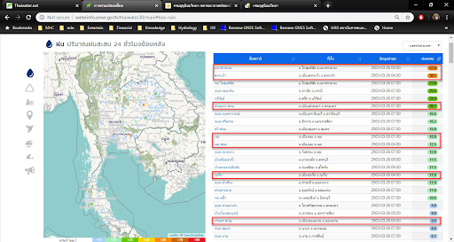

1. เข้าไปที่ [Backoffice thaiwater30](http://web.thaiwater.net/thaiwater30/backoffice/data_integration/mgmt_script)

2. เมนู  ระบบสนับสนุนการบริหารการทำงาน ->  เชื่อมโยงข้อมูล  -> ตั้งค่าการ download

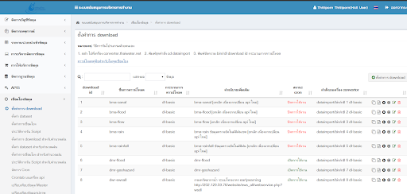

3. ค้นหา tmd  กดที่แก้ไข เพื่อดูรายละเอียด download id

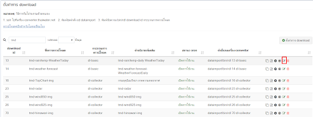

4. ตรวจสอบ โฮส นำ url เปิดใน browser แล้วค้นหาดูสถานีตามที่ผู้ใช้แจ้ง ดูว่ามีข้อมูลใหม่มาหรือไม่

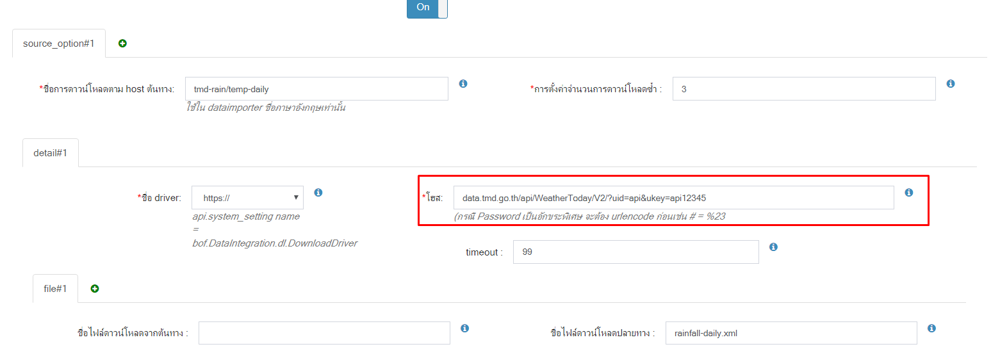

5. นำ url เปิดบน browser เพื่อตรวจสอบข้อมูลเบื้องต้น ว่าข้อมูลต้นฉบับ update หรือไม่ **กรณีข้อมูลต้นฉบับไม่ update แจ้งผู้ใช้**

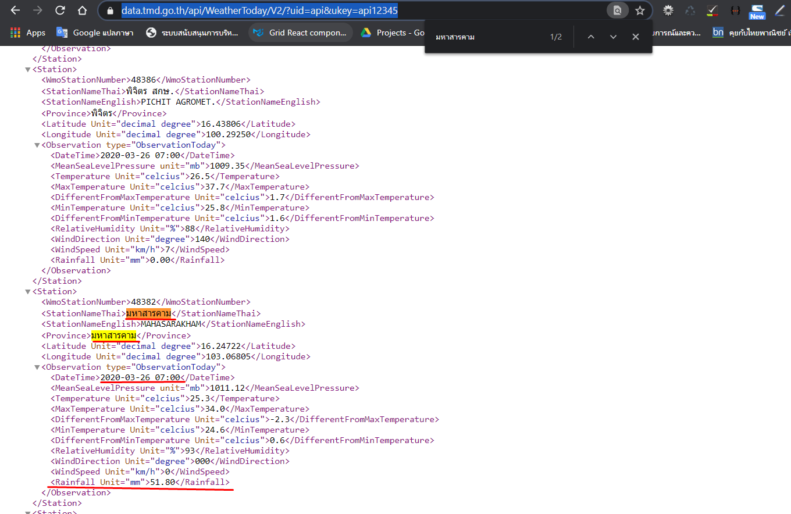

6. กรณีข้อมูลต้นทาง update ให้ตรวจสอบข้อมูลในระบบ thaiwater30 ต่อ

```
ตรวจสอบข้อมูล
Server : master.thaiwater.net
Database thaiwater30
Schema : public
```

7. หา รหัสหน่วยงานกรมอุตุ
Table : agency

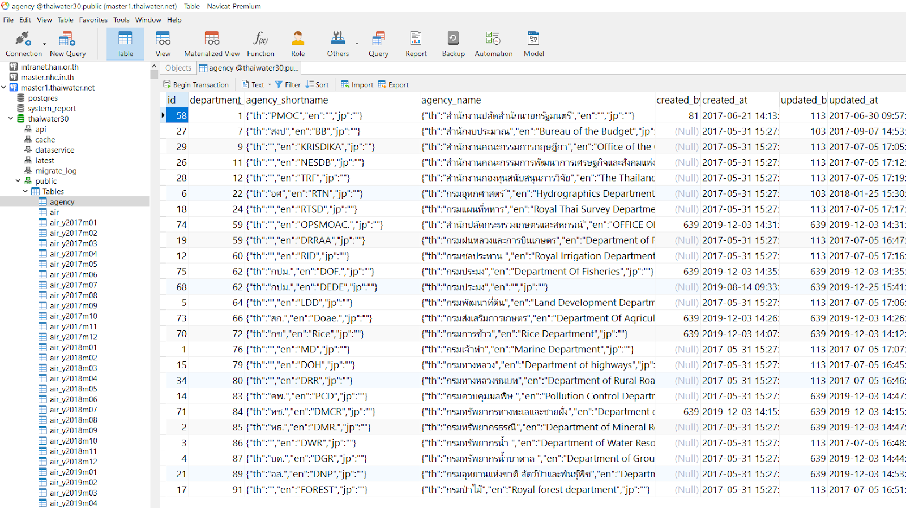

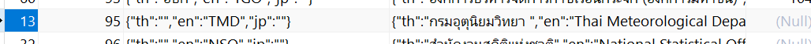

8. ดูที่
Schema : latest ดูว่ามีข้อมูลฝนเข้ามาหรือไม่

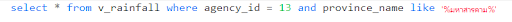


9. ดูต่อที่ฝน 24 ว่าการคำนวนฝนได้นำข้อมูลเข้ามาหรือไม่ เนื่องจากข้อมูลที่แสดงหน้าเว็บเป็นข้ัอมูล ฝน 24

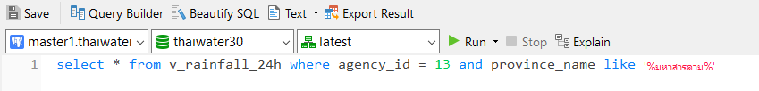

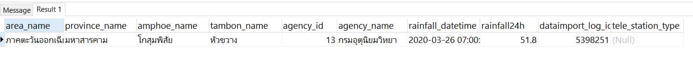

10. สรุปได้ว่าข้อมูลเข้าในระบบแล้ว
จากนั้นตรวจสอบ api ว่ามีข้อมูลหรือไม่

http://api2.thaiwater.net:9200/api/v1/thaiwater30/public/thailand_main

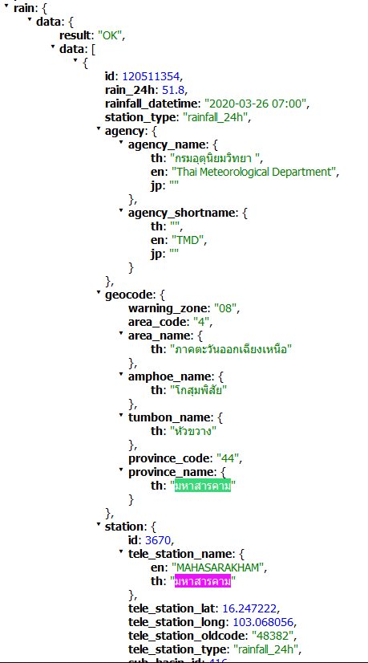

11. จากนั้นตรวจสอบหน้าเว็บ
http://web.thaiwater.net/thaiwater30/main

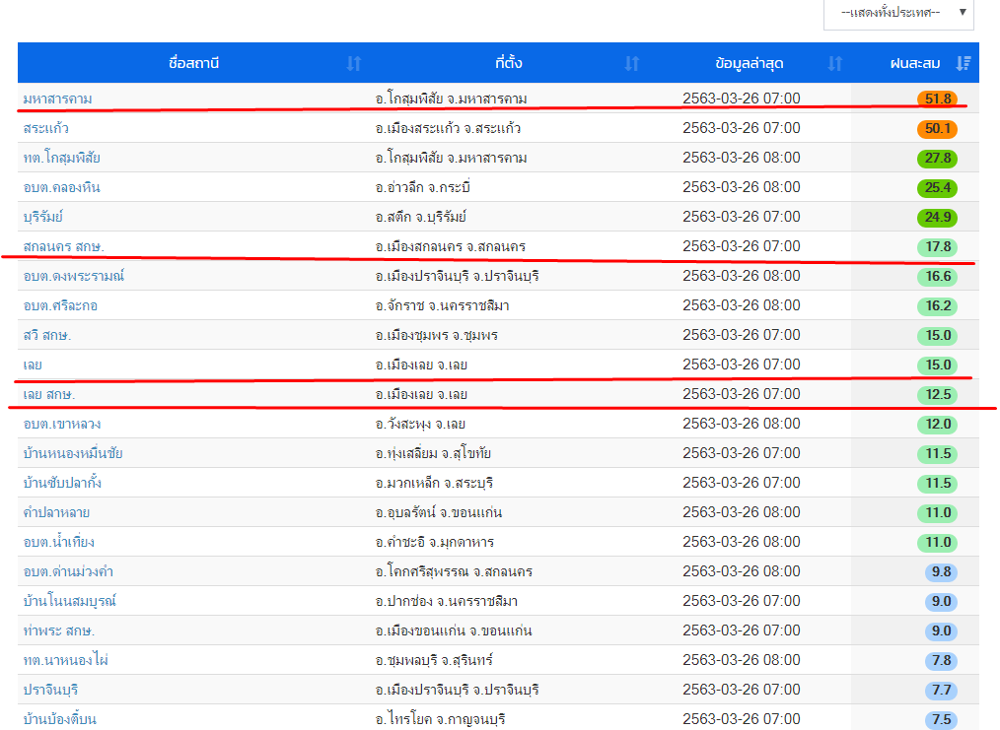