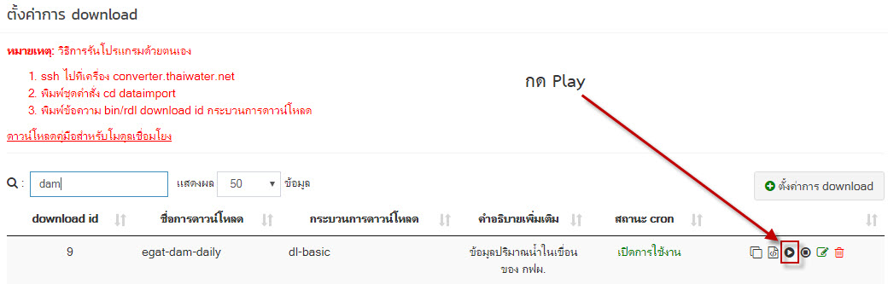
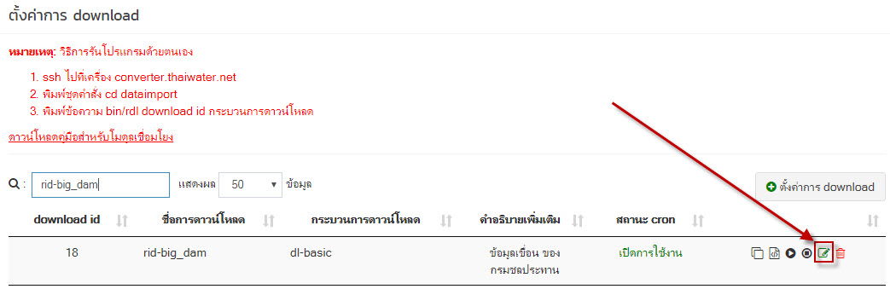
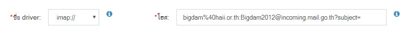
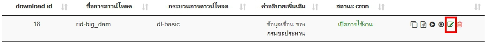
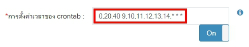

# วิธีตรวจสอบข้อมูล เขื่อนกรมชล-ขนาดใหญ่ กรณีที่มีการเปลี่ยนแปลงข้อมูลต้นทาง (มีการเปลี่ยนชื่อหัว subject mail)
1. ตรวจสอบข้อมูลจาก database ว่าข้อมูลไม่อัพเดจจริง โดยไปที่
  *  Host - 192.168.12.136
   * phpPgAdmin - https://192.168.12.136/phpPgAdmin/
   * Schema - public
   * Table - dam_daily
2. รันคำสั่ง sql เพื่อดูข้อมูลล่าสุด
	```sql
	SELECT * FROM "dam_daily" ORDER BY "dam_date" DESC
	```
	

3. จากรูปด้านบน ถ้าข้อมูลไม่อัพเดจถึงวันปัจจุบัน ให้ตรวจสอบการเชื่อมโยงข้อมูลของ Thaiwater30 โดยเข้า
	Browser - http://web.thaiwater.net/thaiwater30/login แล้วทำการ Login เข้าสู่ระบบ แล้วไปที่ 
	ระบบสนับสนุนการบริหารจัดการ > เมนูเชื่อมโยงข้อมูล > ตั้งค่าการ download 
	ค้นหา rid-big_dam แล้วทำการ play เพื่อรัน download อีกครั้ง ดังภาพที่ 2
 
	 
 
4. จากนั้นตรวจสอบข้อมูลอีกครั้งดังข้อ 1 ถ้าในกรณีที่ข้อมูลยังไม่อัพเดจอีก ต้องทำการตรวจเช็คการเชื่อมโยงข้อมูลที่ละขั้นตอนได้แก่ download, convert, import โดยเริ่มจากการ download ตรวจสอบว่าข้อมูลถูกดาวโหลดมาจริง ต้องทำการไปเช็คข้อมูลที่ต้นทางก่อนว่าข้อมูลทางต้นทางมีการอัพเดจหรือไม่ โดยเข้าไปที่ email : rid bigdam เขื่อนขนาดใหญ่กรมชลฯ
* user : bigdam@haii.or.th
* pass : Bigdam2012
จากการตรวจสอบ mail มีการเปลี่ยนชื่อ subject mail ไม่สามารถจับรูปแบบที่แน่นอนได้ แต่มีการอัพเดจข้อมูลปกติ
 
5. เนื่องจากข้อมูลต้นทางมีการเปลี่ยนแปลง จึงต้องไปแก้ไขการตั้งค่า download โดยไปที่ 
ระบบสนับสนุนการบริหารจัดการ > เมนูเชื่อมโยงข้อมูล > ตั้งค่าการ download แล้วค้นหา rid-big_dam แล้วกดแก้ไข
	 

6. จากนั้นระบบจะแสดงการตั้งค่าดาวโหลด ไปดูที่การตั้งค่าโฮสตอนนี้เป็น 
bigdam%40haii.or.th:Bigdam2012@incoming.mail.go.th?subject=%E0%B9%80%E0%B8%82%E0%B8%B7%E0%B9%88%E0%B8%AD%E0%B8%99%E0
%B8%82%E0%B8%99%E0%B8%B2%E0%B8%94%E0%B9%83%E0%B8%AB%E0%B8%8D%
E0%B9%88
copy ส่วนของค่า subject=
%E0%B9%80%E0%B8%82%E0%B8%B7%E0%B9%88%E0%B8%AD%E0%B8%99%E0%B8%
82%E0%B8%99%E0%B8%B2%E0%B8%94%E0%B9%83%E0%B8%AB%E0%B8%8D%E0%B9%88
ไปแปลงที่เว็บ https://meyerweb.com/eric/tools/dencoder/ จะได้คำว่า "เขื่อนขนาดใหญ่"
การทำงานของ diver: imap:// คือการอ่านข้อมูลจาก mail โดยเซตค่าต่างๆตามโฮสที่ตั้งค่า ทั้งนี้จากการตรวจสอบ mail มีการเปลี่ยนชื่อ subject mail ไม่สามารถจับรูปแบบที่แน่นอนได้ 

7. จากนั้นแก้ไขโดยการตั้งให้ subject= ค่าว่างเพื่อให้โค้ดไปวาด mail ที่มีวันที่ตรงกับปัจจุบันเท่านั้นโดยไม่ต้อง filter subject mail ที่มีคำว่า "เขื่อนขนาดใหญ่" เนื่องจาก mail มีไว้สำหรับส่งข้อมูลเขื่อนขนาดใหญ่เท่านั้น จึงไม่จำเป็นต้อง filter subject mail ดังนั้นจึงตั้งค่าโฮส ดังรูปที่ 6 แล้วทำการกดบันทึก
	 

8. ทำตามข้อ 3 อีกครึ่งเพื่อทำการรัน และตรวจสอบข้อมูลตามข้อ 1 อีกครั้ง

#วิธีตรวจสอบเขื่อนกรมชลขนาดใหญ่ กรณีที่วันที่ปัจจุบันไม่อัพเดท
1. ตรวจสอบข้อมูลว่าอัพเดทเป็นวันที่ปัจจุบันหรือไม่ ตามข้อที่ 1 ของ #วิธีตรวจสอบข้อมูล เขื่อนกรมชล-ขนาดใหญ่ กรณีที่มีการเปลี่ยนแปลงข้อมูลต้นทาง (มีการเปลี่ยนชื่อหัว subject mail)
2. รันคำสั่ง sql เพื่อดูข้อมูลล่าสุด ตามข้อที่ 2 ของ #วิธีตรวจสอบข้อมูล เขื่อนกรมชล-ขนาดใหญ่ กรณีที่มีการเปลี่ยนแปลงข้อมูลต้นทาง (มีการเปลี่ยนชื่อหัว subject mail)
3. ตรวจสอบ E-mail rid Bigdam ว่าได้รับข้อมูลจากต้นทางหรือไม่ โดยไปที่
* user : bigdam@haii.or.th
* pass : Bigdam2012
4. หากมีข้อมูลจากต้นทางมาที่ E-mail แล้ว แต่ข้อมูลยังไม่ถูกอัพเดทเป็นวันที่ปัจจุบัน ให้เข้าไปที่ Browser - http://web.thaiwater.net/thaiwater30/login แล้ว Login เข้าสู่ระบบ แล้วไปที่ ระบบสนับสนุนการบริหารจัดการ > เมนูเชื่อมโยงข้อมูล > ตั้งค่าการ download กดแก้ไข
	 
ไปที่ การตั้งค่าเวลาของ crontab เพิ่มเวลา 15, 16, 17, 18 เข้าไป แล้วกดบันทึก
	 
5. ตรวจสอบว่าข้อมูลถูกอัพเดทหรือไม่อีกครั้ง
