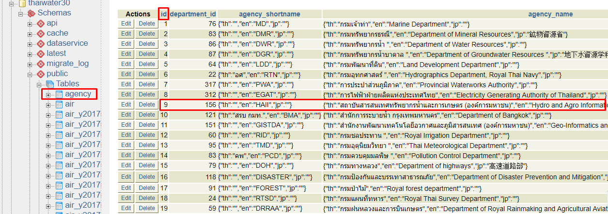

<!---
author Thitiorn Meeprasert (thitiporn@haii.or.th)
-->
###ตรวจสอบข้อมูลฝนที่หน้าเว็บไม่ update

1. เมื่อผู้ใช้แจ้งข้อมูลฝน ไม่แสดงในหน้าเว็บ http://web.thaiwater.net/thaiwater30/main
ผู้ใช้อาจจะแจ้ง รหัสสถานี ชื่อ หรือหน่วยงาน

2. ตัวอย่างแจ้งข้อมูลหน่วยงานไม่แสดงผล เช่นข้อมูล ฝน24 สสนก ไม่แสดงในหน้าเว็บ
```
ค้นหารหัส agency ในฐานข้อมูล ที่เครื่อง
```
   * Host - pgpool.thaiwater.net
   * phpPgAdmin - https://pgpool.thaiwater.net/phpPgAdmin/
   * Schema - public
   * Table - agency


3. ค้นหาข้อมูลใน schema ข้อมูลล่าสุดเพื่อตรวจสอบว่าข้อมูลเข้ามาหรือไม่
   * Schema - latest
   * View - v_rainfall
    

  <b>ถ้าข้อมูลไม่ update </b>ให้ตรวจสอบว่า โปรแกรมเชื่อมโยงข้อมูลทำงานหรือไม่ ใน backoffice เมนูระบบสนับสนุนการบริหารการทำงาน -> เชื่อมโยงข้อมูล -> ประวัติการรัน Script


<b>ถ้าข้อมูล update</b>
  4. ตรวจสอบข้อมูลใน schema cache (cache มีอายุ 1 ชม.)
   * Schema - cache
   * View - v_cache_rainfall24h


5. ถ้าข้อมูลในหน้าเว็บ ยังไม่ update (ข้อมูล cache 1 ชม.)
ให้ refresh cache ผ่าน backoffice

