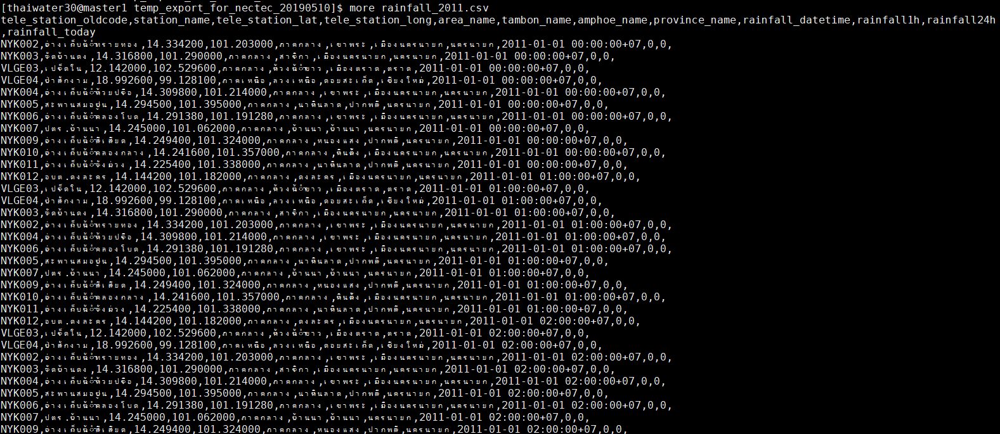
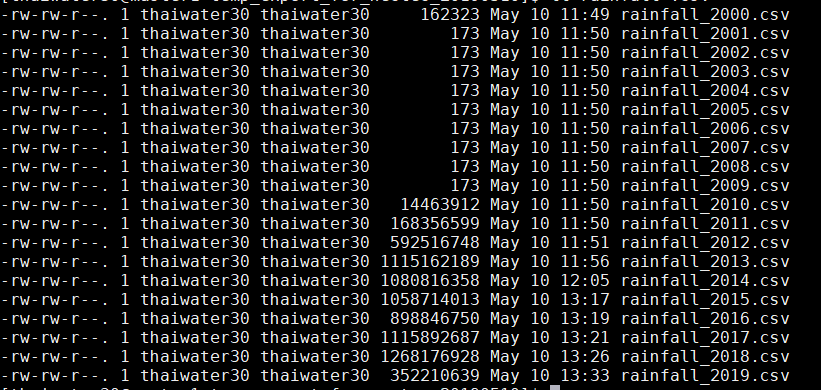

<!---
author Thitiorn Meeprasert (thitiporn@haii.or.th)
-->
###script export ข้อมูลบนเครื่อง master1.thaiwater.net

1. ไฟล์ /home/thaiwater30/export/export.sh เป็น script export ข้อมูลรายปี
ตัวอย่าง script export ข้อมูล table : rainfall แก้ไขเงื่อนไขตามต้องการ
```sh
psql -U thaiwater30 -d thaiwater30 -c "COPY (SELECT
    d.tele_station_oldcode,
    d.tele_station_name->>'th' as station_name,
    d.tele_station_lat,
    d.tele_station_long,
    g.area_name ->> 'th'::text AS area_name,
    g.tumbon_name ->> 'th'::text AS tambon_name,
    g.amphoe_name ->> 'th'::text AS amphoe_name,
    g.province_name ->> 'th'::text AS province_name,
    dd.rainfall_datetime,
    rainfall1h,rainfall24h,rainfall_today
   FROM rainfall dd
     LEFT JOIN m_tele_station d ON dd.tele_station_id = d.id
     LEFT JOIN lt_geocode g ON d.geocode_id = g.id
      LEFT JOIN agency agt ON d.agency_id = agt.id
  WHERE dd.rainfall_datetime between '$2-01-01' and '$2-12-31'
  and d.agency_id = 9 AND rainfall1h <> 999999
  AND dd.deleted_at = to_timestamp(0::double precision)
  order by dd.rainfall_datetime) TO STDOUT WITH CSV HEADER;" > $1_$2.csv
```

2. วิธีการเรียกใช้งาน
```sh
/home/thaiwater30/export/export.sh [table rainfall,temperature,humid,pressure] [year 2018]
```
ตัวอย่างการเรียกใช้งาน
```
/home/thaiwater30/export/export.sh rainfall 2011
```
ผลลัพธ์
```
rainfall_2011.csv
```


ข้อมูลที่ได้




3. ไฟล์ /home/thaiwater30/export/run_export.sh เป็น script export ข้อมูลรายปี โดยกำหนดได้หลายปี
แก้ไข ปีของข้อมูลที่ต้องการ export ตามที่ต้องการ
```sh
#change year array
array=(
2000
2001
2002
2003
2004
2005
2006
2007
2008
2009
2010
2011
2012
2013
2014
2015
2016
2017
2018
2019
)
for i in "${array[@]}"
do
	./export.sh $1 ${i}
done

```

4. วิธีการเรียกใช้งาน
```sh
/home/thaiwater30/export/run_export.sh [table rainfall,temperature,humid,pressure]
```
ตัวอย่างการเรียกใช้งาน
```
/home/thaiwater30/export/run_export.sh rainfall
```
ผลลัพธ์


