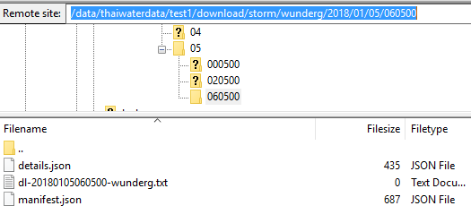

# การตรวจสอบข้อมูลพายุ

## ตรวจสอบข้อมูลในฐานข้อมูล
1. ตรวจสอบฐานข้อมูลในเครื่อง
   * [https://192.168.12.136/phpPgAdmin/](https://192.168.12.136/phpPgAdmin/)
   * Database : thaiwater30
   * Schema : public
   * Table : storm
2. ตรวจสอบตาราง storm โดยตารางนี้จะเป็น partition ตามปี-เดือน ให้ดูข้อมูลล่าสุดที่เข้ามา
   ```sql
   SELECT * FROM storm
   LIMIT 50
   ```
3. ตรวจสอบฟิลล์ storm_datetime ว่าพายุล่าสุดมีถึงเมื่อไหร่
   

4. หากข้อมูลพายุล่าสุดไม่เป็นวันปัจจุบัน เป็นไปได้คือ
   * ไม่มีพายุใหม่เข้ามา ซึ่งต้องตรวจสอบกับข้อมูลภายนอกว่าช่วงนี้มีพายุเข้ามาหรือไม่ และตรวจสอบกับภาพเส้นทางพายุ
   * ต้นทางข้อมูลไม่อัพเดท
   * ปัญหาการเชื่อมโยงข้อมูล

## ตรวจสอบการดึงข้อมูลจากหน้าเว็บ
กรณีข้อมูลมีเข้ามาปัจจุบันแต่หน้าเว็บไม่แสดงผล ให้ทดลองนำ query มารันแล้วดูผลข้อมูล
1. ตรวจสอบ query ที่ใช้ดึงข้อมูลพายุขึ้นสู่หน้าเว็บไซต์
2. ไปยัง storm model ที่ haii.or.th\api\thaiwater30\model\storm\sql.go
3. ในไฟล์จะมี sql ที่ใช้ดึงข้อมูลพายุ มาแสดงที่หน้าแรกของเว็บ thaiwater30
    ```sql
    SELECT storm_datetime,
           storm_lat,
           storm_directionlat,
           storm_long,
           storm_directionlong,
           storm_name,
           storm_pressure,
           storm_wind
    FROM   storm
    WHERE  deleted_at = To_timestamp(0)
    AND storm_name :: text IN (SELECT DISTINCT( storm_name :: text )
                               FROM   storm
                               WHERE  storm_datetime > CURRENT_TIMESTAMP - interval '1 day'
                               AND deleted_at = To_timestamp(0))
    AND ( storm_long >= 91 AND storm_long < 115.3)
    AND ( storm_lat >= 5.4 AND storm_lat <= 21.9)
    ORDER  BY storm_name :: text,
              storm_datetime
    ```
4. ทดลองรัน query และดูผลลัพธ์ ข้อมูลพายุจะมีเงื่อนไข "**CURRENT_TIMESTAMP - interval '1 day'**" อยู่ หากพายุวันที่น้อยกว่าวันปัจจุบันเกิน 1 วันก็จะไม่เข้าเงื่อนไข

## ตรวจสอบขั้นตอนการ download / convert
กรณีต้นทางมีข้อมูลแต่ไม่มีเชื่อมมาในระบบ
1. ไปยังเมนูตั้งค่าดาว์โหลด
   
2. ค้นหาคำว่า storm จะพบข้อมูลพายุ 2 รายการ สมมติในที่นี้เราสนใจข้อมูลพายุของ wunderground ซึ่งมีค่า download_id เป็น 159
   
3. ค้นหา log ของการดาว์โหลด โดยไปที่ฐานข้อมูล ตาราง dataimport_download_log
   ```sql
   SELECT * FROM api.dataimport_download_log
   WHERE dataimport_download_id = 159
   LIMIT 20
   ```
   
4. ทำการนำค่า download_path ใน record ที่สนใจ มาเปิดดูไฟล์บน server ว่าไฟล์ที่ดาว์โหลดมา มีความถูกต้องหรือไม่ ในที่นี่อาจจะต้องใช้คนตรวจสอบเนื้อหาในไฟล์ หรือเทียบกับไฟล์เก่าๆ ในอดีตที่เคยโหลดเข้ามา และทำการจดค่า id ของ record ที่สนใจเพื่อตรวจสอบกับการ convert ต่อ ในที่นี้เราจะได้ **id = 927496** (ในตัวอย่างเป็น record ที่สอง)
   * sftp ไปยัง archive.thaiwater.net
   * ไปยังโฟล์เดอร์ตั้งต้นที่เริ่มเก็บข้อมูลที่ /data/thaiwaterdata/test1
   * ไปยังโฟล์เดอร์ download/storm/wunderg/2018/01/05/060500
   * path เต็มจะเป็น /data/thaiwaterdata/test1/download/storm/wunderg/2018/01/05/060500
   * จะพบรายการไฟล์
   * ทำการเปิดไฟล์และตรวจสอบว่าไฟล์ที่ดาว์โหลดมา มีเนื้อหาหรือไม่ เนื้อหาถูกต้องหรือไม่ ฟอร์แมตมีเปลี่ยนหรือไม่ หากพบว่าปกติให้ตรวจสอบจาก converter ต่อ

   
5. ทำการตรวจสอบ convert log จากตาราง ในที่นี้จะใช้ค่า download_log_id = 928245 ตามที่ได้มาจากด้านบน
   ```sql
   SELECT * FROM api.dataimport_dataset_log
   WHERE dataimport_download_log_id = 927496
   LIMIT 20
   ```
   
6. เราจะให้ความสนใจในฟิลล์ data_path ซึ่งเป็นโฟล์เดอร์ที่ทำการ convert ไฟล์ ในที่นี้จะได้ค่า **data_path = dataset/usnrl/storm/2018/01/05/060500**
   * sftp ไปยัง converter.thaiwater.net
   * ไปยังโฟล์เดอร์ตั้งต้นที่เริ่มเก็บข้อมูลที่ /data/thaiwater/thaiwaterdata/test1
   * ไปยังโฟล์เดอร์ dataset/usnrl/storm/2018/01/05/060500
   * จะพบรายการไฟล์
   * ทำการเปิดไฟล์ ที่ลงท้ายด้วย -error.csv จะมีแจ้งว่าพบ error อะไรบ้าง จากตัวอย่าง
     * cv-20180105020500-wunderg.csv - แสดงข้อมูลที่ทำการ convert สำเร็จ
     * cv-20180105020500-wunderg-error.csv - แสดง convert error log
     * im-20180105020500-wunderg-error.csv - แสดง import error log
   
7. จากตัวอย่างพบว่า ฟอร์แมตวันที่ของข้อมูลพายุ ไม่ถูกต้อง ตรวจสอบแล้วเวลาข้อมูลไม่มีค่าวินามีส่งมา จึงทำการแก้ไขฟอร์แมตของวันที่ในการตั้งค่า dataset
  
8. เข้าระบบหลังบ้าน เข้าเมนูเชิ่อมโยงข้อมูล > ตั้งค่า dataset ค้นหาชื่อ "wunderg" จะพบ dataset id=532 ขึ้นมา กดเข้าไปแก้ไข ทำการแก้ไขฟิลล์วันที่โดยให้รูปแบบเป็น "%b %e %Y %R"
  
9. ทำการ convert ข้อมูลใหม่อีกครั้ง โดยไปที่เครื่อง converter และทำการ convert download id=159 และ download_log_id=927496 ตัวเลขเหล่านี้ได้มาจากขั้นตอนด้านบน
   ```sh
   # local , user : cim, password : cimTi***** (Ask Admin)
   > ssh converter.thaiwater.net

   # server
   > cd /home/cim/dataimport
   > bin/rdl 159 dl-qmgr -step=cv -cmd=new,fetch -download_log_id=927496
   ```
   
