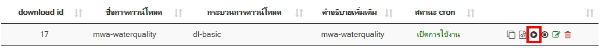
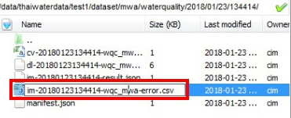
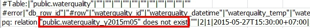
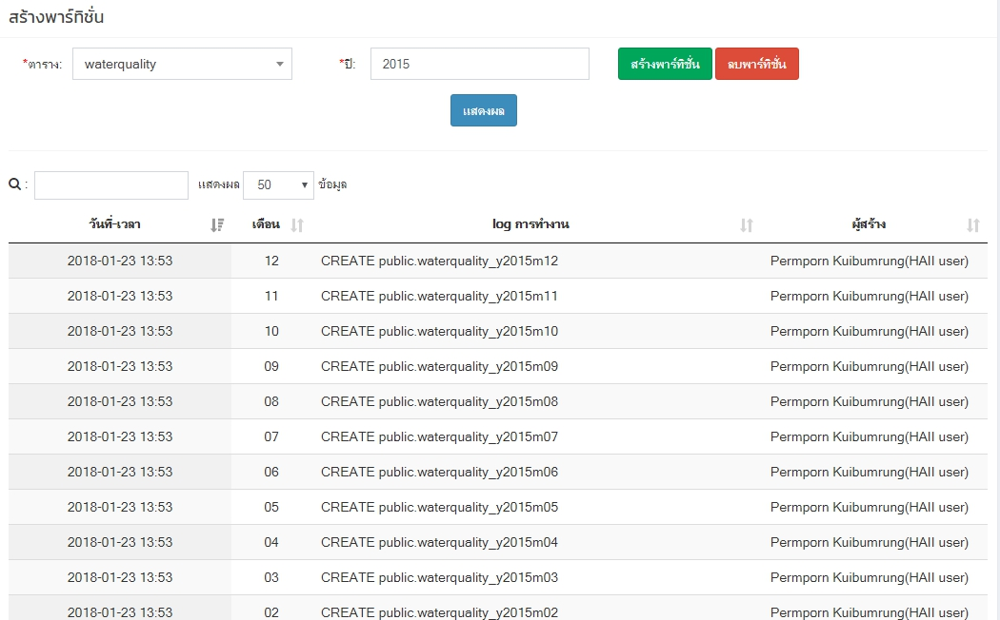
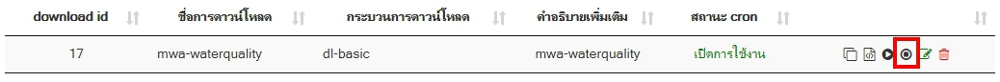

<!--by werawan 22/01/2018 -->
# ตรวจสอบข้อมูลคุณภาพน้ำ กรณีที่ไม่แสดงข้อมูลคุณภาพน้ำและข้อมูลไม่อัพเดท
1. ตรวจสอบข้อมูลจาก database เพื่อดูข้อมูลอัพเดทล่าสุด โดยไปที่
  *  Host - 192.168.12.136
   * phpPgAdmin - https://192.168.12.136/phpPgAdmin/
   * Schema - public
   * Table - waterquality
2. รันคำสั่ง sql เพื่อดูข้อมูลล่าสุด
	```sql
	SELECT * FROM "dam_daily" ORDER BY "dam_date" DESC
	```
3. ถ้าข้อมูลไม่อัพเดทถึงวันที่ปัจจุบัน ให้ตรวจสอบการเชื่อมโยงข้อมูลของ Thaiwater30 โดยเข้าไปที่ Browser - http://web.thaiwater.net/thaiwater30/login แล้ว login เข้าสู่ระบบ ไปที่ ระบบสนับสนุนการบริหารจัดการ > เมนูเชื่อมโยงข้อมูล > ตั้งค่าการ download ค้นหา mwa-waterquality แล้วกด play เพื่อรัน download
	
4. เช็คว่าข้อมูลถูกอัพเดทเป็นวันที่ปัจจุบันแล้วหรือไม่ โดยตรวจสอบข้อมูลตามข้อที่ 1 และ 2
5. ถ้าข้อมูลยังไม่ถูกอัพเดทให้เช็ค error ในเครื่อง archive.thaiwater.net ที่ path: /data/thaiwaterdata/test1/dataset/mwa/waterquality/
	
   เข้าไปที่ไฟล์ im...-error.csv เพื่อดูว่ามี error อะไรอยู่
	
6. จากภาพที่ 3 error คือ ไม่มี พาร์ทิชั่น ในปี 2015 ให้สร้าง พาร์ทิชั่น ใหม่โดยเข้าไปที่ Browser - http://web.thaiwater.net/thaiwater30/login แล้ว login เข้าสู่ระบบ ไปที่ ระบบสนับสนุนการบริหารการทำงาน > จัดการฐานข้อมูล > สร้างพาทิชั่น ให้กดเลือกตารางที่ต้องการสร้าง กดเลือกปีที่ต้องการสร้าง แล้วกดปุ่มสร้างพาร์ทชั่น จะได้พาร์ทิชั่นที่ต้องการสร้างแสดงตาม log การทำงาน
	
7. ถ้าข้อมูลยังไม่ถูกอัพเดทให้เข้าไปที่ Browser - http://web.thaiwater.net/thaiwater30/login แล้ว login เข้าสู่ระบบ ไปที่ ระบบสนับสนุนการบริหารจัดการ > เมนูเชื่อมโยงข้อมูล > ตั้งค่าการ download ค้นหา mwa-waterquality แล้วกด stop และเช็คการอัพเดทของข้อมูลอีกครั้ง
	


