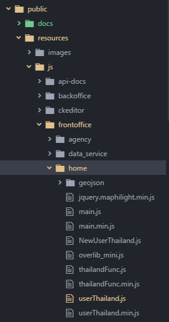
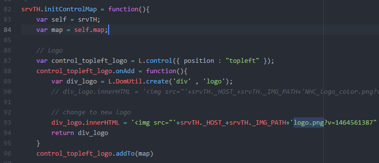

# การเปลี่ยนแปลง logo
## หน้าแรก (หน้าแผนที่)
1. ไปยังไฟล์ public/resources/js/frontoffice/home/userThailand.js
   

2. เปิดไฟล์และไปยังฟังก์ชั่น srvTH.initControlMap

3. ในฟังก์ชั่นจะมี Code ซึ่งใส่ Logo อยู่ ให้แก้ไขชื่อไฟล์หรือ path ตามต้องการ
    

4. ทำการ minified userThailand.js เป็น userThailand.min.js
5. นำไฟล์ขึ้นระบบ git และทำการ pull จากเครื่อง Server ลง production
