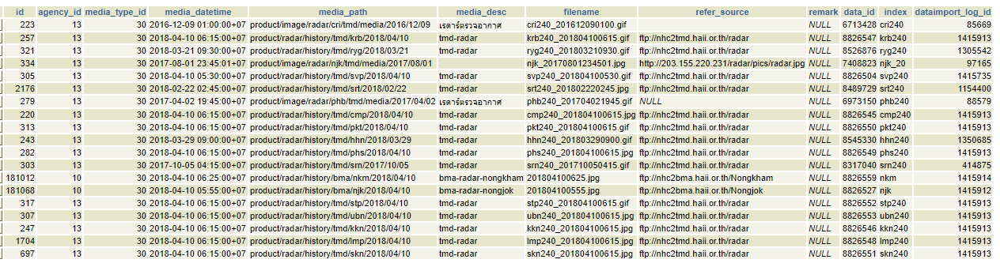
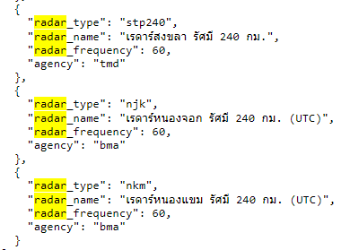

# การเชื่อมโยงข้อมูลเรดาร์ และนำแสดงบนเว็บไซต์
1. ทำการเชื่อมโยงข้อมูลเรดาร์เข้าตาราง media และตรวจสอบว่าข้อมูลได้เข้าระบบแล้ว  
หมายเหตุ ดูตัวอย่างจาก download และ dataset เดิมที่ทำไว้แล้ว

2. เรดาร์จะมีค่า media_type_id=30, หน่วยงาน bma agency_id=10 ส่วน tmd agency_id=13

3. เมื่อเชื่อมโยงข้อมูลเข้าแล้ว ในตาราง cache.latest_media จะมีการดึงข้อมูลล่าสุดเข้ามาโดยอัตโนมัติ โดยโปรแกรม api/thaiwater30/model/latest_media/cache.go ในฟังก์ชั่น UpdateMediadDataCache
  

  โดยระบบจะทำการดึงข้อมูลที่ > max dataimport_log_id จาก ตาราง media มา เพื่อทำการปรับปรุงใน latest_media

  

4. เราจะต้องตั้งค่าชื่อ index ของเรดาร์ ใน **Schema: cache, ตาราง latest_media** เพื่อจะได้บอกได้ว่าเป็นเรดาร์ของที่ไหน โดยการได้ชื่อขึ้นกับความเหมาะสมในการตัดจากข้อมูลที่มีอยู่ ดังตัวอย่างใน column index
  

5. การตัดชื่อสามารถทำได้โดยปรับปรุงที่ไฟล์ api/thaiwater30/model/latest_media/map.goดังตัวอย่าง

  

  ในภาพจะเป็นภาพเรดาร์หน่วยงาน bma ซึ่งมี agency_id=10 และภาพเรดาร์ media_type_id=30 โดยหากใน field media_desc มีค่าเท่ากับ bma-radar-nongjok จะตั้งชื่อ index ให้เป้น njk เป็นต้น

  

  ตัวอย่างภาพเรดาร์หน่วยงาน tmd ซึ่งมี agency_id=13 และภาพเรดาร์ media_type_id=30 โดยเราจะตัดตัวอักษร 6 ตัวแรกจากชื่อไฟล์มาเป็นชื่อ index เช่น หากไฟล์ชื่อ cri240_201612090100.gif เมื่อตัด 6 ตัวแรก จะได้ cri240 มาเป็นชื่อ index

6. เมื่อตรวจสอบพบว่าชื่อ index ของภาพเรดาร์ถูกต้องแล้ว เราจะเพิ่ม config เรดาร์ที่จะแสดงผลบนเว็บไซต์ โดยไปที่

    Schema: API  
    Table: system_setting  
    ID: 331  
    name: Frontend.analyst.Radar.RadarTypeOrder

    

    โดย radar_type ตั้งให้ตรงกับชื่อ index ในฐานข้อมูล  
    ส่วนอื่นๆ เป็นข้อมูลประกอบเพื่อให้ทราบว่าเป็นเรดาร์ที่ไหน หน่วยงานอะไร

7. หากตั้งถูกต้องภาพเรดาร์จะปรากฎในหน้าเว็บไซต์
    

8. ตั้งค่าภาษาที่แสดงชื่อเรดาร์ เพื่อให้เรดาร์แสดงชื่อได้ถูกต้อง หากยังไม่มีการตั้งชื่อ จะไม่มีชื่อแสดง  
ไปที่โฟล์เดอร์เว็บไซต์ thaiwater30: resources/lang/th/frontend/home/index.php เพิ่ม radar ใหม่ดดยใช้ตัวแปรขึ้นต้นด้วย radar_ และตามด้วย index ของเรดาร์ที่เราจัดทำไว้ เช่น radar_njk สำหรับเรดาร์หนองจอก เป็นต้น โดยแก้ไขในทุก 3 ภาษา (ไทย อังกฤษ ญี่ปุ่น)

    

9. ตรวจสอบว่าหน้าเว็บแสดงชื่อถูกต้อง หากแก้ไขแล้วภาษายังไม่เปลี่ยนให้ทำการ clear laravel cache โดยรัน command  
```
php artisan cache:clear
```
