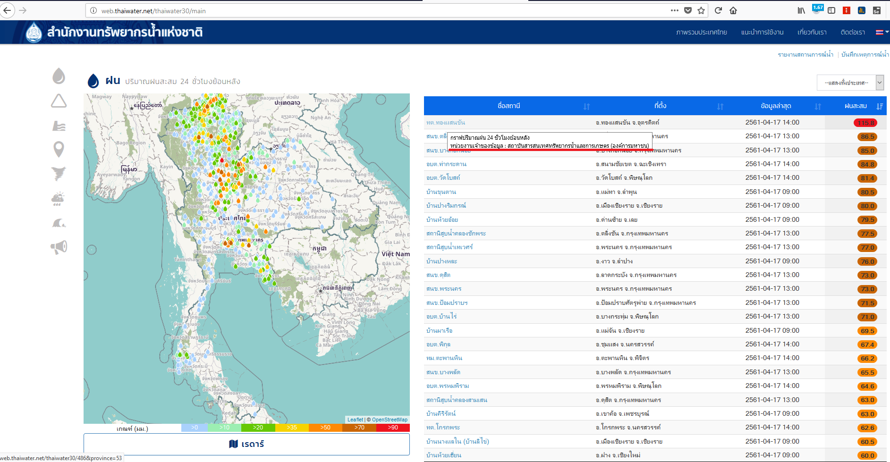

<!---
author Thitiorn Meeprasert (thitiporn@haii.or.th)
-->
##หน้า thailand/main เพิ่ม Tooltip หน่วยงาน ข้อมูล(ฝน,ระดับน้ำ,คุณภาพน้ำ)

http://web.thaiwater.net/thaiwater30/main


แก้ไขไฟล์
```
public/resources/js/frontoffice/home/main.js
```

```js
// แก้ไข function เพื่อเพิ่ม เงื่อนไขการแสดงผล tooltip ข้อมูลหน่วยงาน
function xxx_renderName
// เพิ่ม ตัวแปร อ่านค่า agency_name จาก json
//JH.GetJsonLangValue function นี้จะอ่านชื่อ จาก json TH,EN,JP เรียงตามลำดับ
var text = srvMain.translator["_agency_name"] + JH.GetJsonLangValue(d , "agency.agency_name");

function xxx_GraphLink(link , text, textOptional = "")
// เพิ่ม text parameter แบบ optional textOptional = ""
// ใน function เพิ่มการแสดงผลตามค่า textOptional ที่ส่งมา
srvMain.translator["rain_graph_title_link"] + "\n" + textOptional
```

ตัวอย่าง function แสดงตารางข้อมูลฝน
```js
/**
*   gen link to graph
*   @param {string} link - query string ที่ใช้ในการเรียกกราฟ
*   @param {string} text - ข้อคาวมของ ลิ้งค์
*   @param {string} textOptional - ข้อคาวมของ ลิ้งค์ เพิ่มเติม
*   @return {string} a tag
*/
srvMain.Rain_GraphLink = function(link , text, textOptional){
    return srvMain.Gen_GraphLink(link , text , srvMain.translator["rain_graph_title_link"] + "\n" + textOptional , "modal-rain");
}

// render rain table
/**
*   render rain station name
*   @param {object} row - object
*   @return {string} station name
*/
srvMain.Rain_render_name = function(row){
    var station_id = JH.GetJsonValue(row, "station.id");
    var province_code = JH.GetJsonValue(row, "geocode.province_code");
    var station_name = JH.GetJsonLangValue(row, "station.tele_station_name");
    var text = srvMain.translator["_agency_name"]  + JH.GetJsonLangValue(row , "agency.agency_name");
    return srvMain.Rain_GraphLink(station_id+"&province="+province_code , station_name ,text);
}

```
