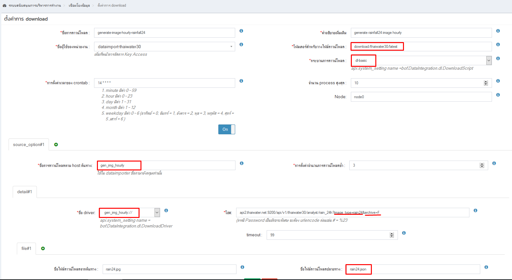
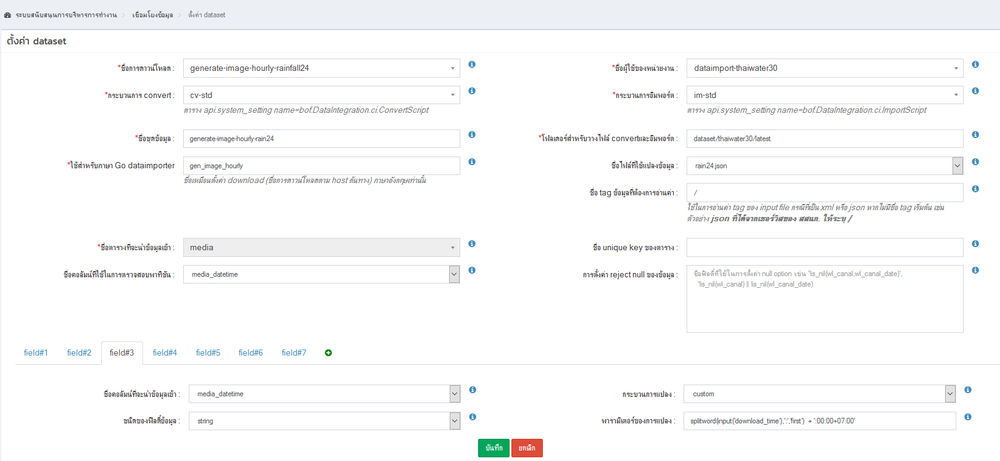

<!---
author Thitiorn Meeprasert (thitiporn@haii.or.th)
-->
###generate ภาพฝน เขื่อน ระดับน้ำ รายชั่วโมง

1. โปรแกรมเมื่อ generate ภาพแล้วต้องสร้างไฟล์ download .json เพื่อให้กระบวนการ convert map dataset มาอ่านเพื่อ insert ข้อมูลใส่ table media
```go
func (dl *GihHttpDownloader) DownloadFile(src, dest string, params []byte) ([]string, error) {
// generate json file at directory download for conveter process
	data := &ImageInformation{
		Source:       src,
		ImageFile:    imgname,
		ImageType:    imgType,
		DownloadTime: time.Now(),
	}

	// create json file
	dest = filepathx.ChangeExt(dest, "", ".json")
	fn, err := os.Create(dest)
	if err != nil {
		return nil, err
	}
	defer fn.Close()
	ex := json.NewEncoder(fn)
	if err = ex.Encode(&data); err != nil {
		return nil, err
	}

	return []string{dest}, nil
}
```

2. การ config Download
```sh
 กระบวนการดาวน์โหลด : dl-basic มีภาพเดียว ถ้ามีหลาย ๆ ภาพใช้ dl-collector
 ชื่อการดาวน์โหลดตาม host ต้นทาง:  ภาษาอังกฤษเท่านั้น download กับ dataset ต้องกำหนดเหมือนกัน เพื่อทำให้สามารถตรวจสอบประวัติการันย้อนหลังได้
```



 3. การ config dataset
```json
{
  "source": "*.*",
  "image_file": "/data/thaiwater/thaiwaterdata/data/product/image/water_level/2018/06/water_level_2018_06_06_16.jpg",
  "image_type": "water_level",
  "download_time": "2018-06-06T16:19:47.145145483+07:00"
}
```

```sh
ตัดข้อความ จาก tag json image_file
"/data/thaiwater/thaiwaterdata/data/product/image/water_level/2018/06/water_level_2018_06_06_16.jpg"

media_datetime : splitword(splitword(input('image_file'),'/','last'),'_','2') + '-' + splitword(splitword(input('image_file'),'/','last'),'_','3') + '-' +  splitword(splitword(input('image_file'),'/','last'),'_','4') + 'T' +  splitword(splitword(splitword(input('image_file'),'/','last'),'_','5'),'.','0') + ':00:00+07:00'
media_datetime : 2018-06-06T16:00:00+07:00

media_path : splitword(input('image_file'),'/','5') + '/' + splitword(input('image_file'),'/','6') + '/' + splitword(input('image_file'),'/','7') + '/' +  splitword(input('image_file'),'/','8') + '/' +  splitword(input('image_file'),'/','9')
media_path : product/image/water_level/2018/06

file_name : splitword(input('image_file'),'/','last')
file_name : water_level_2018_06_06_16.jpg
```


