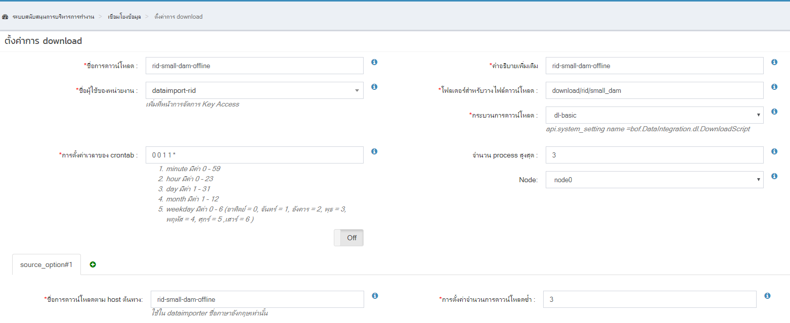
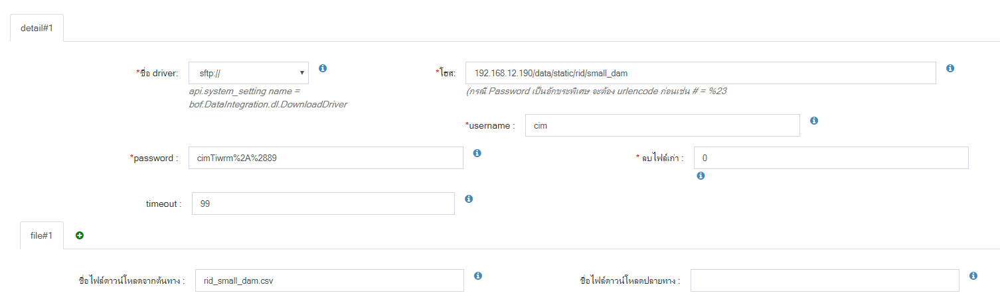
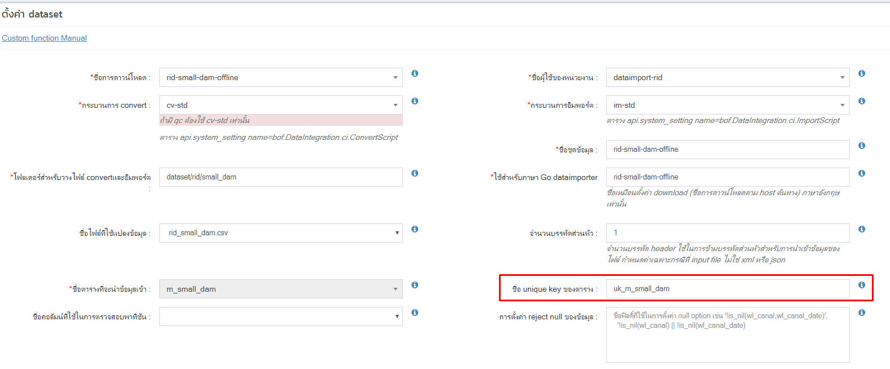
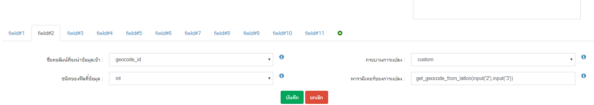
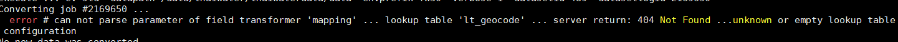
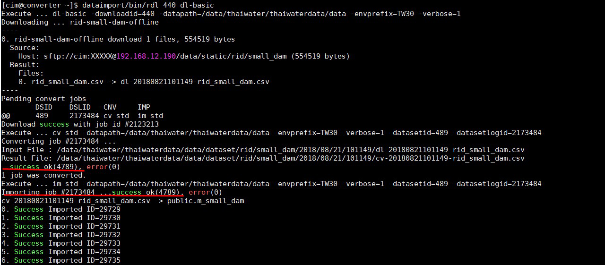

<!---
author Thitiorn Meeprasert (thitiporn@haii.or.th)
-->
###metadata เขื่อนขนาดเล็ก กรมชลฯ

1. ftp ไฟล์ไปวางที่เครื่อง archive.thaiwater.net
```
/data/static/rid/small_dam/
```

2. สร้าง download




3. เพิ่มรายละเอียด table ที่สร้าง ในไฟล์ map.go เพื่อให้ใช้งาน func mapping field ได้
```
api\thaiwater30\model\metadata\map.go
```
```go
//HasProvince = ถ้ามี geocode_id ในตาราง
//HasBasin = ถ้ามี basin_id ในตาราง
	"m_small_dam": &Struct_Table{
		Table:       "m_small_dam",
		IsMaster:    true,
		HasProvince: true,
		HasBasin:    true},
```
4. สร้าง dataset
<span style="color:red">&ast;ในตารางต้องสร้าง unique key เสมอ มิฉะนั้นจะไม่สามารถใช้งาน upsert ได้</span>




<br>
####ปัญหาและการแก้ไข
1. Converting job #2169650 ...
  error # can not parse parameter of field transformer 'mapping' ... lookup table 'lt_geocode' ... server return: 404 Not Found ...unknown or empty lookup table
 configuration


เนื่องจาก ยังไม่ได้ เพิ่มข้อมูล table ในไฟล์ api\thaiwater30\model\metadata\map.go
<br>
2. ```Error ...col #4 ' 15.5821 ' ... can not convert GO string to PostgreSQL data using *pqx.Float64Converter```
ตรวจสอบ mapping dataset type ตรงกับ field ใน table
<br>
3. ```convert กับ import จำนวนเท่ากันแต่ข้อมูลใน table ไม่เท่า```
ให้ตรวจสอบข้อมูล ที่มี unique ซ้ำกันทำให้ข้อมูลเป็น update

