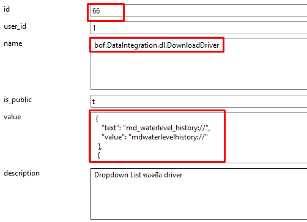
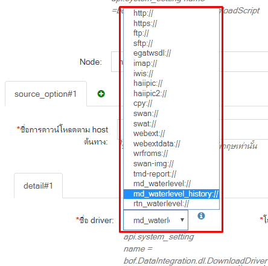
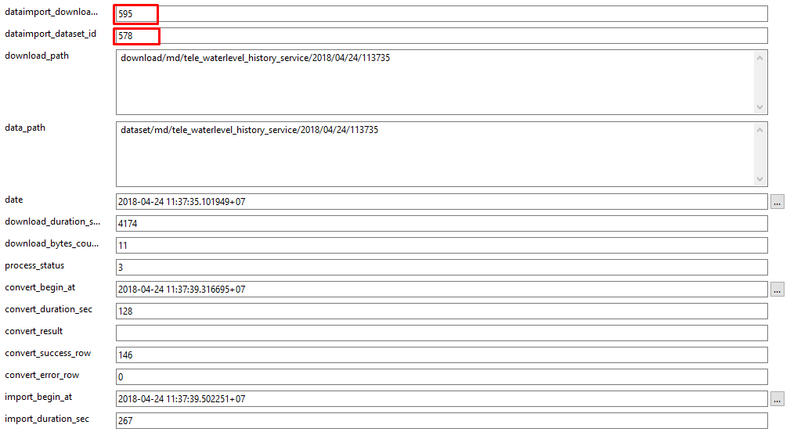

# ขั้นตอนการเชื่อมโยงข้อมูลระดับน้ำกรมเจ้าท่า (ย้อนหลัง) โดยใช้   Web Service


######ข้อมูลระดับน้ำของกรมเจ้าท่า มีสถานีทั้งหมด 12 สถานี โดยเรียกใช้ API ร่วมกัน 2 ชุด

>1. API สำหรับใช้ในการอ่านค่าสถานี
>```
>http://log.ddnsthai.com/MD/Api/MD/GetAll
>```
> [คลิกดูตัวอย่างข้อมูล](http://log.ddnsthai.com/MD/Api/MD/GetAll )
>
>2. API สำหรับอ่านข้อมูลระดับน้ำย้อนหลัง
>```
>http://log.ddnsthai.com/MD/Api/MD/GetLevel?codestation={รหัสสถานี}&datadate={วันที่}
>```
> พารามิเตอร์ | ชื่อ | ตัวอย่างข้อมูล
>------------ | ------------- | --------
>codestation | รหัสสถานี | MD01
>datadate | รูปแบบวันที | 2018-01-01
>[คลิกดูตัวอย่างข้อมูล](http://log.ddnsthai.com/MD/Api/MD/GetLevel?codestation=MD01&datadate=2018-01-01 )

#### ตั้งค่าโปรแกรม Eclipse เพื่อให้ Run Dataimport บน Local
>กดเมนู Run (ไอคอนสีเขียว) -> เลือก Run Configurations


######เลือก tab main

> ตั้งค่า Project Path
```
thaiwater30
```

>ตั้งค่า Go package to build
```
haii.or.th/dataimport/downloader/dl-basic
```


######เลือก tab Arguments
> ตั้งค่า Program Arguments

```
ก่อนตั้งค่า Program Arguments ให้สร้าง folder ไว้ที่ c:/www_data/test_download
จากนั้น สร้างไฟล์ basic.json ลงใน c:/www_data/test_download/basic.js
```
```
เข้า  backoffice->เชื่อมโยงข้อมูล->ตั้งค่าการ download
เลือก รายการตั้งค่า download มา 1 รายการ
จากนั้น กด view json  
```

>
```
คัดลอก ข้อมูลใน download_setting_json
```
>
```
นำไปวางไว้ในไฟล์ c:/www_data/test_download/basic.js แล้วบันทึกไฟล์

บรรทัดที่ขีดเส้นใต้สีแดง ค่า host เป็นกำหนด url:webservice สำหรับอ่านข้อมูล
```
>
```
-verbose
-datapath c:/www_data/test_download
-testcfg c:/www_data/test_download/basic.json
```


#### เริ่มเขียน Dataimport Driver ด้วยภาษา Golang

######1. เพิ่ม folder สำหรับเก็บไฟล์ driver.go ใช้ชื่อ md_waterlevel_history ตาม path
```
src\haii.or.th\dataimport\downloader\driver\md_waterlevel\driver.go
```


> ตั้งชื่อ Package ให้สอดคล้องกับ โฟลเดอร์
```go
package md_waterlevel_history

import {
    ...
}
```

######2. เปิดไฟล์ connector.go  ทำการแก้ไข 2 จุด ดังนี้

```
src\haii.or.th\dataimport\downloader\connector.go
```

> เพิ่ม import driver ตัวใหม่ .... บรรทัดที่ 8-35
```go
import (
	...
	"haii.or.th/dataimport/downloader/driver/md_waterlevel_history"
)
```
> เพิ่ม NewConnector ตัวใหม่ .... บรรทัดที่ 42-66
```go
var knownConnectionType = map[string]NewConnectionFn{
	...
	"mdwaterlevelhistory": md_waterlevel_history.NewConnector,
}
```

> key | connnector
>------------ | -------------
>"mdwaterlevelhistory" | md_waterlevel_history.NewConnector,
><span style="color:red">\*key ตัวเล็กหมด ติดกันเท่านั้น ห้ามมีอักขระพิเศษ</span>

######3. update code บนเครื่อง server converter
```sh
Server : converter
cd go_local/src/haii.or.th/dataimport
make pull install
```

######4. เพิ่ม driver type ใน table เพื่อให้ backoffice สามารถมองเห็นใน dropdown
```sql
host : https://192.168.12.136/phpPgAdmin
schema : api
table : system_settiing
data ID : 66
colunm name : name
colunm value : bof.DataIntegration.dl.DownloadType

{
    "text": "md_waterlevel_history://",
    "value": "mdwaterlevelhistory://"
}
```
>

>หากเพิ่มข้อมูลครบถ้วน ชื่อ driver : md_waterlevel_history จะเพิ่มเข้ามา

>
######5. ตั้งค่า download ใน backoffice เมนูเชื่อมโยงข้อมูล-ตั้งค่าการ download


>###### การตั้งค่าโฮสและส่งค่าพารามิเตอร์ เพื่อ Run ข้อมูลย้อนหลัง

```
log.ddnsthai.com/MD/Api/MD/GetAll?codestation=MD01&datadate=2018-03-12
```

ชุดข้อมูล | codestation (รหัสสถานี) | datadate (วันที่ )
--------- | ------------ | -------------
ข้อมูลสถานี ( ทั้งหมด ) ( วันปัจจุบัน ) | ว่าง | ว่าง
ข้อมูลสถานี ( ทั้งหมด ) ( รายวัน ) | ว่าง | 2018-01-01
ข้อมูลสถานี ( ทั้งหมด ) ( รายเดือน ) | ว่าง | 2018-01
ข้อมูลสถานี ( ทั้งหมด ) ( รายปี ) | ว่าง | 2018
ข้อมูลสถานี ( MD01 ) (วันปัจจุบัน) | MD01 | ว่าง
ข้อมูลสถานี ( MD01 ) ( รายวัน ) | MD01 | 2018-01-01
ข้อมูลสถานี ( MD01 ) ( รายเดือน ) | MD01 | 2018-01
ข้อมูลสถานี ( MD01 ) ( รายปี ) | MD01 | 2018


###### 6. ตั้งค่า dataset เพื่อทำการ convert และ import data

>รูปแบบข้อมูล

```json
[
  {
    "CodeStation": "MD11",
    "LevelWater": "",
    "DatetimeServer": "2017-04-24 12:52:00"
  },
  {
    "CodeStation": "MD11",
    "LevelWater": "",
    "DatetimeServer": "2017-04-24 12:52:00"
  },
  {
    "CodeStation": "MD11",
    "LevelWater": "-1.591",
    "DatetimeServer": "2017-04-27 18:44:00"
  },
  {
    "CodeStation": "MD11",
    "LevelWater": "-1.591",
    "DatetimeServer": "2017-04-27 18:45:00"
  }
]
```

>การ mapping ชื่อ กับ dataset  กรณีที่เป็น xml หรือ json

```json
หากไม่มีชื่อ tag ข้อมูลที่ต้องการอ่านค่า ให้ระบุ: /

ตัวอย่างข้อมูล JSON
[
  {
    "CodeStation": "MD11",
    "LevelWater": "",
    "DatetimeServer": "2017-04-24 12:52:00"
  }
]
```
```json
หากมีชื่อ tag ข้อมูลที่ต้องการอ่านค่า ให้ระบุ: data

ตัวอย่างข้อมูล JSON
[
  "data" : [
    {
      "CodeStation": "MD11",
      "LevelWater": "",
      "DatetimeServer": "2017-04-24 12:52:00"
    }
  ]
]
```

>ใน backoffice เมนูเชื่อมโยงข้อมูล->ตั้งค่า dataset


7. เมือใส่ dataset เสร็จแล้ว กด รันเพื่อสั่งให้โปรแกรมทำงานที่เมนุ download


> หาต้องการทดสอบการันแบบ manual server : converter
> ```sh
> cd dataimport
>    #คำสั่งจะทำทั้ง download convert import
>    #bin/rdl {download_id} dl-basic
> bin/rdl 595 dl-basic
> ```

8. ดู log การ download convert import ที่

```sql
host : https://192.168.12.136/phpPgAdmin
schema : api
view : v_dataset_log_download_log
```


>โดยใส่เงื่อนไข id download ที่สร้างขึ้น

```sql
SELECT *
FROM v_dataset_log_download_log
WHERE api.v_dataset_log_download_log.dataimport_download_id = 595
```



>ตรวจสอบข้อมูล ในตารางที่นำข้อมูลเข้า คือ tele_waterlevel
```sql
host : https://192.168.12.136/phpPgAdmin
schema : public
table : tele_waterlevel
```
>นำข้อมูล dataset_log_id ค้นหาในช่อง dataimport_log_id
```sql
SELECT * FROM public.tele_waterlevel
WHERE public.tele_waterlevel.dataimport_log_id = '1491607'
```
>เมื่อนำเข้าสำเร็จ ผลการค้นหาจะแสดงผลดังรูป
>

