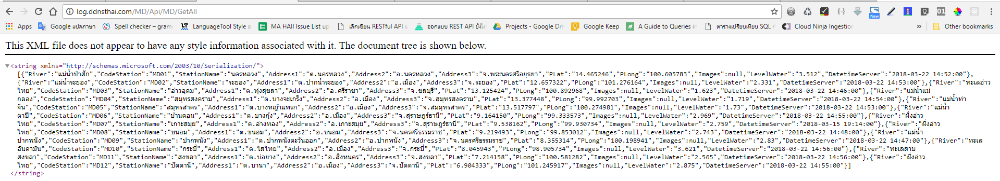
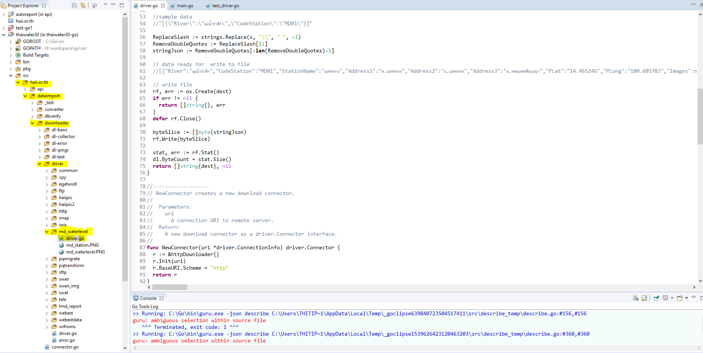
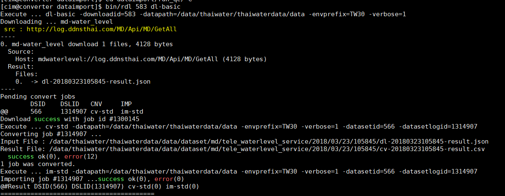
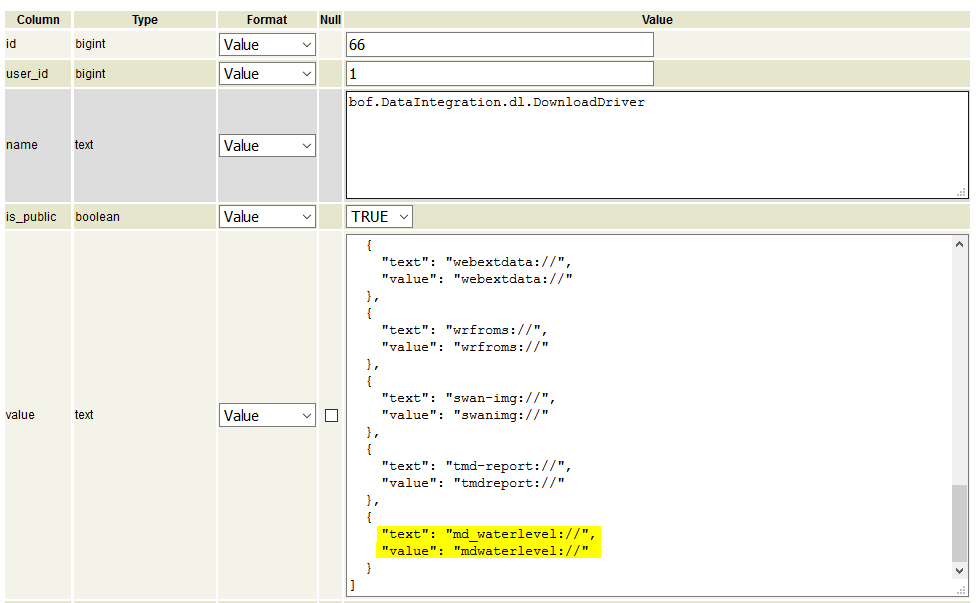
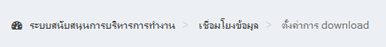
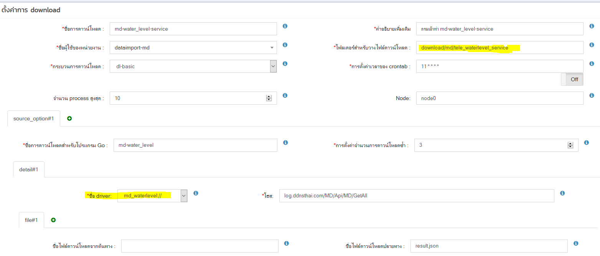
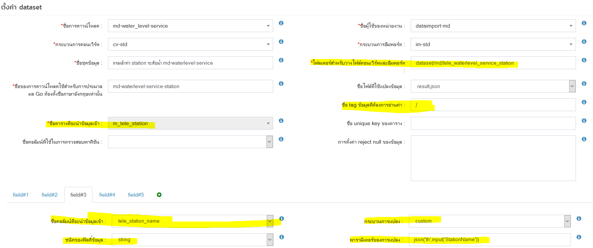

<!---
author Thitiorn Meeprasert (thitiporn@haii.or.th)
-->
##เชื่อมโยงข้อมูล webservice ระดับน้ำรสม. กรมเจ้าท่า

webservice :
[http://log.ddnsthai.com/MD/Api/MD/GetAll](http://log.ddnsthai.com/MD/Api/MD/GetAll)
ตัวอย่างข้อมูลจาก webservice

[md api document](md_api_document.pdf)

 1. เพิ่ม folder, file driver เพื่อ download ข้อมูลจาก webservice
```
haii.or.th\dataimport\downloader\driver\md_waterlevel\driver.go
```


ในไฟล์ driver กรณีรัน manual หากต้องการให้แสดงข้อความเพื่อตรวจสอบโปรแกรม ให้ใส่ข้อความในคำสั่ง
```
dl.Logger.UpdateStatus(text)
เช่น
```

เพื่อต้องการให้แสดง url ที่ได้จากการ set download



2. เมื่อเขียน driver เสร็จแล้ว ให้แก้ไขไฟล์
```
haii.or.th\dataimport\downloader\connector.go
```
เพื่อเพิ่ม driver

```go  
Line 61
var knownConnectionType = map[string]NewConnectionFn{
  "mdwaterlevel": md_waterlevel.NewConnector,
}
```

#####ตัวอย่างการเพิ่ม connector
"mdwaterlevel": md_waterlevel.NewConnector,
 key | connnector
------------ | -------------
"mdwaterlevel" | md_waterlevel.NewConnector,
<span style="color:red">\*key ตัวเล็กหมด ติดกันเท่านั้น ห้ามมีอักขระพิเศษ</span>

3. update บน server converter
```sh
Server : converter
cd go_local/src/haii.or.th/dataimport
make pull install
```

4. เพิ่ม driver type ใน table เพื่อให้ backoffice สามารถมองเห็นใน dropdown
```sql
ชื่อ driver table : api.system_settiing
Id  66  bof.DataIntegration.dl.DownloadType
{
    "text": "md_waterlevel://",
    "value": "mdwaterlevel://"
}
```
<span style="color:red">\*ต้องใส่เหมือนกับที่กำหนดไว้ในไฟล์ </span>
```
haii.or.th\dataimport\downloader\connector.go
```
```go
var knownConnectionType = map[string]NewConnectionFn{
  "mdwaterlevel": md_waterlevel.NewConnector,
}
```


<span style="color:blue">\*พอทำ download เสร็จแล้ว ปุ่มรันใน download จะยังไม่ขึ้นต้องไปทำ dataset ก่อน </span>

5. ตั้งค่า download   ใน backoffice เมนูเชื่อมโยงข้อมูล->ตั้งค่าการ download





6. ไปที่ตั้งค่า dataset เพื่อทำการ convert and import data ใน backoffice เมนูเชื่อมโยงข้อมูล->ตั้งค่า dataset


รูปแบบข้อมูล

การตั้งค่า dataset


การ mapping ชื่อ กับ dataset


<span style="color:red">\*ชื่อ tag ข้อมูลที่ต้องการอ่านค่า : /</span>
<span style="color:blue">ชื่อ tag ข้อมูลที่ต้องการอ่านค่า ใช้ในการอ่านค่า tag ของ input file กรณีที่เป็น xml หรือ json หากไม่มีชื่อ tag เริ่มต้น เช่น ตัวอย่าง json ที่ได้จากเซอร์วิสของ สสนก. ให้ระบุ /</span>
ตัวอย่างข้อมูล JSON


7. เมือใส่ dataset เสร็จแล้ว กด รันเพื่อสั่งให้โปรแกรมทำงานที่เมนุ download


8. ดู log การ download convert import ที่
```sql
View api.v_dataset_log_download_log โดยใส่เงื่อนไข id download ที่สร้างขึ้น

select *
from v_dataset_log_download_log
WHERE
api.v_dataset_log_download_log.dataimport_download_id = 583
and  date >= '2018-03-18'
ORDER BY date
```

หาต้องการทดสอบการันแบบ manual  server : converter
```sh
cd dataimport
   #คำสั่งจะทำทั้ง download convert import
   #bin/rdl {download_id} dl-basic
bin/rdl 583 dl-basic
```


####สิ่งที่ต้องทำต่อ
<span style="color:red">\*</span>การ map ตำบล อำเภอ จังหวัด เพื่อเปลี่ยนเป็น geocode ปัจจุบัน 2018-03-29 เมื่อไม่สามารถ mapping ตำบล อำเภอ จังหวัด เพื่อเปลี่ยนเป็น geocode ได้ ระบบจะไม่นำข้อมูล record นั้นเข้าฐานข้อมูล ต้องเขียน custom function เพิ่ม

####ปัญหาที่พบ
1. error field : download_detail
```sh
{"error":"EVENT_CODE_ID(21) unsupport connection scheme [md-waterlevel]","result":[{"name":"md-water_level","file_count":0,"byte_count":0,"error":{},"details":null}]}
สาเหตุ
driver ที่เขียนไว้ คือ md_waterlevel
แต่ใน config เป็น md-waterlevel
และ
```
<span style="color:red">\*driver ที่ระบุใน connector ต้องเป็นตัวเล็กหมด ติดกันเท่านั้น ห้ามมีอักขระพิเศษ mdwaterlevel</span>

2.  error field : convert_result
```sh
{"error":"EVENT_CODE_ID(3) tele_station_id can not parse parameter of field transformer 'mapping' ... lookup table 'm_tele_station' ... server return: 500 Internal Server Error ...The server encountered an internal error. Please retry the request. ...pq: column \"codestation\" does not exist"}
สาเหตุ
mapping dataset field codestation ผิด
```

ชื่อฟิลดิ์ input สำหรับการ convert : <span style="color:blue">tag ใน json ที่ download มา</span>
ชื่อฟิลดิ์ที่ใช้ตรวจสอบข้อมูล input : <span style="color:blue">ชื่อ field ในฐานข้อมูล ที่จะเอาข้อมูลใน tag json ไปใส่</span>

3. error field : convert_result
```
DatetimeServer":"2018-03-22 14:55:00"
waterlevel_datetime:invalid date/time '' ... requires %Y-%m-%d %H:%M:%S"
สาเหตุ
พบข้อมูล json ที่ download มา มีช่องวางอยู่ในเนื้อข้อมูล
```

