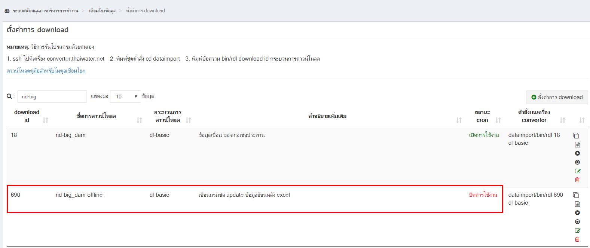
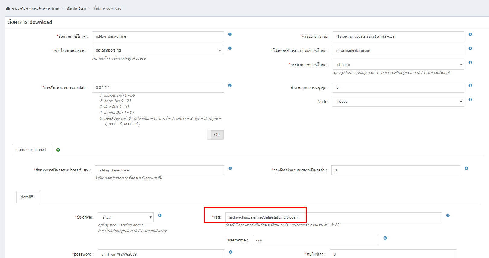
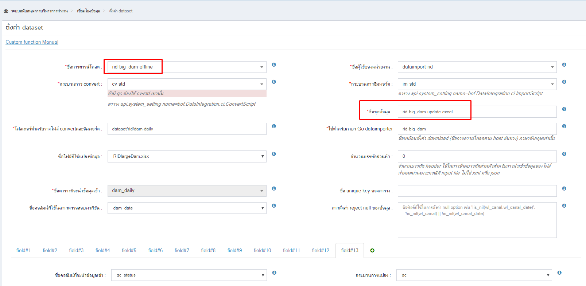
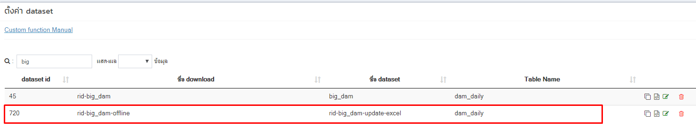
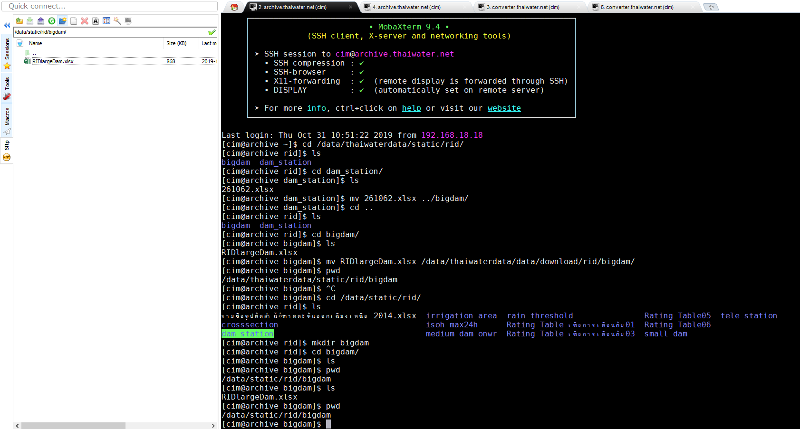
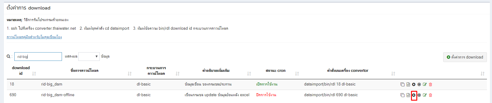

<!---
author Thitiorn Meeprasert (thitiporn@haii.or.th)
-->
### การนำเข้าข้อมูลเขื่อนกรมชลย้อนหลัง
เดิมการเชื่อมโยงวิธีการปกติอาจจะมีอยู่แล้ว ให้เพิ่มการ download จากเครื่อง archive.thaiwater.net ที่สามารถนำไฟล์ไปวาง และใช้ Mapping กับ dataset ที่มีอยู่แล้ว ตามคู่มือด้านล่างนี้
คู่มือ :
http://web.thaiwater.net/thaiwater30/resources/pdf/how_to_import_file_to_folder.pdf?v=1507013214

1. เมื่อผู้ใช้แจ้งกรมชลฯ ส่งข้อมูลเขื่อนมา update เป็นไฟล์ excel

2. login backoffice เมนู เชื่อมโยงข้อมูล -> ตั้งค่าการ download
http://web.thaiwater.net/thaiwater30/backoffice/data_integration/mgmt_script

3. ค้นหา ด้วยคำที่เกี่ยวข้อง เช่นกรณีนี้เกี่ยวกับเขื่อน ใช้คำว่า dam/เขื่อน/กรมชล


กรณีไม่พบให้เพิ่ม download
<br />
3. ดูที่โฮส ให้นำไฟล์ไปวางที่ไหน
server : archive.thaiwater.net
user : cim
```sh
/data/static/rid/bigdam/
```


กรณีเป็นการสร้าง download เพิ่ม ให้ทำการ Map dataset เดิมที่มีอยู่แล้วเข้ากับ download ใหม่





<br />
5. ssh/sftp ไปที่เครื่อง archive.thaiwater.net นำไฟล์ไปวางใน folder ที่ระบุ



<br />

6. รัน download



หรือ ssh ไปที่เครื่อง converter.thaiwater.net copy script ไปรัน

```sh
dataimport/bin/rdl 690 dl-basic
```
