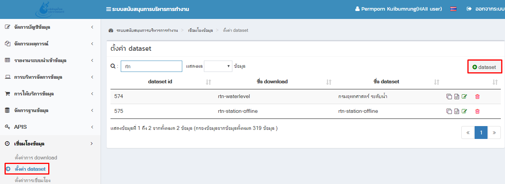
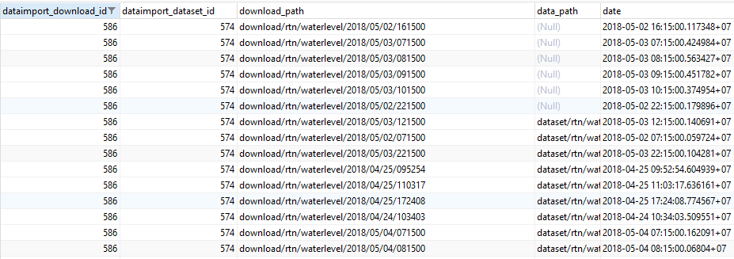
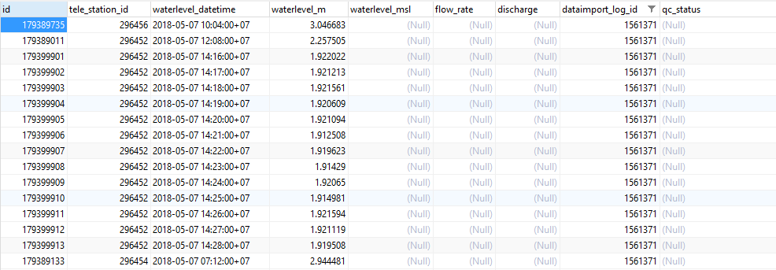

# เชื่อมโยงข้อมูลระดับน้ำกรมอุทศาสตร์
#####ข้อมูลต้นทางที่ใช้ในการเชื่อมโยงมีสถานีทั้งหมด 20 สถานี โดยมีข้อมูลอยู่ 2 ชุดดังนี้

1. ข้อมูลสถานี โดยจะทำการแปลงให้อยู่ในรูปแบบ json ตัวอย่างดังนี้
> 
2. webservice ข้อมูลระดับน้ำ รายวัน รายสถานี (รูปแบบ JSON)
>```
>  http://203.147.22.19/Tsunami2011/03_Station/315_GetStationData.ashx?StationID=58&date=28/02/2018&scale=1&sensor=1
>```
```่ JSON
  "rawData": [
    {
      "label": "Sensor1",
      "data": [
        [
          1519776000000,
          null
        ],
        [
          1519778520000,
          2.491498
        ]
      }
  ]
```

#### 1. เพิ่มชื่อ driver ใน table เพื่อให้ backoffice สามารถมองเห็นใน dropdown และนำ config ไปเขียน Golang

```sql
host : https://192.168.12.136/phpPgAdmin
schema : api
table : system_settiing
data ID : 66
colunm name : name
colunm value : bof.DataIntegration.dl.DownloadType

#เพิ่ม string
{
    "text": "rtn_waterlevel://",
    "value": "rtnwaterlevel://"
}
```
> 

>หากเพิ่มข้อมูลครบถ้วน ชื่อ driver : rtn_waterlevel จะเพิ่มเข้ามา
>หลังจากนั้นให้เซต download ไปที่ ตั้งค่าการ download -> +ตั้งค่าการ download

> 

>
 

 >###### การตั้งค่าโฮสและส่งค่าพารามิเตอร์ เพื่อ Run ข้อมูลย้อนหลัง

 ```
 ตัวอย่าง
 # ข้อมูลสถานี ( ทั้งหมด ) ( วันปัจจุบัน )
 203.147.22.19/Tsunami2011/03_Station/315_GetStationData.ashx
 # ข้อมูลสถานี ( ทั้งหมด ) ( รายวัน )
 203.147.22.19/Tsunami2011/03_Station/315_GetStationData.ashx?datadate=2018/01/01&codestation=
 # ข้อมูลสถานี ( รายสถานี ) ( วันปัจจุบัน )
 203.147.22.19/Tsunami2011/03_Station/315_GetStationData.ashx?datadate=&codestation=RTN62
 # ข้อมูลสถานี ( รายสถานี ) ( รายวัน )
 203.147.22.19/Tsunami2011/03_Station/315_GetStationData.ashx?datadate=2018/01/01&codestation=RTN62
 ```

 ชุดข้อมูล | datadate (วันที่) | codestation (สถานี)
 --------- | ------------ | -------------
 ข้อมูลสถานี ( ทั้งหมด ) ( วันปัจจุบัน )  | ว่าง  | ว่าง
 ข้อมูลสถานี ( ทั้งหมด ) ( รายวัน )  | 2018/01/01  | ว่าง
 ข้อมูลสถานี ( รายสถานี ) ( วันปัจจุบัน )  | ว่าง  | RTN62
 ข้อมูลสถานี ( รายสถานี ) ( รายวัน )  | 2018/01/01  | RTN62


#### 2.  เพิ่ม folder และfile driver.go เพื่อ download ข้อมูลจาก web service ด้วยภาษา Golang
สร้างไฟล์ตามพาทดังนี้
>```
>  haii.or.th\dataimport\downloader\driver\rtn_waterlevel\driver.go
>```

#### 3. วิธีรัน download บน local ด้วยภาษา Golang ด้วยโปรแกรม Eclipse
>กดเมนู Run (ไอคอนสีเขียว) -> เลือก Run Configurations ดังรูป


>  ตั้งค่า run config


>  ตั้งค่า Argument

  
> 		-verbose
> 		-datapath c:/www_data/test_download
> 		-testcfg c:/www_data/test_download/basic.json

> ตัวอย่างการตั้งค่า datapath c:/www_data/test_download คือ path ที่จะนำไฟล์ download ไว้

> ตัวอย่างการตั้งค่า testcfg path c:/www_data/test_download/basic.json คือ path file config ที่ได้จากการตั้งค่าการดาวโหลดใน back office สามารถไป copy จาก database เลือกตาม id download ที่ config ได้จากการตั้งค่าการดาวโหลดใน back office ที่

> 		Db: 192.168.12.136
> 		Table: api.dataimport_download

> แล้วทำการกด run config

#### 4. การเขียน driver download ข้อมูลระดับน้ำกรมอุทศาสตร์
> 4.1. อ่าน file station.json

> 4.2. Loop stations ที่ได้จากการอ่าน file นำเอา station_id ใส่ลิ้ง web service แล้ว ทำการ Get string จาก web service แล้วตัด tag แปลงค่า ใส่ array ก้อนใหม่

> 4.3. นำ array ที่ได้ export เป็นไฟล์ .json

> 4.4. string ที่ได้จะเป็นรูปแบบ json ดังนี้

```json
[ { "StationCode":"RTN1",  
"StationName":"Ranong",  
"WaterLevel":"2.12514",   	
"Datetime":"2018-04-26 07:00:00",  
"Sensor":"1",   	
"ValueType":"Instantaneous",   	
"Unit":"m",  
"Variable":"Water Level" } ]
```
> 4.5 เปิดไฟล์ connector.go  ทำการแก้ไข 2 จุด ดังนี้

```
src\haii.or.th\dataimport\downloader\connector.go
```

> เพิ่ม import driver ตัวใหม่ .... บรรทัดที่ 8-35
```go
import (
	...
	"haii.or.th/dataimport/downloader/driver/rtn_waterlevel"
)
```
> เพิ่ม NewConnector ตัวใหม่ .... บรรทัดที่ 42-66
```go
var knownConnectionType = map[string]NewConnectionFn{
	...
	"rtnwaterlevel": rtn_waterlevel.NewConnector,
}
```
> key | connnector
>------------ | -------------
>"rtnwaterlevel" | rtn_waterlevel.NewConnector,
><span style="color:red">\*key ตัวเล็กหมด ติดกันเท่านั้น ห้ามมีอักขระพิเศษ</span>

#### 5. pull code บนเครื่อง server converter
หลังจาก git push ไปที่เครื่อง Server: converter แล้ว

```sh
Server : converter
cd /home/cim/go_local/src/haii.or.th/dataimport/
make pull install
```

#### 6. ตั้งค่า dataset เพื่อทำการ convert และ import data

 >รูปแบบข้อมูล

 ```json
 [{
   "StationCode":"RTN1",
   "StationName":"Ranong",
   "WaterLevel":"null",
   "Datetime":"2018-05-07 07:00:00",
   "Sensor":"1",
   "ValueType":"Instantaneous",
   "Unit":"m",
   "Variable":"Water Level"
 }]
 ```

 >ใน backoffice เมนูเชื่อมโยงข้อมูล->ตั้งค่า dataset

 > 

> โดยตั้งค่า dataset ดังนี้

> 
 
 
 
 

#### 7. เมื่อตั้งค่า dataset เสร็จแล้ว กด รันเพื่อเชื่อมโยงข้อมูล ไปที่เมนุ ตั้งค่าการ download


 > หาต้องการทดสอบการันแบบ manual server : converter
 > ```sh
 > cd /home/cim/dataimport/
 >    #คำสั่งจะทำทั้ง download convert import
 >    #bin/rdl {download_id} dl-basic
 > bin/rdl 586 dl-basic
 > ```

#### 8. ดู log การ download convert import ที่

 ```sql
 host : https://192.168.12.136/phpPgAdmin
 schema : api
 view : v_dataset_log_download_log
 ```
 โดยใส่เงื่อนไข id download ที่สร้างขึ้น

 ```sql
 SELECT *
 FROM "api"."dataimport_download_log"
 WHERE "dataimport_download_id" = '586'
 ```
 > 

 >ตรวจสอบข้อมูล ในตารางที่นำข้อมูลเข้า คือ tele_waterlevel
 ```sql
 host : https://192.168.12.136/phpPgAdmin
 schema : public
 table : tele_waterlevel
 ```
 >นำข้อมูล dataset_log_id ค้นหาในช่อง dataimport_log_id
 ```sql
 SELECT * FROM public.tele_waterlevel
 WHERE public.tele_waterlevel.dataimport_log_id = '1491607'
 ```
 >เมื่อนำเข้าสำเร็จ ผลการค้นหาจะแสดงผลดังรูป
 >

