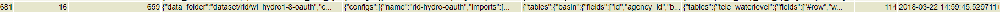
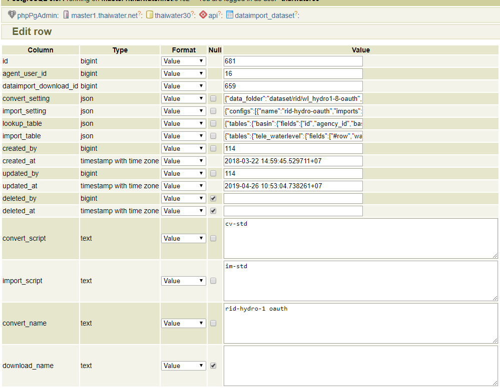
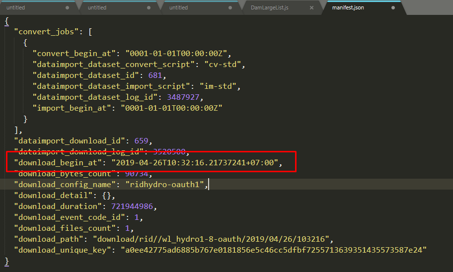
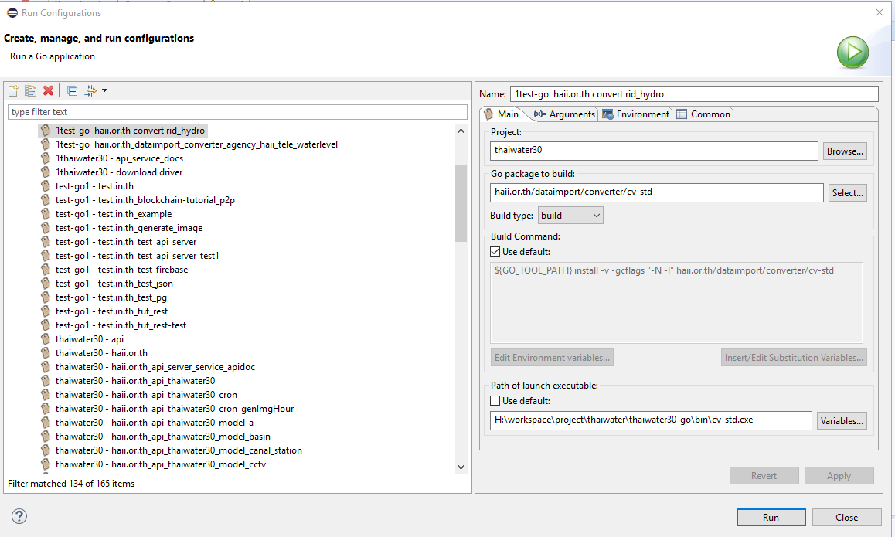
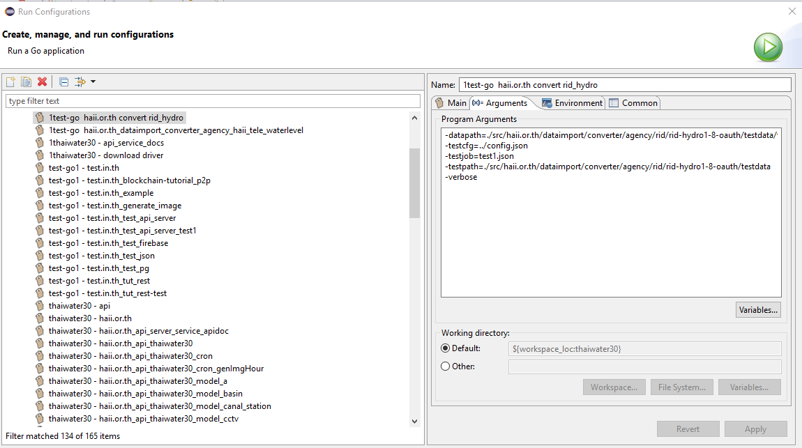
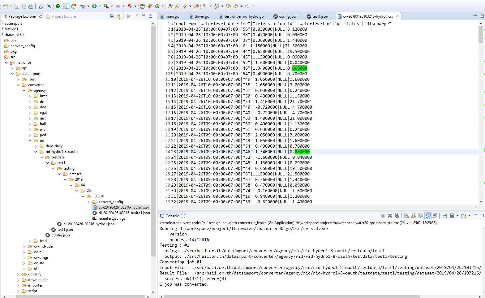

<!---
author Thitiorn Meeprasert (thitiporn@haii.or.th)
-->
###ทดสอบ convert ด้วย Eclipse
####ตัวอย่างการทดสอบข้อมูล webservice น้ำท่า hydro1-8 กรมชลประทาน

1. สร้าง folder
```
src\haii.or.th\dataimport\converter\agency\rid\rid-hydro1-8-oauth
src\haii.or.th\dataimport\converter\agency\rid\rid-hydro1-8-oauth\testdata
src\haii.or.th\dataimport\converter\agency\rid\rid-hydro1-8-oauth\testdata\test1
```

2. สร้างไฟล์ config.json

```
src\haii.or.th\dataimport\converter\agency\rid\rid-hydro1-8-oauth\config.json
```
copy text จาก field : convert_setting จาก table : api.dataimport_dataset ใส่ในไฟล์ config.json





```json
{
  "data_folder": "dataset/rid/wl_hydro1-8-oauth",
  "configs": [
    {
      "name": "rid-hydro-oauth",
      "input_name": "hydro1.json",
      "header_row": 0,
      "data_tag": "/",
      "row_validator": "",
      "fields": [
        {
          "name": "waterlevel_datetime",
          "type": "datetime",
          "input_fields": [
            "hourlytimeUTC"
          ],
          "transform_method": "datetime",
          "transform_params": {
            "input_format": "%FT%TZ"
          }
        },
        {
          "name": "tele_station_id",
          "type": "string",
          "input_fields": [
            "stationid"
          ],
          "transform_method": "mapping",
          "transform_params": {
            "add_missing": true,
            "from": [
              "tele_station_oldcode"
            ],
            "missing_data": {
              "agency_id": "12",
              "tele_station_oldcode": "input('Stationid')"
            },
            "table": "m_tele_station",
            "to": "id"
          }
        },
        {
          "name": "waterlevel_m",
          "type": "string",
          "input_fields": [
            "Wlvalues"
          ],
          "transform_method": "",
          "transform_params": ""
        },
        {
          "name": "qc_status",
          "type": "",
          "input_fields": null,
          "transform_method": "qc",
          "transform_params": ""
        },
        {
          "name": "discharge",
          "type": "interface",
          "input_fields": [
            "qvalues"
          ],
          "transform_method": "",
          "transform_params": ""
        }
      ]
    }
  ]
}
```

3. รัน download นำไฟล์ที่ได้จาก folder download
```
/data/thaiwater/thaiwaterdata/data/download/rid/wl_hydro1-8-oauth/2019/04/26/103216/
```
ไฟล์ dl-20190426103216-hydro1.json วางที่
```
  src\haii.or.th\dataimport\converter\agency\rid\rid-hydro1-8-oauth\testdata\test1
```

4. สร้างไฟล์ test1.json
```
haii.or.th\dataimport\converter\agency\rid\rid-hydro1-8-oauth\testdata\test1.json
```

เปิดไฟล์ manifest.json
```
/data/thaiwater/thaiwaterdata/data/download/rid/wl_hydro1-8-oauth/2019/04/26/103216/manifest.json
```

copy json ใส่ในไฟล์ test1.json
```json
"download_begin_at": "2019-04-26T10:32:16.21737241+07:00",
```



```json
{
    "jobs":[
       {
       	  "download_begin_at":"2019-04-26T10:32:16+07:00",
       	  "path":"test1",
       	  "download_config_name":"rid-hydro"
       }      
    ]
 }
```

5. สร้างการรันโปรแกรม Run as Configuration



program Arguments
```sh
-datapath=./src/haii.or.th/dataimport/converter/agency/rid/rid-hydro1-8-oauth/testdata/test1
-testcfg=../config.json
-testjob=test1.json
-testpath=./src/haii.or.th/dataimport/converter/agency/rid/rid-hydro1-8-oauth/testdata
-verbose
```




6. รันโปรแกรม เมื่อรันโปรแกรมเรียบร้อยแล้วจะได้ไฟล์ CSV ที่เกิดจากการ convert

