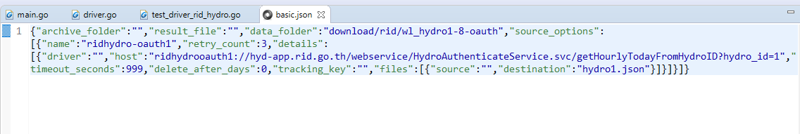
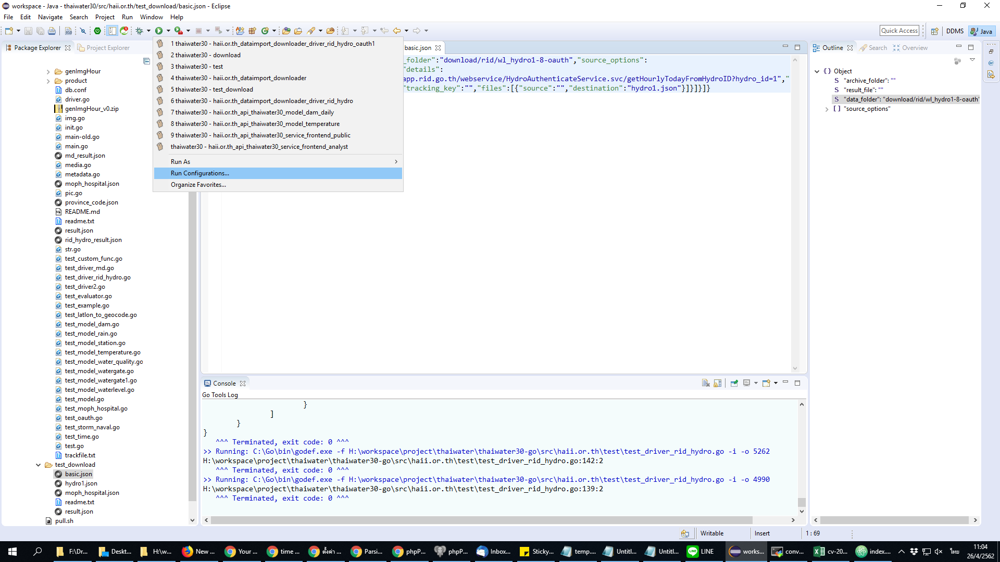
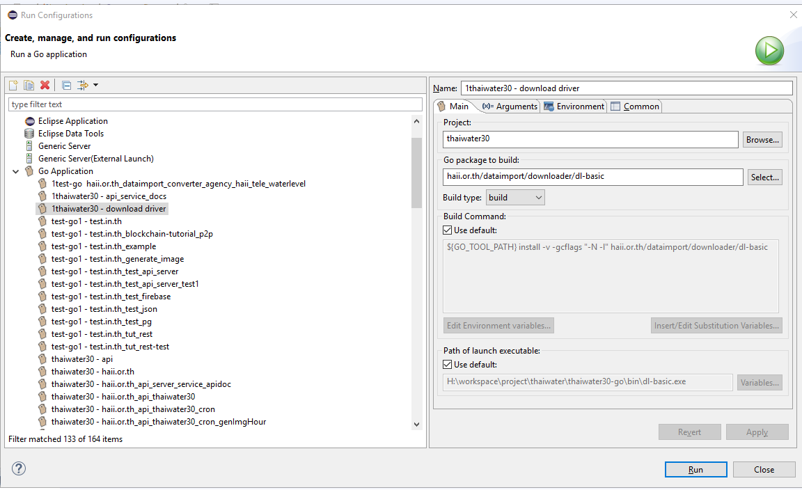
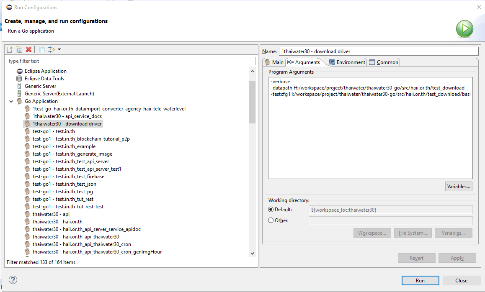
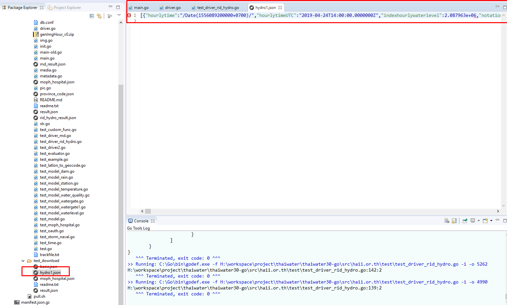

<!---
author Thitiorn Meeprasert (thitiporn@haii.or.th)
-->
###ทดสอบ download driver ด้วย Eclipse
####ตัวอย่างการทดสอบข้อมูล webservice น้ำท่า hydro1-8 กรมชลประทาน

1. สร้าง folder
```
src\haii.or.th\test_download
```

2. สร้างไฟล์ basic.json
```
src\haii.or.th\test_download\basic.json
```

3. copy text จาก field : download_setting table api.dataimport_download วางในไฟล์ basic.json


```json
{
  "archive_folder": "",
  "result_file": "",
  "data_folder": "download/rid/wl_hydro1-8-oauth",
  "source_options": [
    {
      "name": "ridhydro-oauth1",
      "retry_count": 3,
      "details": [
        {
          "driver": "",
          "host": "ridhydrooauth1://hyd-app.rid.go.th/webservice/HydroAuthenticateService.svc/getHourlyTodayFromHydroID?hydro_id=1",
          "timeout_seconds": 999,
          "delete_after_days": 0,
          "tracking_key": "",
          "files": [
            {
              "source": "",
              "destination": "hydro1.json"
            }
          ]
        }
      ]
    }
  ]
}
```




4. รันโปรแกรมด้วย Run as Configuration





program Arguments
```
-verbose
-datapath H:/workspace/project/thaiwater/thaiwater30-go/src/haii.or.th/test_download
-testcfg H:/workspace/project/thaiwater/thaiwater30-go/src/haii.or.th/test_download/basic.json
```



5. เมื่อรันโปรแกรม จะได้ไฟล์ download ตามชื่อที่กำหนดไว้

