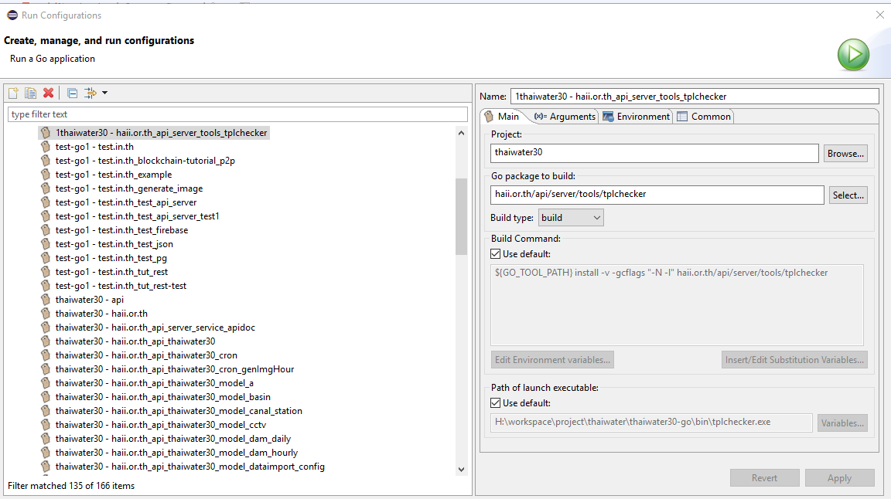
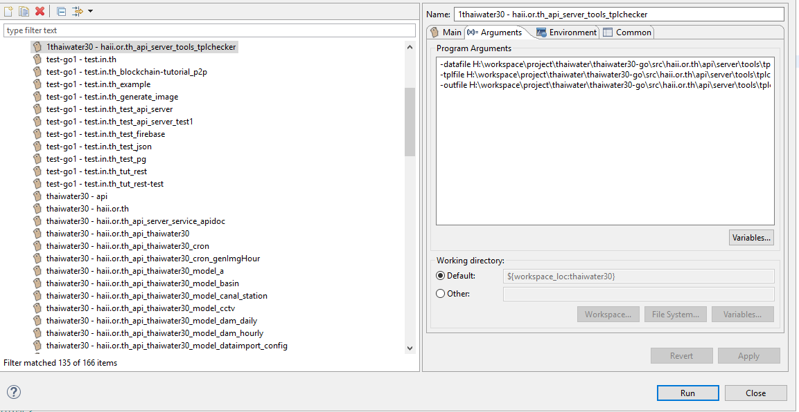
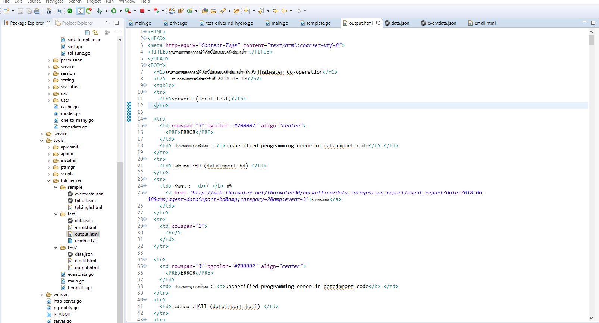

<!---
author Thitiorn Meeprasert (thitiporn@hii.or.th)
-->
###ทดสอบ Email event template ด้วย Eclipse
####ตัวอย่างการทดสอบ email template  รายงานสรุปเหตุการณ์รายวัน

1. สร้าง folder
```sh
src\haii.or.th\api\server\tools\tplchecker\test
```

2. สร้าง ไฟล์ src\haii.or.th\api\server\tools\tplchecker\test\data.json

ดู template ที่ต้องการทดสอบใน  table api. lt_event_code
จากนั้น นำ event_code_id ไปค้นหาใน table api.event_log
copy text ใน field : event_data มาใส่ในไฟล์ data.json

```sh
{
	"ReportDate": "2018-06-18T00:00:00+07:00",
	"ReportDateStr": "2018-06-18",
	"Data": [{
		"category_id": 2,
		"category_code": "ERROR",
		"category_description": {
			"th": "Error conditions",
			"en": "Error conditions",
			"jp": ""
		},
		"event_code_id": 3,
		"event_code_code": "EventDataErrorGeneric",
		"event_code_description": {
			"en": "unspecified programming error in dataimport code",
			"th": "เกิดข้อผิดพลาดจากการเขียนโปรแกรม"
		},
		"agent_user_id": 63,
		"agent_name": "dataimport-hd",
		"agent_full_name": "HD",
		"incident_count": 7
	},
	{
		"category_id": 2,
		"category_code": "ERROR",
		"category_description": {
			"th": "Error conditions",
			"en": "Error conditions",
			"jp": ""
		},
		"event_code_id": 3,
		"event_code_code": "EventDataErrorGeneric",
		"event_code_description": {
			"en": "unspecified programming error in dataimport code",
			"th": "เกิดข้อผิดพลาดจากการเขียนโปรแกรม"
		},
		"agent_user_id": 21,
		"agent_name": "dataimport-haii",
		"agent_full_name": "HAII",
		"incident_count": 40
	}
}
```

3. สร้างไฟล์ src\haii.or.th\api\server\tools\tplchecker\test\email.html  copy email html template ที่สร้างใส่ในไฟล์
```html
<HTML>
<HEAD>
<meta http-equiv="Content-Type" content="text/html;charset=utf-8">
<TITLE>สรุปรายการเหตุการณ์ที่เกิดขึ้นในระบบคลังข้อมูลน้ำฯ</TITLE>
</HEAD>
<BODY>
	<H1>สรุปรายการเหตุการณ์ที่เกิดขึ้นในระบบคลังข้อมูลน้ำฯสำหรับ Thaiwater Co-operation</H1>
	<h2>	รายการเหตุการณ์ประจำวันที่  {{$.EventData.ReportDateStr}}</h2>
	<table>
	<tr>
		<th>{{$.EventServerName}}</th>
	</tr>
	{{range $key, $value := $.EventData.Data}}
	<tr>
		<td rowspan="3" bgcolor='{{color "eventlog_category" $value.category_id}}' align="center">
			<PRE>{{$value.category_code}}</PRE>
		</td>
		<td> ประเภทเหตุการณ์ย่อย  : <b>{{$value.event_code_description.en}}</b> </td>
	</tr>
	<tr>
		<td> หน่วยงาน  :{{$value.agent_full_name}} ({{$value.agent_name}}) </td>
	</tr>
	<tr>
		<td> จำนวน  :  <b>{{$value.incident_count}} </b> ครั้ง
		  <a href='{{event_report_url $.EventData.ReportDateStr $value.agent_name $value.category_id $value.event_code_id}}'>รายละเอียด</a>
		</td>
	</tr>
	<tr>
		<td colspan="2">
			<hr/>
		</td>
	</tr>
	{{end}}
	</table>
</BODY>
</HTML>
```

4. สร้าง configuration เพื่อรันโปรแกรม




Arguments


```
-datafile H:\workspace\project\thaiwater\thaiwater30-go\src\haii.or.th\api\server\tools\tplchecker\test\data.json
-tplfile H:\workspace\project\thaiwater\thaiwater30-go\src\haii.or.th\api\server\tools\tplchecker\test\email.html
-outfile H:\workspace\project\thaiwater\thaiwater30-go\src\haii.or.th\api\server\tools\tplchecker\test\output.html
```

5. รัน configuration
6. เมื่อรันเรียบร้อยแล้วจะได้ไฟล์ output.html


