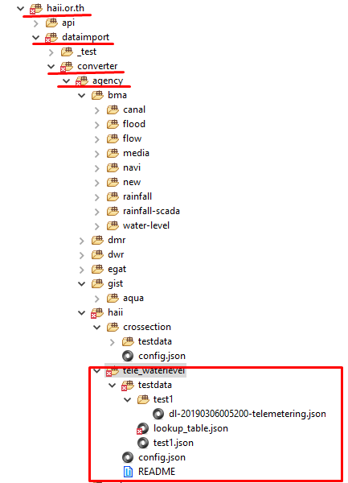
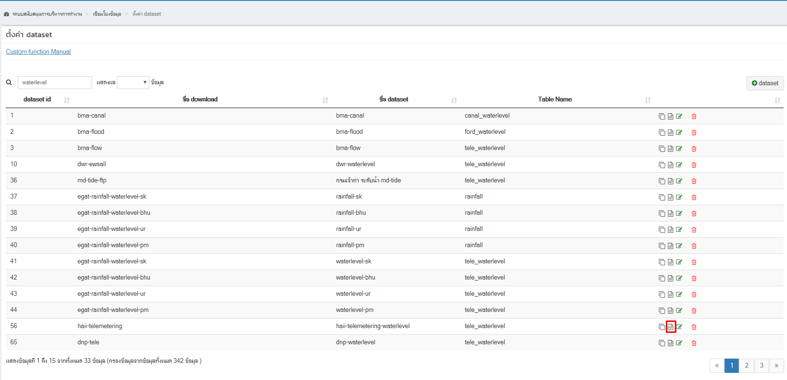
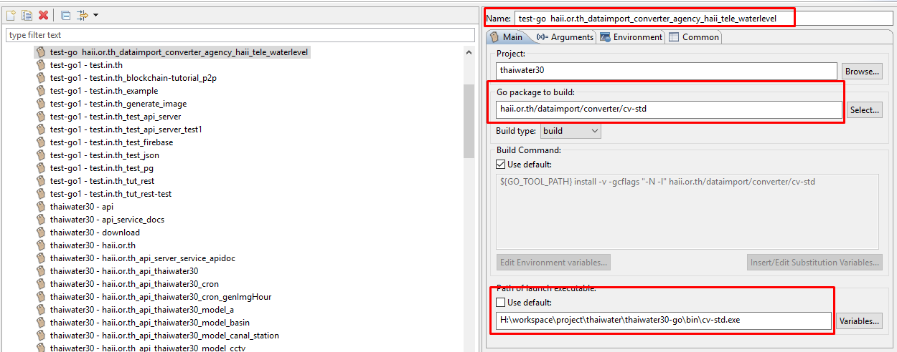

<!---
author Thitiorn Meeprasert (thitiporn@haii.or.th)
-->
###ทดสอบ qc-rule
####ตัวอย่างการทดสอบข้อมูลระดับน้ำสสนก.
```go
waterlevel_msl qc-rule ระดับน้ำปัจจุบันต้องไม่มากกว่าระดับน้ำก่อนหน้า 60 ซม.
```
qc-rule ที่จะทดสอบ
```go
waterlevel_msl <= lookup('cache.latest_waterlevel','value_previous','id',tele_station_id) + 0.6

look up table "cache.latest_waterlevel" ต้องการข้อมูล field "value_previous"
โดยหาจาก "id" = "tele_station_id"
```

1. สร้าง folder ตามหน่วยงาน ตามประเภทข้อมูล  
```
src\haii.or.th\dataimport\converter\agency\haii\tele_waterlevel\

```
ต้องมีโครงสร้างไฟล์ตามรูป


2. ไฟล์ config.json copy config จาก backoffice เมนูการตั้งค่า dataset http://web.thaiwater.net/thaiwater30/backoffice/data_integration/mgmt_conv
```
src\haii.or.th\dataimport\converter\agency\haii\tele_waterlevel\config.json
```



```json
{
	"data_folder": "dataset",
	"configs": [{
			"name": "haii-telemetering-waterlevel",
			"input_name": "telemetering.json",
			"header_row": 0,
			"data_tag": "/",
			"row_validator": "!is_nil(waterlevel_msl)",
			"fields": [
			{
          "name": "tele_station_id",
          "type": "int",
          "input_fields": [
            "code"
          ],
          "transform_method": "mapping",
          "transform_params": {
            "add_missing": false,
            "from": [
              "tele_station_oldcode"
            ],
            "missing_data": null,
            "table": "m_tele_station",
            "to": "id"
          }
        }, {
					"name": "waterlevel_datetime",
					"type": "datetime",
					"input_fields": [
						"date",
						"time"
					],
					"transform_method": "datetime",
					"transform_params": {
						"input_format": "%Y-%m-%d %H:%M"
					}
				}, {
					"name": "waterlevel_msl",
					"type": "float",
					"input_fields": [
						"water_level"
					],
					"transform_method": "",
					"transform_params": ""
				}, {
					"name": "qc_status",
					"type": "qc",
					"input_fields": null,
					"transform_method": "qc",
					"transform_params": ""
				}
			]
		}
	]
}
```

3. ไฟล์ qc_rule.json ใส่ qc-rule ที่ต้องการทดสอบ ซึ่ง qc-rule group_name,expression จะตรงกับข้อมูลที่จะใส่ใน table public.qc_rule field group_name,expression
```
src\haii.or.th\dataimport\converter\agency\haii\tele_waterlevel1\testdata\qc_rule.json
```
```go
[
	{
		"id": 1,
		"group_name": "waterlevel_msl",
		"expression": "lookupnil('cache.latest_waterlevel','value_previous','id',tele_station_id) || waterlevel_msl <= lookup('cache.latest_waterlevel','value_previous','id',tele_station_id) + 0.6",
		"description": "ระดับน้ำปัจจุบัน ต้องไม่มากกว่าระดับน้ำก่อนหน้า 0.6 เมตร  if (abs(WL(t) - WL (t-1)) > 60 cm)  then QC_Flag (fail)"
	}
 ]
```
<span style="color:red">&ast;กรณีข้อมูลไม่ครบตามเกณฑ์ ข้อมูล qc_status = false</span>

4. กรณี qc-rule มีมีเรียกใช้ func lookup ข้อมูลจาก table อื่น ๆ ให้สร้างไฟล์ lookup และใส่ข้อมูลเพื่อให้ระบบเรียกใช้ func ทำงานได้ถูกต้อง

ตัวอย่างไฟล์ lookup_m_tele_station.json ใช้ในการ mappin tele_station_oldcode จากไฟล์ download เพื่อแปลงเป็น id ตอน convert file
```
src\haii.or.th\dataimport\converter\agency\haii\tele_waterlevel1\testdata\lookup_m_tele_station.json
```

```json
{
  "column_names": [
    "id",
    "tele_station_oldcode"
  ],
  "data": [
		[365,"ABRT"],
		[310,"ACRU"],
		[514,"ANLI"],
		[492316,"ATG011"],
		[492317,"ATG02"],
		[492340,"ATG021"],
		[492341,"ATG022"],
		[492318,"ATG03"],
		[492342,"ATG031"],
		[492343,"ATG032"],
		[492319,"ATG04"],
		[492344,"ATG041"],
		[492345,"ATG042"],
		[492320,"ATG05"],
		[492346,"ATG051"],
		[492347,"ATG052"]
	]
}
```

ไฟล์สำหรับใส่ข้อมูลทดสอบ qc lookup_cache.latest_waterlevel.json
```go
lookup('cache.latest_waterlevel','value_previous','id',tele_station_id)
```
ชื่อไฟล์ lookup_[ชื่อ table ที่จะ lookup].json
```
src\haii.or.th\dataimport\converter\agency\haii\tele_waterlevel1\testdata\lookup_cache.latest_waterlevel.json
```
```json
{
  "column_names": [
    "tele_station_id",
    "id",
    "value_previous"
  ],
  "data": [
    [
      128,
      128,
      22.10
    ],
    [
      238,
      238,
      null
    ],
    [
      36,
      36,
      1.58
    ],
    [
      734,
      734,
      62.81
    ]  
   ]
}
```

5. copy file download จาก server converter วางใต้ folder testdata\test1 เพื่อเป็นตัวอย่างข้อมูลที่จะทดสอบ
```
src\haii.or.th\dataimport\converter\agency\haii\tele_waterlevel1\testdata\test1\dl-20190306005200-telemetering.json
```
```json
[{
  "code": "CHN004",
  "date": "2019-03-06",
  "time": "00:40",
  "temp": "999999",
  "humid": "999999",
  "press": "999999",
  "solar": "127.25",
  "rain10m": null,
  "rain1h": null,
  "raintoday": null,
  "rain24past": null,
  "date_rain24past": null,
  "time_rain24past": null,
  "water_level": "22.06",
  "geo_code_basin": 9999
},
{
  "code": "MUN014",
  "date": "2019-03-06",
  "time": "00:40",
  "temp": "999999",
  "humid": "999999",
  "press": "999999",
  "solar": "123.39",
  "rain10m": null,
  "rain1h": null,
  "raintoday": null,
  "rain24past": null,
  "date_rain24past": null,
  "time_rain24past": null,
  "water_level": "231.72",
  "geo_code_basin": 9999
}
]
```

6. สร้าง configuration เพื่อรันโปรแกรมด้วย Eclipse


Arguments


รัน configuration

ถ้า config ทุกไฟล์ถูกต้อง เมื่อรัน configuration ระบบจะแสดงข้อความว่า convert file สำเร็จ


7. ผลลัพท์ที่ได้จากการ convert รหัส 128

  ไฟล์   | ข้อมูลที่ใช้
  -------------  | -------------
  lookup_m_tele_station.json | [128,"CHN004"],
  testdata\test1\dl-20190306005200-telemetering.json |   "code": "CHN004" "water_level": "22.06",
  testdata\lookup_cache.latest_waterlevel.json | "data": [[128,128,22.10]]


ตัวอย่างข้อมูลระดับน้ำในคลอง ข้อมูลจาก กทม.
\src\haii.or.th\dataimport\converter\agency\bma\canal

```json
1|128|2019-03-06T00:40:00+07:00|22.060000|"{""is_pass"":true,""rules"":{""waterlevel_msl"":[{""id"":1,""is_pass"":true}]}}"
```
ทดสอบเปลี่ยนข้อมูลที่ lookup โดยให้ระดับน้ำก่อนหน้า = 20.10 เพื่อให้ qc_status เป็น false
ไฟล์   | ข้อมูลที่ใช้
  -------------  | -------------
testdata\lookup_cache.latest_waterlevel.json | "data": [[128,128,20.10]]
waterlevel_msl | 22.060000

ผลการทดสอบ

