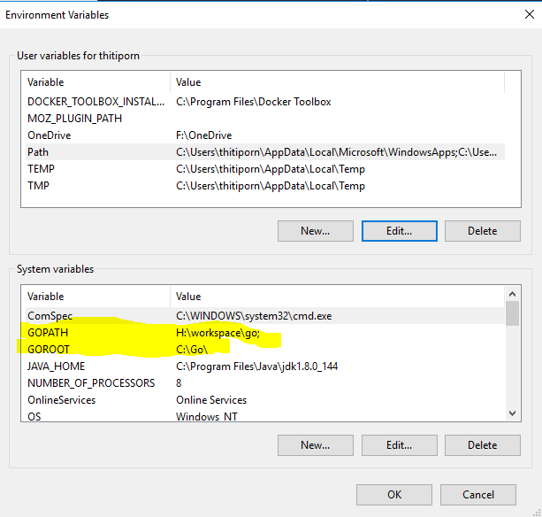
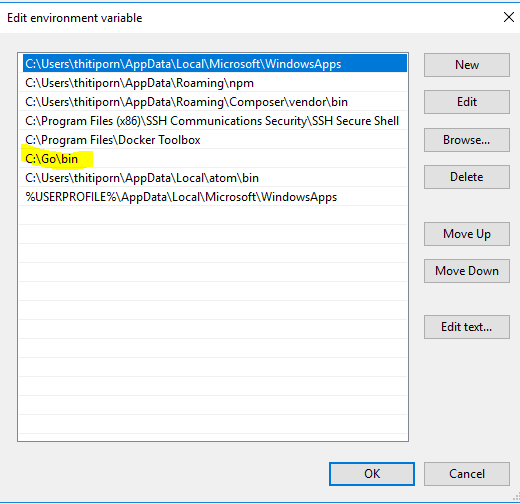
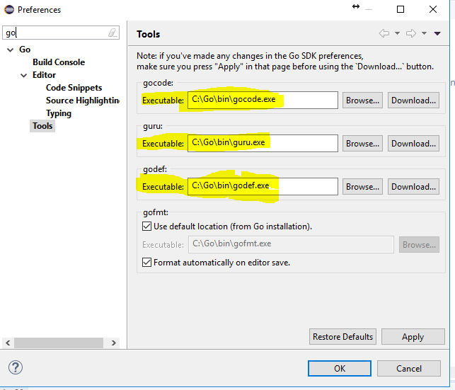
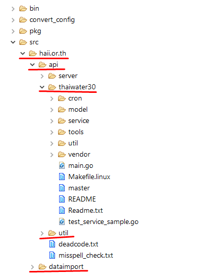
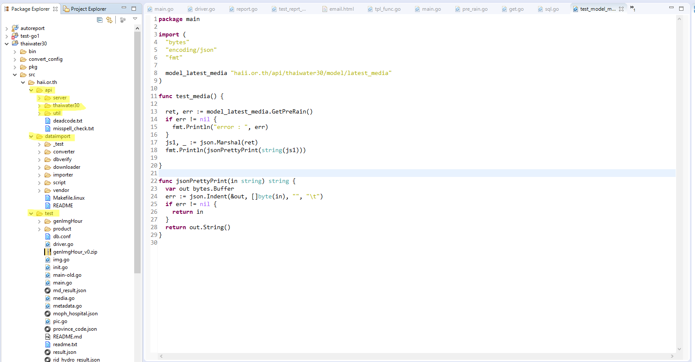

<!---
author Thitiorn Meeprasert (thitiporn@haii.or.th)
-->
###วิธีติดตั้ง Go - Thaiwater30
1. Download Golang from https://golang.org/dl/ and Install (<span style="color:red">go 1.7.4</span>)<span style="color:blue">\*ห้ามใช้ version อื่น</span>
<br>
2. Environment Variables
* GOROOT สำหรับกำหนด path ของ Go compiler
* GOPATH สำหรับกำหนด path ของ project หรือระบบงานของเรา
```
GOROOT -> C:\Go (Default Windows) or Directory
Golang
```
3. GOPATH -> Project directory




เมื่อเสร็จแล้ว restart เครื่อง

4. Download Eclipse. from https://www.eclipse.org/downloads/
<br>
5. เข้า Eclipse ไปที่ Help -> Install New Software -> Work with
Click Add -> Name: Golang -> Location: http://goclipse.github.io/releases/
รอโหลด และเลือก GoClipse กด next ลงจนเสร็จ restart eclipse
<br>
6. Eclipse กด Help -> Check for update
<br>
7. install GoTools เข้า git bash พิมพ์
```sh
go get github.com/nsf/gocode
go get -u -v github.com/golang/lint/golint
go get -u -v golang.org/x/tools/cmd/guru
go get -u -v golang.org/x/tools/cmd/goimports
go get -u -v golang.org/x/tools/cmd/gorename
```

กรณี insall goTools ไม่ได้ ให้ downloads file ตาม link ด้านล่างนี้ไปวางที่ C:\Go\bin
ดาวน์โหลดไฟล์ [here](assets/bin.zip)

8. Eclipse เลือก Window -> Preferences -> Go -> Tools
```
gofmt : C:\Go\bin\gofmt.exe
godoc : C:\Go\bin\godoc.exe
GOOS: windows
```


10. Create Project จาก Eclipse จะได้โฟลเดอร์ (bin, pkg , src)
<br>
11. สร้าง Folder
```
src/haii.or.th
```
<br>
12. clone project จาก git ใน Project/src/haii.or.th/

```
git clone https://git.haii.or.th/cim_cws/dataimport.git
git clone https://git.haii.or.th/cim_cws/api-server
git clone https://git.haii.or.th/cim_cws/api-thaiwater30.git
git clone https://git.haii.or.th/cim_cws/api-util.git
git clone https://git.haii.or.th/cim_atikom/go-test.git
```

เมื่อ clone มาแล้วเปลี่ยนชื่อ folder ให้เป็นตามด้านล่างนี้




13. folder structure
* pkg เอาไว้เก็บผลจากการ install library จาก package ต่าง ๆ
* bin เอาไว้เก็บ binary จากการ build ระบบงาน

reference :
* https://golang.org/doc/install
* https://golang.org/doc/code.html
* http://www.somkiat.cc/guideline-golang-for-beginner/
