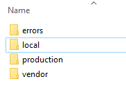
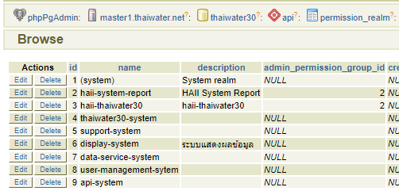

# การติดตั้ง frontend บน localhost
## clone เว็บลงสู่เครื่อง local
1. ทำการวางโครงสร้างระบบ โดยให้ตัวเว็บไซต์อยู่ใต้ haii.or.th
   

2. ทำการ clone ตัวเว็บไซต์ลงสู่ localhost ใน folder frontend โดยเราสามารถดูข้อมูล git repository ได้ที่ [https://git.haii.or.th](https://git.haii.or.th)
   ```sh
   > cd yourpath/haii.or.th/frontend
   > git clone git@git.haii.gin:cim_cws/fronend-thaiwater30.git
   ```
   เราจะได้โฟล์เดอร์ thaiwater30 ขึ้นมาภายใต้ frontend directory

3. ก็อปปี้ไฟล์ .env จาก server ลงมาวางไว้ที่ root web

4. ไปที่ path ของเว็บไซต์และติดตั้ง package php และ javascript
   ```sh
   > cd yourpath/haii.or.th/frontend/thaiwater30
   > composer install
   > bower install
   ```
5. ทำการ mapping folder กับ url บน Apache โดยการแก้ไข httpd.conf ในส่วนของ virtualhost
   และทำการrestart apache ซึ่ง httpd.conf ตำแหน่งจะขึ้นกับการติดตั้งของแต่ละคน จากตัวอย่างเราจะเรียกเว็บ root ได้ที่ http://thaiwater30.localhost โดยตัวโค๊ดจะอยู่ที่ "G:/go_project/thaiwater30/src/haii.or.th/frontend"
   ```sh
   <VirtualHost *:80>
     ServerName thaiwater30.localhost
     ServerAlias thaiwater30.localhost
     DocumentRoot "G:/go_project/thaiwater30/src/haii.or.th/frontend"
     <Directory "/">
       Options +Indexes +Includes +FollowSymLinks +MultiViews
       AllowOverride All
       Require local
     </Directory>
   </VirtualHost>
   ```
6. ทดลองเข้าเว็บจากเครื่อง local ในที่นี้อาจะพบ error ซึ่งจะทำการแก้ไขต่อไป แต่ทดสอบว่าเครื่องเราสามารถลิ้งค์เว็บไปยังโฟล์เดอร์ที่ต้องการได้ถูกต้อง จาก config ตัวอย่างเราจะเข้าเว็บที่ http://thaiwater30.localhost/thaiwater30/public

## การทำ config ระบบ
1. สร้าง APP_KEY ในเครื่อง local โดยไปที่ [https://www.randomlists.com/string](https://www.randomlists.com/string)
ทำการใส่ข้อมูลตามภาพ จะได้ key มา ให้ทำการเลือกและก็อปปี้ key มาเก็บไว้ 1 ชุด
   
   

2. นำ APP_KEY ไปใส่ใน .env
      

3. เปลี่ยน URL Prefix ของเครื่อง สมมติในเครื่องเราทำการเรียกเว็บที่ http://localhost/thaiwater30/public ให้ตั้ง SITE_URLPREFIX เป็น /thaiwater30/public
   

4. เปลี่ยน SITE_VIEWMODE เป็น local
5. ทำการก็อปปี้วิว จาก resources/view/production เป็น resources/view/local ในการรันจาก local จะมีการเรียก view จาก folder นี้
   

6. ทำการตรวจสอบ user id และ account ใน
  * DB : thaiwater30
  * Schema : api
  * Table : user
  หากยังไม่มีผู้ใช้ ให้สร้างขึ้นมาใหม่ โดยให้ user_type_id=1 (ลิ้งค์จากตาราง lt_user_type) และ account เป็นชื่อที่ไม่ซ้ำกับข้อมูลเดิม
  
  
  ในที่นี้เราสร้างผู้ใช้ได้รหัสผู้ใช้ 541 และ account คือ haii-thaiwater30-www-manorot ให้จด 2 ค่านี้ไว้เพื่อใช้ต่อ
  
7. ไปที่ฐานข้อมูล เพิ่ม key ของ user id ของเราที่ตาราง agent โดยมี field ที่สำคัญคือ
   * user_id : user id จากตาราง user
   * agent_type_id : ลิ้งค์จากตาราง lt_agent_type โดยหากเป็น web จะมีค่าเป็น 2
   
   * callback_url : url ในเครื่อง local ที่เรียก api เช่น หากเรารันในเครื่อง  local เป็น http://localhost/thaiwater30/public ให้ใส่ apicb ต่อด้านหลังเป็น http://localhost/thaiwater30/public/apicb
   * secret_key : ค่า key ที่สร้างขึ้นมาจากข้อ 1
   * permission_realm_id : ลิ้งค์จากตาราง permission_realm โดยจะใส่ค่า 3 สำหรับเว็บ thaiwater30
   

   ในที่นี้เราจะใช้ค่า user_id ที่สร้างจากขั้นตอนที่แล้ว ในที่นี้คือ 541 และทำการนำ secret key ที่สร้างจากขั้นตอนก่อนหน้ามาใส่ใน field secret_key ส่วน callback_url คือ url ของเว็บใน local และเพิ่ม /apicb ต่อท้าย
   

8. กลับมาที่ local ให้แก้ไข .env โดยนำ account ที่ได้จากขั้นตอนที่ผ่านมา (ในที่นี้คือ haii-thaiwater30-www-manorot) มาใส่ที่ API_APPID
   
9. ทดลองเปิดเข้าหน้าเว็บ ตรวจสอบว่าการแสดงผลปกติ
10. ทดลองเปิดเข้าหน้า backoffice และทำการล็อคอิน ตรวจสอบการแสดงผล โดยเราจะใช้ /login ต่อท้ายเพื่อเข้าสู่หน้าล็อคอิน
